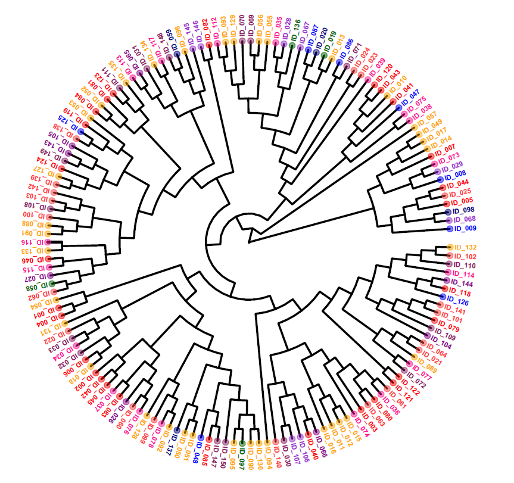

As I mentioned in my blog, I started working on a project to design a collection and classification system for political events using news articles. In my [previous post](https://www.carlos-toruno.com/blog/classification-system/01-gathering-data/), I showed how we are massively collecting the data using a News API. In this blog post, I would like to talk about the second step, the data labeling process, what does it mean, and why it is the **most important** step when developing a supervised machine learning project.

## Machines can learn

Ok, let's go back a few steps and let's first discuss about **Machine Learning**. First of all, Machine Learning (ML) is not the same as **Artificial Intelligence** (AI). It is a subfield. Please don't use the terms as synonyms... they are not.

AI is a very wide term that usually refers to the evolving ability of computers to emulate human thought and rationale.  On the other hand, Machine Learning is the science behind the development of complex algorithms and models that use data to identify patterns, make decisions, and learn through more data.

Without a doubt, computers need these kind of systems in order to emulate human rationale. Therefore, ML is just a small branch within the big spectrum of AI. If you are looking for a visual explanation, I would suggest you to take a look at the following video from IBM Technologies (very beginner friendly, I promise):

<iframe width="100%" height="315" src="https://www.youtube.com/embed/4RixMPF4xis?si=K2N--At9XewMzi9V" title="YouTube video player" frameborder="0" allow="accelerometer; autoplay; clipboard-write; encrypted-media; gyroscope; picture-in-picture; web-share" allowfullscreen></iframe>

Now that we have made clear that ML is not the same as AI, we now have to talk about ML in more depth. If you watched the video above, you would have heard the terms supervised, unsupervised, and reinforced. These terms are a reference on how your model is going to learn the patterns in your data.

**Unsupervised Learning** is a type of training in which the model explores the data's inherent structure to find patterns, structures, or relationships without any explicit guidance or predefined outcomes annotated by humans.

Imagine the following scenario, you apply a public opinion poll to a sample of individuals and ask them about their opinions, perceptions, and ideas on social and political topics. You would like to group people according to their ideologies. If it were only one question... let's say... 

>_Should the Government take over public utilities or regulate them as part of a private market?_ ... 

... it is easy to classify individuals according to their stand regarding public intervention in the economy. However, when you have 5, 10, 50 variables... how can you possibly group people? The combinations are just too much.

Well, as it happens, one of the most popular applications of unsupervised learning is **cluster analysis**. By making use of some clusterization techniques, the algorithms will analyze the answer patterns of individuals and come up with groupings depending on the level of similarity among their answers.

You DID NOT have to teach the model on how to group individuals, you just pass a metric and the model will group them for you based on that metric. That's the esence behind unsupervised learning and it has so many other applications such as **dimentionality reduction** (very helpful to create indexes or compound measures), **anomaly detection** (get rid of those outliers), **recomendation systems**, among others.

On the other hand, **supervised learning** requires the algorithm to learn from previously labelled data. In this case, the model learns the patterns within each labelled class and tries to replicate this classification to unseen data.

For example, let's imagine that you have a data set containing a series of images of paintings. Additionally, these paintings are classified according to which art movement they belong to (Renaissance, Neoclassicism, Impressionism, etc). A supervised learning algorithm will start analyzing the paintings within each art movement. It will search for measureable characteristics such as colors, strokes, shapes, textures, and it will start learning which specific features increase the likelihood of a painting belonging to a given art movement. This way, when facing unseen data, the model will be able to give an _educated guess_ regarding what art movement these new paintings belong to.

That is the essence of supervised learning. There are other ways of training an algorithm, such as **reinforcement learning**, which is based on a reward-or-penalty system. However, that will be your homework.

At this point, we will be focusing on supervised learning and the role of labelled data.

## Can AI be sexist?

Back in 2014, Amazon started to work on a machine learning tool that could take a massive amount of CVs and identify the top 5 candidates in the pool. In the developing of this tool, the company had the top machine learning specialists, along with a generous source of funds behind. The system was trained using data spanning over a decade. Nonetheless, [the project was abandoned](https://www.reuters.com/article/us-amazon-com-jobs-automation-insight/amazon-scraps-secret-ai-recruiting-tool-that-showed-bias-against-women-idUSKCN1MK08G/).

After one year, they realized that the model was not rating candidates in a gender-neutral way. Nicht gut!! After a not-so-long reflection, they realized that the main issue was that the data used to train the model reflected the male dominance in the IT market. Because of this, the model learned that, in order to accurately predict the "_most suitable_" candidates based on past data, it needed to penalize CVs containing the word "women". Straight to the garbage can.

You might be wondering what's my point. Easy. Ensuring high quality standards in the data that you use to train your model is, without a doubt, the **MOST IMPORTANT** part of developing a machine learning algorithm. In the Amazon example, they could have saved a lot of money by just stratifying the sample used to train the tool. Easy to say once that you know exactly what went wrong... but my point is still valid.

Gathering and preparing the data for training and testing your model might easily take up to 80% of your project's time. So, adjust your expectations and remember "_anything that can go wrong, will go wrong_".

## How to annotate?

The first thing we need to define is, **_who_** is going to perform the annotations. The most common way to perform annotations is through a **humans-only approach**. Meaning that you gather an annotation team familiar with the task at hand and they start perfoming the labeling manually. When adopting a **humans-only approach**, you need to stablish a workflow and framework aiming to avoid double annotations, loss of information, reduce subjective perceptions, among other related issues. Additionally, adopting this approach is usually slower and more costly than all the other options, specially due to the investment on training your annotation team.

The data labeling can also be done using an **automated approach**, meaning that some AI models can go through the data, analyze its content, and perform the labeling in an automatic fashion. Just to give you some context, ChatGPT has proven to be more accurate than humans in labeling certain types of data. Just take a look at [this article](https://www.pnas.org/doi/10.1073/pnas.2305016120) from the Proceedings of the National Academy of Sciences (PNAS). Nevertheless, this outcome is not absolute, meaning that there are a lot of factors behind:

- Human annotators might not be so familiar with the task at hand (poor training).  
- The annotation workflow had some flaws (loss of information, lack of quality control).
- AI usually performs well when the labeling is not complex.
- When using Large Language Models (LLM) to label data -such as GPT-, it is important to provide explicit instructions at the beginning of the prompt to set the context and define the task.

As always, it is very difficult to asses if a **humans-only** or an **automated** approach is better for your task. Because of this, most projects nowadays use a **humans-in-the-loop approach (HITL)**. In general, this approach consist in combing both the automated and human methods into one. How? First, an AI model starts labeling news in batches, a sample of labels is supervised by humans and feed back to the model in order to learn from its mistakes. Rinse and repeat until you think you have a decent outcome.

## Is it really important?

I have already talked about the importance of ensuring the data labeling from a technical point of view. If you still have doubts (... _actually I just want to give you an additional fact_...), you might be interested in knowing that, according to [Grand View Research](https://www.grandviewresearch.com/industry-analysis/data-collection-labeling-market?utm_source=prnewswire&utm_medium=referral&utm_campaign=ICT_30-March-23&utm_term=data_collection_labeling_market&utm_content=rd), the data collection and labeling market is one of the fastest growing markets worldwide. The latest trends point to a market size of over US$2.2 billions in 2022 and expected to generate over US$17.3 billions by 2030. Just take a look at the services provided by companies such as [Labelbox](https://labelbox.com/product/annotate/), [Amazon's Ground Truth](https://aws.amazon.com/sagemaker/groundtruth/), [Scale](https://scale.com/data-engine), [v7labs](https://www.v7labs.com/labeling-service), among many others.

In the last few years, the machine learning practitioners have slow down in developing more complex and modern algorithms and focused more into data quality. I guess that, at the end of the day, the world is just going back to the old but accurate saying of "_garbage in, garbage out_".