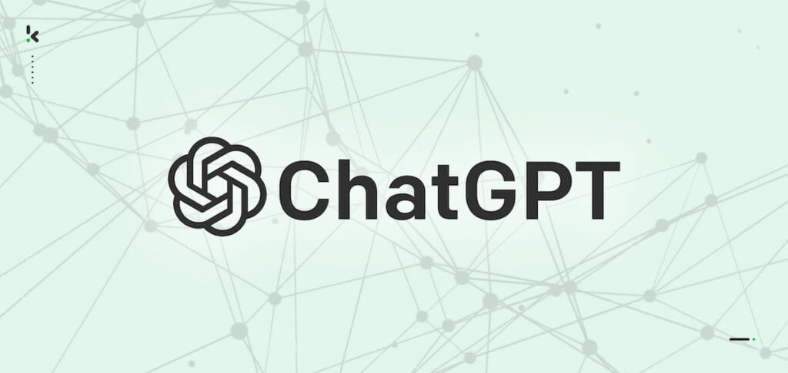

If you are one of my three fateful readers, you might be aware that I recently started a project focused on designing a gathering and classification system for events related to the Rule of Law, Justice, and Governance. I already wrote a post on [how we are doing the data collection using a News API](https://www.carlos-toruno.com/blog/classification-system/01-gathering-data/), and another one explaining the [importance of labelled data in Machine Learning](https://www.carlos-toruno.com/blog/classification-system/02-labelling-data/). Today, I'm gonna talk about ChatGPT and how to use it in order to classify news articles.

## Large Language Models

Last week, one of my work colleagues asked me a question that made me realize that most people is very familiar with ChatGPT. I mean, it is one of the most used apps nowadays. I use it almost on a daily basis for example. However, very few people outside the world of data science, AI, or tech in general understand the difference between ChatGPT and GPT. Therefore, let's talk about some concepts first (nerd time!!!!).

In the [previous post](https://www.carlos-toruno.com/blog/classification-system/02-labelling-data/) of this series, I introduced the difference between Artificial Intelligence (AI) and Machine Learning (ML). As a reminder, Machine Learning is a subfield of AI. To make things spicier, ML also has its own subfields, one of those is called **Deep Learning (DL)**. DL algorithms use [Neural Networks](https://news.mit.edu/2017/explained-neural-networks-deep-learning-0414) stacked in layers to identify and extract complex relationships and patterns present in the data and stores this relationships as variables or "_**parameters**_". This way, when the model is asked to perform a task, it uses the context and the provided instructions to predict an outcome based on the information that it was used during its training. Are you still with me? If not, you just need to know that DL models are rocking right now.

> _Modeled loosely on the human brain, a neural network consists of thousands or even millions of simple processing nodes that are densely interconnected._

Deep Learning is used to train machines to identify objects in images, recognize and process audio (speech recognition), generate visuals based on instructions, and so on. One of the most popular applications of DL has been in text generation through _**Large Language Models (LLMs)**_. In very simple terms, LLMs are Deep Learning models used for text generation that were trained using a massive amount of information and a specific architecture called called _**Transformers**_. I'm not gonna go deep into what transformer models are in this post. You only need to know that, since their introduction in 2017, they have been a game changer. You can read about Transformers in [this post](https://www.ibm.com/topics/transformer-model) that I highly recommend.

In Anime terms, if DL models is a game changer in the gender such as Attack on Titans, Transformers would be Captain Levi. 

<iframe width="100%" height="345" src="https://www.youtube.com/embed/zizonToFXDs?si=V8txdXRD7YaAd_dT" title="YouTube video player" frameborder="0" allow="accelerometer; autoplay; clipboard-write; encrypted-media; gyroscope; picture-in-picture; web-share" allowfullscreen></iframe>

Due to their complex design and massive information, LLMs are very flexible and can be used for multiple text-related tasks such as language translation, chatbots, answer enquires, and so on. Just to give you an idea on how large these models are, some rumors indicate that `GPT-4-Turbo` was trained over 1.7 trillion parameters. To train such a model, you would need a petabyte worth on text data (that's a millon gigabytes worth of text, no images, no video... just text). Without a doubt, training LLMs has a huge carbon footprint on our planet. Therefore, always inform yourself about the best possible ways to reduce your carbon footprint.

<iframe width="100%" height="345" src="https://www.youtube.com/embed/ftWlj4FBHTg?si=Ezq68lBos8fkw0Bj" title="YouTube video player" frameborder="0" allow="accelerometer; autoplay; clipboard-write; encrypted-media; gyroscope; picture-in-picture; web-share" allowfullscreen></iframe>

There are thousands of LLMs out there. In fact, there are over 43,000 text generative models registered in [Hugging Face](https://huggingface.co/models?pipeline_tag=text-generation&sort=trending). Hugging Face (HF) is the AI port of the internet. Individual users, universities, and even big names in the industry such as [Microsoft](https://huggingface.co/microsoft), [Google](https://huggingface.co/google), and [Meta](https://huggingface.co/meta-llama) are publishing their models on this website. The best part of the story is that you can test and use most of the available LLMs on HF for free.

Even with so many trained models out there, there is one name that is impossible to miss. The _**Generative Pre-Trained Transformer**_, also known as GPT. GPT refers to a family of LLMs developed by OpenAI. The GPT-2 model is actually [available on Hugging Face](https://huggingface.co/gpt2). Sadly, the most powerful models of the family such as GPT-3 and GPT-4 are not open source and only available through ChatGPT or the paid API service provided by the company. At this point we can finally answer the initial question that we had. What's the difference between GPT and ChatGPT?

As you know by now, GPT refers to a family of Large Language Models. To check the latest GPT models, you can visit the [OpenAI's documentation website](https://platform.openai.com/docs/models/gpt-4-and-gpt-4-turbo). ChatGPT, on the other hand, is a program not a model. It is a web app that has an user interface, a text input box, a history panel, and behind curtains it is powered by one of the GPT models. The free version of ChatGPT give you access to interact with their GPT-3.5-Turbo model. The premium version gives you access to the GPT-4-Turbo model developed by the company. The question now is, can I use ChatGPT to classify news articles?

## Using ChatGPT as a classifier

It is actually possible to use ChatGPT as a classifier. However, in order to get what you are expecting, you need to know how to instruct, contextualize, and phrase your instructions in a way that the model can provide you with an accurate answer. If you just throw them a question into the void, you will surely get an answer. But the likelihood of getting one that satisfy your question is really low.

What we want to achieve is the almost perfect prompt, or at least an effective one. Effective prompts are usually characterized by exhibiting:

1. A clear context
2. A specific set of instructions
3. No unnecessary information
4. Simple phrased sentences

There is an entire new subfield that is dedicated exclusively to craft effective prompts, [Prompt Engineering](https://platform.openai.com/docs/guides/prompt-engineering). The key message here is, you need to know what to ask and how to ask it for. LLMs have been trained on vast amounts of information. That doesn't mean they will be able to read your mind. At least not yet.

Let's continue with our task of using ChatGPT to classify news articles. I have randomly chosen one news article from the massive pool that we extracted using the News API. The article talks about how the German Federal Police started new border controls in the German-Polish border. You can find the original article (in german) in [this link](https://www.rbb24.de/panorama/beitrag/2023/10/brandenburg-bundespolizei-grenze-kontrollen-schleuser-polen-frankfurt-oder.html).

Lets start with an obvious case of what NOT to do. I passed the following prompt:

> _I need you to read the following news article and classify it according to which pillar of the Rule of Law it belongs to: [CONTENT OF THE NEWS ARTICLE]_

I received the following answer:

Honestly, it is a pretty well phrased answer. It gave me a pillar and a brief summary of the content of the news article. There is only one problem, I don't know of any "Law Enforcement and Security" pillar. At this point, we can say that the ambiguous instructions and lack of context forced the model to hallucinate an answer.

Let's do things in a proper way. First, let's contextualize the model on what we want. Think of ChatGPT as the new colleague in the office. They have a lot of knowledge, but they need you to train them on how stuff is done around. Is their first day in the office. Actually, it is their first second in the office. If you just tell the model something like "the pretest data arrived, do the validation report!". The model is gonna answer "yes, ma'am" and it will do something. But let's be honest, it has no idea what pretest data is, what a validation report is, what kind of things to focus on, how to run the report, and at least 45 more issues.

The previous paragraph just made me realize that I might do something similar to my team. So, if any of you is reading this... I'm truly sorry. Anyway, back to business!

I usually recommend using the first prompt to contextualize. You do not ask for a task just yet. As an example, I passed the following contextual prompt:

> _You are an assistant with knowledge in global politics, social sciences, and related fields. Your task is to carefully read a news article and determine whether it is related to the definition of Rule of Law that I will give you. You should read very carefully the definition of Rule of Law that I will give you, and also use the knowledge of global politics and social sciences that you have to perform this task._

The model understood the context and answered the following:

Now that the virtual assistant has a context for the task. We can pass the information that we consider necessary in order to perform the task. As a result, I continued with the following prompt:

>_The term Rule of Law refers to a system in which law is able to impose meaningful restraints on the state and individual members of the ruling elite. It refers to a governance principle in which all persons, institutions and entities, public and private, including the State itself, are accountable to laws that are publicly promulgated, equally enforced and independently adjudicated, and which are consistent with international human rights norms and standards._
>
>_We extend this concept further by defining the Rule of Law as a rules-based system in which the following four universal principles are upheld. First, the government and its officials and agents are accountable under the law. Second,  the laws are clear, publicized, stable, and fair, and protect fundamental rights, including the security of persons and property. Third, the process by which the laws are enacted, administered, and enforced is accessible, fair, and efficient. Lastly, access to justice is provided by competent, independent, and ethical adjudicators, attorneys or representatives, and judicial officers who are of sufficient number, have adequate resources, and reflect the makeup of the communities they serve._
>
>_Given the previous definitions, we can infer that the Rule of Law is a multidimensional concept that extends over eight basic pillars: limited government powers; absence of corruption; order and security; fundamental rights; open government; effective regulatory enforcement; access to civil justice; and an effective criminal justice._
>
>_From a political science perspective, these factors draw on four basic ideas related to the relationship between the state and the civil society, i.e. the checks and balances on the government's power; the effectiveness of the state in performing its basic functions; participation and collaboration between the state and its citizens; and absence of arbitrary abuse by authority._
>
>_Next, I will provide you with the headline, the summary, and the content of a news article._

As you can observe, I still haven't requested any task to the virtual assistant. I am just providing it with information to delimit the horizon and prevent the model from hallucinating (that's an actual technical concept). Morever, the model is understanding the process and kindly answered:

Next step, I passed the headline, a brief summary, and the full content of the news article along with a final set of instructions to guide the model on the expected output. Remember, until now, you have provided context and the information needed to perform the task. As you would do in real life with your new colleague in the office, you also need to guide the model on the expected outcome that you wish. Therefore, I passed the following prompt:

>_Headline [HEADLINE]_
>
>_Summary: [summary]_
>
>_Content: [FULL CONTENT]_
>
>_Analyze the news article and its context, and answer the following question: Is this news article related to the Rule of Law and having an impact on justice, governance or the Rule of Law based on the given definition of Rule of Law?_
>
>_When answering, strictly attach to the given conceptual framework and what each pillar measures within a country, and also keep in mind the following points:_
>1. _We do not include the right to access to healthcare in the conceptual framework of the Rule of Law because we did not contact public health experts in this project, so these news should not be related to the Rule of Law._
>2. _It is very important to distinguish between different type of news: description of events, interviews, op-eds, public statements, to clarify whether the news article has any actual impact on justice, governance or the Rule of Law._
>3. _Our conceptual framework does not include war events or peace agreements, so don't classify these type of news as related to the Rule of Law._
>4. _Opinion columns and opinion articles in general should not be related to the Rule of Law._

Final output looks as follow:

You can further customize how you want your output to be to facilitate its processing. For example, you can ask the assistant to answer using a data-friendly format as follows:

We have successfully manage to use ChatGPT in order to classify news articles in two groups, those that are related to the Rule of Law and those that are not. Now, we just need to copy and paste the previosu steps 10 thousand times and we can have a decent data to work on. Just kidding. Obviously, that is not feasible. 

If you want to perform the previous process in a more automatic fashion (let's code!!!!), you will have to use the official API provided by OpenAI. As I have explained several times in this blog, an Application Programming Interface (API) is a set of rules and tools that allows different software applications to communicate with each other. In this specific example, their API will allow our program (a python module) to access their model through an [endpoint](https://smartbear.com/learn/performance-monitoring/api-endpoints/).

In other words, we will be able to have the conversation directly with the GPT model, without having to depend on the user interface provided by ChatGPT. We can also save a prompt template and automatically adapt the instruction set to each news article and send multiple conversations (requests) in minutes. In my next blog post, I will go a bit more technically on how do this using the [python client provided by OpenAI](https://github.com/openai/openai-python) and the [langchain library](https://www.langchain.com/).

Finally, I would like to thanks [Pablo Gonzalez](https://github.com/pgonzalezb4) for its valuable mentorship and support in this project.
