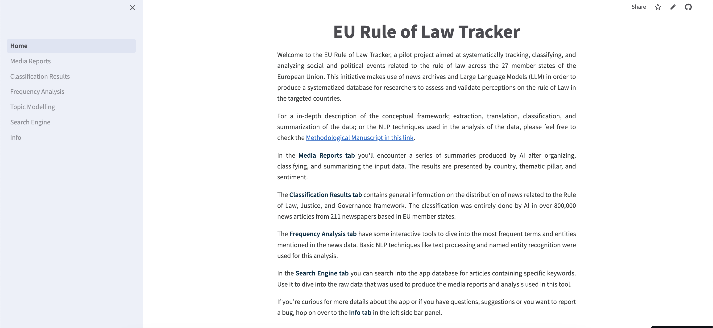
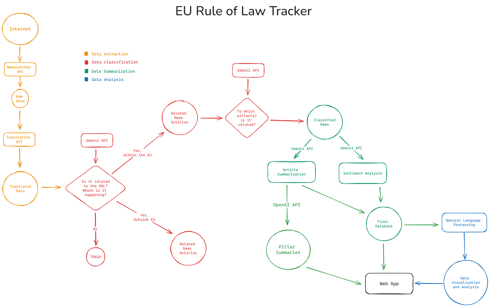
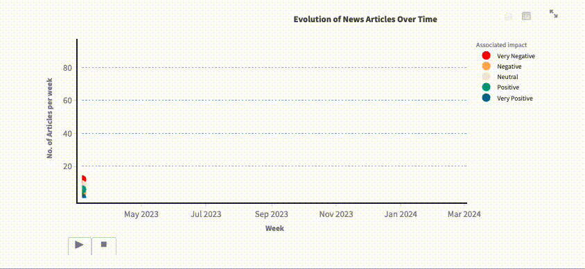
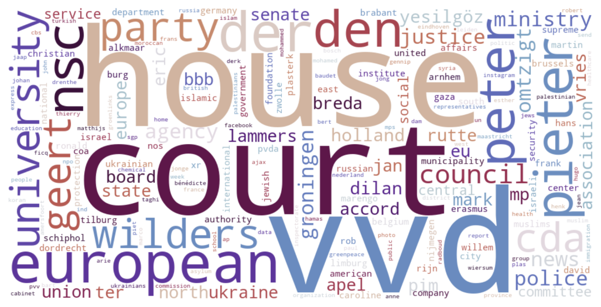

My dear three readers, as you might have noticed in my previous blog posts, I have been working on a pilot project that aims at systematically track, classify, and analyze social and political events related to the Rule of Law across the 27 member states of the European Union. This has been a long, long journey that started with [gathering news data through news APIs](https://www.carlos-toruno.com/blog/classification-system/01-gathering-data/), [using AI models to classify big data](https://www.carlos-toruno.com/blog/classification-system/05-langchain/), and ending with some Natural Language Processing (blog post on this is coming soon). Well, I'm glad to announce that I have finished the alpha version for this project. In this blog post, I'm introducing the [EU Rule of Law Tracker](https://eu-rol-tracker.streamlit.app/).

Some of my colleagues and friends are aware of the creation of *Media Reports* using AI. A first version of these reports are hosted in the [EU Copilot App](https://eu-copilot.streamlit.app/Media%20Reports). However, the EU ROL Tracker is different than these Media Reports. To begin with, the media reports were only the result of using AI to classify, organize, and summarize a huge volume of information. The EU ROL Tracker has not only improved the way that these summaries are presented, but it also takes the task to actually analyze the information that the AI has classified for us.

The use of AI has allowed us to quickly gather unstructured data and transform it into a structured data format. When we have information in a structured format, the possibilities of analysis increase exponentially. Sadly, my free time is only limited, but I was able to include a few exinteresting exercises. I will talk about these in-depth analyses in more detail bellow, but for now, just know that the [EU ROL Tracker](https://eu-rol-tracker.streamlit.app/) includes two interesting sections on frequency analysis and topic modelling.

## How does it work?

The tracker can be seen as a system that process data in different phases:

1. Data extraction and translation
2. Data classification
3. Data summarization
4. Data analysis

During the **data extraction phase**, the systems makes use of news archives to make what we call a "*wide search*". Due to the sintax-based approach used in this phase, we intentionally used broad, general keywords to ensure that our results include a wide range of articles, even at the risk of retrieving some unrelated content. This approach was chosen to avoid excluding potentially relevant articles.

After extracting and translating the data, the system narrows and refines the results through Large Language Models (LLMs) during the **data classification phase**. The main objective of this phase is to classify and organize news articles into thematic buckets, one bucket per conceptual pillar.

The **data summarization phase** entails the use of LLMs for two purposes: providing a custom summary of what the news article is about, and assigning an impact to the news article (positive, neutral, negative).

Finally, during the **data analysis** phase, the system passes the processed data to an interactive platform where the user can makee use of exploratory analysis and natural language processing (NLP) techniques to extract further insights on the data.

Sounds simple, right? Well, I explained it in a way that you don't get scared about the details. However, if you want to know more on how the system actually works (and even have access to the actual code of the system), I suggest to take a look at the [Methodological Manuscript](https://ctoruno.github.io/eu-rol-tracker/). I'm still finishing up writing the documentation, but trust me, it is a great source of knowledge.

## What can I find in the Tracker?

The [EU Rule of Law Tracker](https://eu-rol-tracker.streamlit.app/) is a very straightforward platform with five base features. First, the **_Media Reports_** is an interactive tab where the user can select a country from a dropdown list and explore a summary of the main issues and events related to each one of the 8 pillars of the Rule of Law.

Given that the information can be overwhelming, the summaries are grouped by topic and associated impact (very positive, positive, neutral, negative, very negative). At the beginning of every country report, you will find information regarding the sources that were used in every country as well as the time period covered. The summaries were produced using AI, after the model was presented with the project's theoretical framework. Therefore, the summaries should be carefully.

The summaries provided by the media reports are just summaries and their objective is to provide just enough information for the user to grasp a basic understanding of the general overview covered by news media regarding a specific pillar in a given country. However, if users get interested in a specific issue or want to cross-check the information presented by the summaries, then they can jump to the **_Search Engine_** to dive into the news database and search for articles related to the issue of interest.

For example, the media report for Germany contains information regarding some "_lack of transparency and potential bias in judicial processes_" in their Constraints on Government Powers tab, more specifically:

> "_Several articles raise concerns about the transparency and potential bias in judicial processes. The article about the appointment of the head of the Higher Administrative Court in Münster ("Appointment of Court Head") reveals a lack of transparency in the selection process, raising questions about fairness and potential political influence. Similarly, the article about the Hertha BSC legal dispute ("Hertha BSC Legal Dispute") highlights delays caused by bias claims, impacting the efficiency and effectiveness of the judiciary._"

If users want to get more information about these two issues, then they can open the search engine, load the data for Germany, search for specific keywords (in this case can be "court münster" or "hertha bsc") and then narrow the search for articles that were classified as related to Pillar 1 and had a negative impact on the Rule of Law. The engine will return the articles that match the query parameters with the possibility to chech the source, the URL of the original publication, and the full text translated to English.

For the specific case of Germany, the database has a total of 8,820 news articles. As a result, the information can be quite overwhelming if broad or general keywords are used. I personally suggest using the search engine as a complement of the media reports because the summaries provided by the AI already analyzed and provided guidance on the most important issues present in the database. In other words, the search engine works better for an in-depth search of the issues presented in the media reports rather than a tool to check for issues that the AI missed in their summaries.

The third feature has to do with a report on the **_Classification Results_**. The media reports can give you a summary of the issues, however, some relevant questions might arise after reading a few: Which pillar has more negative inputs? Which pillars are more connected between each other? When did the most issues arise? All of these questions can be answered by taking a look at the classification results.

If you are wondering how accurate is the classification performed by the AI, then you should take a look at the [classification section in the methodological manuscript](https://ctoruno.github.io/eu-rol-tracker/#sec-class), at the end of the section I write about how accurate is the classification performed by Gemini in comparison to other LLMs and even to a classification performed by a team of human labellers.

A brief but quite newly added feature is the **_Frequency Analysis_** tab. Here, you can make use of wordclouds and tables to visualize the most frequently used terms and most mentioned entities in the news articles associated to a specific country, pillar, and even by associated impact. For example, the wordcloud bellow shows the most mentioned entities in news articles from the Netherlands that were classified as related to pillar 4 on fundamental freedoms. As we can observe, there were a lot of mentions related to court houses and the VVD (People's Party for Freedom and Democracy), followed by mentions of specific dutch politicians such as Geert Wilders, Pieter Omtzigt, Dilan Yeşilgöz, and Mark Rutte.

Finally, any data derived from newspapers can be analyzed using Natural Language Processing (NLP) techniques. One of the most popular tasks in where NLP is used is **_Topic Modelling_**, which is based on analyyzing a corpus of documents and trying to extract the meaningful topics that a set of documents is talking about. Well, the last feature of our tracker is a tool where you can do just that. The user can select a country, a pillar, and a set of sentiments (very positive, positive, neutral, negative, very negative) and start playing with the topic visualization.

Now, this is a pilot project, so I limited myself to apply the basic [Latent Dirichlet Allocation (LDA) algorithm](https://www.ibm.com/topics/latent-dirichlet-allocation) for the extraction of topics. However, even this is the most basic algorithm for topic modelling out there, the interpretation of results is not beginer friendly. Actually, the use of this feature might require a blog post of its own.

What you need to know right now is that the tracker has a topic modelling feature that uses a LDA algorithm to identify hidden topics in a collection of documents by grouping similar words together. The results are visualized using the [pyLDAvis visualization library](https://github.com/bmabey/pyLDAvis). The pyLDAvis interface shows (1) a bubble chart where each bubble represents a topic, with its size showing how prevalent the topic is in the documents and its position showing how distinct it is from other topics; and (2) a word bar chart, which lists the most important words for any selected topic. You can interact with it by clicking on a topic bubble to see its defining words and adjust sliders to refine how words are scored. This makes it easier to interpret what each topic is about and how they relate to one another. You can play with the number of topics that fit the data (you usually adjust it after a few iterations). If you are curious on how this tool is used to interpret the data, you can check the following tutorial on YouTube (start at min 14:25):

<iframe width="100%" height="350" src="https://www.youtube.com/embed/UEn3xHNBXJU?si=19nuLuDUGudSQ7Ll&amp;start=865" title="YouTube video player" frameborder="0" allow="accelerometer; autoplay; clipboard-write; encrypted-media; gyroscope; picture-in-picture; web-share" referrerpolicy="strict-origin-when-cross-origin" allowfullscreen></iframe>

## How expensive has this been?

Well, besides the value of my free time to work on this, there are two things to take into account. First, you need to secure access to a news archive. In my case, I access news data using the [Newscatcher API service](https://www.newscatcherapi.com/). They have been really helpful and supportive and they even released a [study case covering part of this project](https://www.newscatcherapi.com/case-studies/world-justice-project). Without their support, this project might not have taken place.

Second, the classification system is the cornerstone of the tracker. For this, you could either make use of commercial LLMs, or you could also train and tune your own model. If you choose to make use of a commerical LLM, you might need to consider the costs of accessing their latest models through an API, which can be quite expensive when dealing with big data. If you choose to train your own model, you might need to consider paying for some cloud computing services given that training these models can require some computing power beyond what your standard laptop can offer. Not to mention that [you need a training database](https://www.carlos-toruno.com/blog/classification-system/02-labelling-data/) to make this happen. However, in the medium and long run, this might be a much cheaper option.

In our case, given the lack of a training database and the limited resources that we have, we choose to make use of the Gemini-Pro-1.0 model. This model was released in December 2023 and sending calls through their API service was free as long as the overall use remained under 60 requests per minute (RPM). This policy was in place until May 2024. We took advantage of this window for the heavy bulk of the classification phase. At the beginning of the project, we also tested OpenAI's commercial API. However, after evaluating that Gemini delivered results almost as accurate as their GPT-4-Turbo model, we decided to produce the pilot project using the free tier offered by Google at the time. 

The summaries per country and pillar were done using the Gemini-Pro-1.5 model which has a very restricted free tier. It wouldn't have been possible to classify articles using this model within the free tier, but given that this new model has the advantage of being able to process texts as long as 2 million tokens, the number of calls needed to produce the summaries is actually low in comparison to classify thousands of news articles.

The platform is deployed and hosted within the streamlit cloud service, which is free. Therefore, if we exclude the costs of testing different models and the value of my time, this tracker was set up at USD$0.00.

## What's next?

To be honest, my main objective was to have a project were I could learn how to introduce AI tools into some of our daily activities. I learned so much until now: using news APIs with pagination, langchain frameworks, prompt engineering, measuring frameworks, cloud computing, it was a lot. However, I still see two possible paths. First, training our own text classification model in order to reduce our dependency of commercial models. I mean, we can use the current database for this purpose. Second, we can improve the topic modelling techniques by incorporating word embeddings and testing BERTopic. 