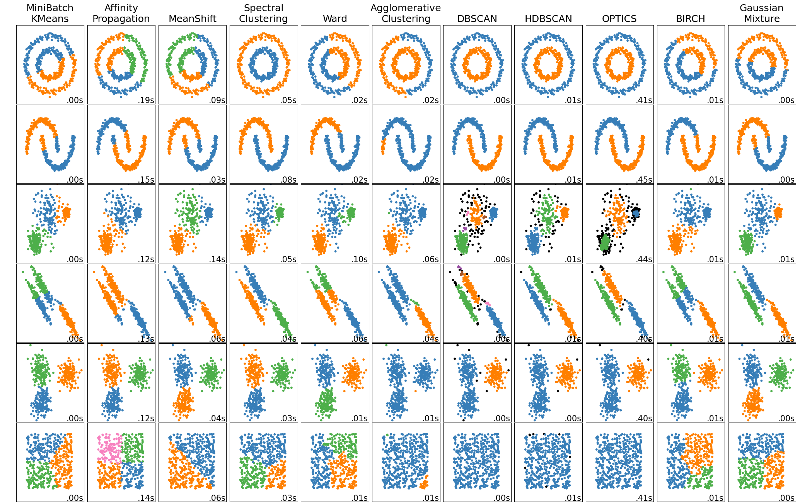
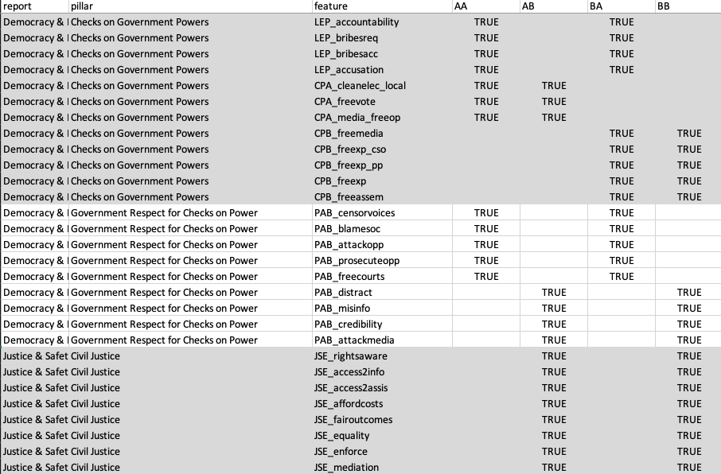

`Hello World!` I know. I have been a bit disconnected from my blog since I finished the [EU Rule of Law Tracker](https://www.carlos-toruno.com/blog/classification-system/06-introducing-eu-rol-tracker/) last year. That was hell of a journey, right? That project made me write about:

- [Extracting data using a news API](https://www.carlos-toruno.com/blog/classification-system/01-gathering-data/).
- [Programming web apps using streamlit](https://www.carlos-toruno.com/blog/streamlit/01-intro/).
- [Using AI to classify news articles](https://www.carlos-toruno.com/blog/classification-system/04-llm-api/).
- [Using Langchain to develop apps that make use of Large Language Models](https://www.carlos-toruno.com/blog/classification-system/05-langchain/).

And I'm still preparing a few blog posts on how to perform basic Natural Languange Processing (NLP) techniques such as Topic Modelling and Named Entity Recognition. Feel free to visit and explore the tracker on [**this website**](https://eu-rol-tracker.streamlit.app/). Given that I'm using the free hosting service from [streamlit.io](https://streamlit.io/), you might need to wake up the app and wait a little bit while it is deployed.

So, how does 2025 looks now? Well, I have been taking it slowly lately, but now I'm working on two different projects. The first one is an academic exercise where I try to group people based on their perceptions and opinions. The second one, is a personal project where I use AI to provide feedback based on some tutoring audio recordings.

In this blog post, I will be introducing the first project and I will leave the second one for a future series of blog posts. If you ever wonder on how to program an app that performs speaker diarization, automatic speech recognition (ASR) for audio transcriptions, and Large Language Models like Deep Seek, you would love that series of posts.

But, for now, let's focus on the academic exercise that I mentioned.

As some of you might know, I was heavily involved in the [WJP Eurovoices project](https://eurovoices.worldjusticeproject.org/). As explained in the website:

> The World Justice Project EUROVOICES evaluates, analyzes, and maps out national and regional variations in how people in the EU perceive and experience democratic governance, fundamental rights, justice, safety, corruption, transparency, regulatory enforcement, and the business climate.

The data collected as part of this project comes from two different sources: expert codings (**_expert scorecard_**) and general population polls (_**people's voices**_). The people's voices data comes from a set of over 64,000 people living in all 27 member states of the European Union. You can check the official website for more information.

If I can be honest with you my dear three readers, I love this data set as if it were my kiddo. At the end of the day, I participated in the design of the questionnaires, the testing of the survey scripts, reviewing the pilot, the quality checks, the data cleaning, data validation, all the charts and visualizations, internal dashboard previews, the report production, and so much more.

What we have published in the website is very interesting material. However, the kind of analysis that we can achieve with this data is incredible far more than simple visualizations. So I came up with one idea. Why don't we use this data and try to group people according to their opinions regarding the rule of law, justice, and governance?

And that's exactly what I did in my free time the last month. At first, I thought that this was going to be a very simple exercise. Oh boy, I was so wrong. The further I was going through the exercise, the more complex it became. Trust me, facing real life data is way more complex than the simple exercises that you see on Youtube tutorials. 

While answering some questions, others popped up. It reminded me of a quote by Argentinian writer Mario Benedetti:

> "_When we thought we had all the answers, suddenly all the questions changed_"

At that point, I thought that sharing my experience and how I approached the different complexities that I faced would be of great value. To whom? I don't know. But it was a fun exercise and I need to keep my blog updated for my three beloved readers. So here I am, planning to write about my journey.

Let's review the basic idea... **_I want to classify people in different groups, according to their opinions and perceptions regarding the state of the rule of law, justice, and governance in their countries or subnational regions_**.

## How do we group people?

If we were talking about one or two questions, this will be a very easy classification exercise. I mean, you could just do a table in excel for this. No, no, no. I'm talking about classifying people based on their answers to over 150 questions, hopefully, 3 to 5 groups maximum. How you do that? The answer is **_Clustering Analysis_**.

Cluster Analysis is a type of statistical technique where the goal is to group a set of observations into clusters taking into account a set of observable characteristics. Based on these features, an algorithm has the objective of sorting data points into piles where there observations are more similar to each other than to those in other clusters, making it easier to understand patterns and relationships.

So, basically, you have an algorithm that will do the job for you. Easy, right? Well, is not that easy. The most popular python library to perform clustering analysis is **_scikit-learn_**. [They have a special section dedicated to survey all the different clustering methods available through their API](https://scikit-learn.org/stable/modules/clustering.html#overview-of-clustering-methods). We are talking about K-Means, spectral clustering, Ward methods, Density methods, BIRCH, Gaussian Mixtures, and so on. Actually, they have a fantastic infographic on how each method would perform in grouping data points in a 2-dimensional space:

If you are not a familiar with the method, you will probably be like WTF is this piece of s***. But for a data person like me, this is genius. An advanced piece of art. But regardless of how much I love it, it also introduces the first problem that I faced: what method should I use?

To answer this question, I needed to do some data exploration, data visualization, and also some performance evaluation. As a result, the **_fourth blog post of this series is a practical step-by-step guide where I make use of the scikit-learn library and compare the results of the clustering exercise_** after selecting three different methods: a simple k-Means method, density methods (DBSCAN & HDBSCAN), and a Gaussian Mixture.

To be honest, clustering methods are like magic. Despite each one of them having their own pros and cons, all of them work based on a principle of using a distance metric between data points to discriminate and group observations into common piles... wait there bad boy!!! 

How do you measure the distance between data points when you have 150 questions? That's 150 dimensions!!!

## Harry Potter and the curse of dimensionality

Trying to group individuals based on over 150 questions means that we are working on a plane with 150 dimensions. Trying to work in this high dimensionality space comes with a set of issues:

1. Some of those features are only going to add noise to the exercise because the information they bring is either irrelevant or redundant.

2. Processing an algorithm in over 150 dimensions requires a a lot of computational power. This can take a few minutes for a k-Means method, but it would be massive for a Gaussian Mixture algorithm.

3. The most used distance metrics used by clustering algorithms (euclidean, manhattan, mahalanobis) lose their discriminatory power when the number of dimensions increases. With a high number of dimensions, all data points start appearing equidistant between each other.

So, how do we reduce the number of dimensions? We make use of **_dimensionality reduction techniques_**!!

I'll try to be brief.

Dimensionality reduction is a process used in data analysis and machine learning to reduce the number of features in a dataset while retaining as much of the meaningful information as possible. It is a key step in simplifying complex datasets, improving computational efficiency, and enabling better visualization and interpretation of data.

There are two different wayt in which you can reduce the dimensions of your data set. First, you just drop dimensions from your analysis based on their respective relevance or importance. I did not do this. Rather, I went with door number two, which is feature extraction. In this scenario, you transform the data into a lower-dimensional space by creating new features that can capture as much of the original information as possible.

Sadly, I didn't find a cool infographic depicting all the different methods that you can use to reduce your number of dimensions but according to ChatGPT, the most common ones are:

- Principal Component Analysis (PCA)
- Factor Analysis (FA)
- Multiple Corresponce Analysis (MCA)
- Latent Class Analysis (LCA)
- Uniform Manifold Approximation and Projection (UMAP)
- t-Distributed Stochastic Neighbor Embedding (t-SNE)

And each one of these methods has a myriad of different implementations. Which specific method is more suitable for our exercise depends on multiple factors. For example, PCA is good for reducing data with an emphasis on variance, FA on the other hands is quite good at identifying latent constructs, while UMAP and t-SNE are excellent for visual purposes. 

In our specific case, I would say that our data has a very special characteristic that greatly reduces the amount of possibilities at our disposal.

If you go to the [downloads page in the website](https://eurovoices.worldjusticeproject.org/downloads) and you take a look at the questionnaires for the People's Vocies data, you will notice that almost all of the questions are [Likert scales](https://www.britannica.com/topic/Likert-Scale). Actually, ALL the 150 questions that I selected for this exercise are Likert scales. Why does that matter?

Well, dimensionality reduction techniques usually make some assumptions on the structure of the data. The standard implementations of these methods assume that features are continous, that intervals between values are consistent, and that values are normally distributed. However, Likert scales exhibit a completely different structure given their discrete and ordinal nature. Therefore, standard applications of these methods would produce biased estimates.

If I can be honest, due to the existence of a [theoretical framework](https://eurovoices.worldjusticeproject.org/files/WJP-EUROVOICES-Methodology.pdf) for our project, my first option was to perform a **_Confirmatory Factor Analysis (CFA) with Weighted Least Squares Mean and Variance Adjusted (WLSMV)_**.

Confirmatory Factor Analysis is a type of FA that evaluates wheter our survey items are groupped as expected. This method makes use of structural equation modelling (SEM) to extract features based on the theoretical framework while also taking into account the ordinal nature of the data. If you are interested in learning more about this method, I would suggest you to check the [lavaan R package website](https://lavaan.ugent.be/#what-is-lavaan) which comes with a very helpful documentation, tutorials, and books on the topic. Python has a SEM library called [semopy](https://semopy.com/) which can be very handy in performing CFA. However, unlike lavaan in R, semopy does not have native support for a WLSMV implementation.

CFA with a WLSMV implementation seemed perfect for our case. Too good to be true in fact. Big issue on the table.

Due to time and cost constraints, the survey that is applied to the general public randomly splits respondents into two different groups (A and B) in the modules of Civic Participation and Institutional Performance. Both modules represents around 75% of all the features contained in our theoretical framework. In other words, not all questions are answered by everyone in our sample. Actually, we can divide our sample into four groups depending on which options of the Civic Participation and Institutional Performance modules they answered: AA, AB, BA, and BB. this is called "_planned missingness_" in data collection designs and it has a huge impact on the use of our microdata.

For example, the distribution of features for the theoretical pillars of Checks on Government Powers, Goverment Respect for Checks on Government Powers, and Civil Justice looks like this:

As you can observe, the entirity of features for our theoretical pillar of Civil Justice relies solely on people who were assighned to groups AB and BB in our survey. Therefore, around 50% of our sample won't have a latent construct for this pillar. The problem extends to other pillars as well. In the case of Checks on Government Powers, two out of the three questions answered by group AB are solely related to elections, while all nine questions answered by group BA are related to accountability and fundamental rights.

The huge theoretical imbalanced between groups makes it very difficult or impossible to apply CFA to our microdata. Regardless of that, **_I have written a bonus post on how to perform CFA with ordinal data in R_**.

As an alterantive, the best option that I considered was to re-designed the features groupings into five "pillars" and implement a Nonlinear PCA (NLPCA) to extract reduced features to each one of our four sub-samples. [NLPCA is a specific implementation of PCA that preserves the ordinal relationships in the variables by making use of "optimal scalling"](https://www.jstatsoft.org/article/view/v031i04). As a result, the **_the third blog post of this series is a practical step-by-step guide on how to perform NLPCA using the Gifi package in R_**.

By treating each group as a separate subsample and redesigning the feature groupings to balance the theoretical measures within each subsample, I am able to deal with the "planned missingness" in our microdata. However, in public opinion polls is very common for people to refuse to answer specific questions. Which brings up a different question...

## How are we gonna handle missing data?

If you have worked with data, there is a 100% probability that you have had to deal with missing data. Depending on the complexity of the task at hand, handling missing data could be a quick step in your data pre-processing routine, or the worst thing to happen to you this month.

The presence of missing data in multiple features can cause an observation to be ignored during the analysis. Therefore, for rigorous exercises beyond simple data exploration, the data analyst will have to impute the missing values to avoid performing a statistical inference on a reduced sample size.

A data imputation can be seen as an educated guess of the value that is missing. There are multiple ways to impute missing data. For example, you can replace the missing values using the mean or median, you could perform a k-neighbor imputation, or... the one that happens to be my favorite nowadays... you could perform a [**_multivariate imputation by chained equations (MICE)_**](https://stefvanbuuren.name/fimd/). 

MICE is the use of a technique called Fully Conditional Specification (FCS) to the specific use case of handling missing data. The logic (and main assumption) behind MICE is that the information required to make a good educated guess for imputing the missing data is found within the data. Because of this, the imputation is performed by iteratively modeling each variable with missing data as a function of the other variables in the dataset. MICE uses separate models for each variable and imputes missing values conditionally on the others. This process is repeated for all variables with missing data in an iterative fashion, cycling through them multiple times to refine the imputations and produce a "complete" data set.

Additionally, to account for the uncertainty in the estimation, the whole process is repeated multiple times to generate more than one "complete" data set. You can perform your analysis (dimensionality reduction in our case) individually on each one of these data sets and then pool your results. The process might seem a bit confusing at first, but in reality is very simple to follow. I found this video very helpful to understand the logic behind the process:

<iframe width="100%" height="315" src="https://www.youtube.com/embed/WPiYOS3qK70?si=gkJzEhua3qzSXP1y" title="YouTube video player" frameborder="0" allow="accelerometer; autoplay; clipboard-write; encrypted-media; gyroscope; picture-in-picture; web-share" referrerpolicy="strict-origin-when-cross-origin" allowfullscreen></iframe>

**_The next blog post in this series will be a step-by-step guide on how to use a MICE algorithm to impute ordinal data_** using the [MICE R package](https://amices.org/mice/) by using a Proportional Odds Logistic Regression (polr) as a base model.

## Overview of the series

In a nutshell, this project will come along with 6 blog post released in the following order:

1. You have this introductory blog post guiding you through the whole process.
2. A step-by-step guide on how to handle ordinal missing data using MICE.
3. A step-by-step guide on how to perform a NLPCA for dimensionality reduction.
4. A step-by-step guide on how to perform a clustering analysis of public opinion data using k-means, HDBSCAN, and Gaussian Mixture.
5. A step-by-step guide on how to perform a CFA of ordinal data in R.
6. Grouping people according to their opinions on the Rule of Law and its dimensions — Main Insights.

