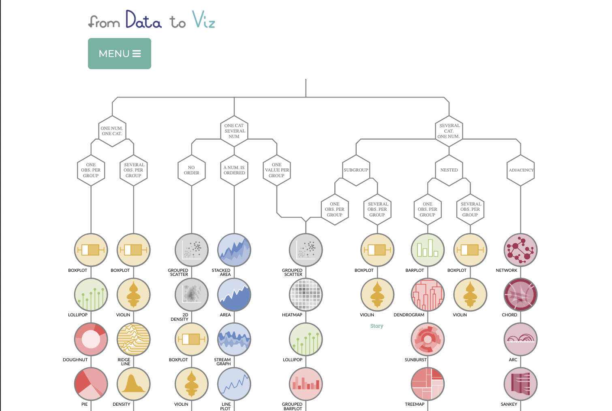

As part of my daily life as a data analyst, I need to constantly come up with the proper data visualizations for my data. I'm not talking about programming a chart, but rather, the previous step of picturing and designing how your visualization will look like. In my experience, this first step has proven to be the most important one and, sometimes, the most complicated step for the whole process. Every data analyst has a different approach on how to tackle this. Therefore, in this post, I'm going to share with you my own data viz process as part of my daily routine.

## Let your data drive the process

If you go to Google and you search for "_R Graph Gallery_" or "_Plotly Graphing Library_" you will encounter that there is more than 50 different ways to display the information you have at hand. It is, to some extent, overwhelming. Naturally, the first step in the decision tree is to pick one out of all of these plots and visuals available. How can we make the right choice in this regard?

Well, keep calm and look into that data frame again. Your only tool to pick the right visual is your data. However, data comes in different forms and shapes. So, **what kind of data you want to show to your audience?** Is it a time series? What kind of variables do you have? Ordinal or cardinal? Are these variables nested?

These questions are fundamental because, even though they will not give you a straight answer, they will reduce the number of plots at your disposal, which is a big help at this point. To give you an example, if you want to display a time series, we can exclude a donught chart from our possibilities.

In this regard, I would suggest you to visit the [from Data to Viz project](https://www.data-to-viz.com/). They provide a very user friendly tree map that will guide you in choosing the appropiate chart that fits your needs given your data and context. In most cases, your horizon of possibilities will be reduced to a set of 4 or 7 different charts. However, this is not the end of the guided session. You will find a real case scenario that resembles your data structure and you will be able to see how does the example data looks like with every potential chart, along with a brief listing of pros and cons and code snippets to reproduce the plots in R. In find this as a very valuabe tool, specially for beginners.

## Search for inspiration

The previous step will help you select the type of chart that best fit your needs. However, this is not enough to achieve the almost perfect viz that we want. We want our message to be visually striking while keeping it clean and simple at the same time. Not an easy task, indeed. For this, we need to search for inspiration. What has other people done to achieve this balance?

Unlike the other steps in this process, this is something that I do continuously because, I have come to realize that you find beautiful pieces of art that could serve as inspiration... when you don't need them. In reality, the beautiful plots that can inspire you, are found when you are randomly reading some random blogs on the internet (just like this one). Therefore, I would advice you to regularly check data viz blogs or websites to see what other people is doing and, if you find something that you like, bookmark it as a favorite, because it can help you to achieve that almost perfect visualization in the future.

As a suggestion, I always keep an eye on the following websites for fresh ideas:
* [Information is Beautiful Awards](https://www.informationisbeautifulawards.com/)
* [The Pudding](https://pudding.cool/)
* [Visualizing Data](https://www.visualisingdata.com/blog/)
* [Flowing Data](https://flowingdata.com/)

At this point, you will think about the aesthetics such as the colors, the font, the alingments, etc. However, I would be lying if I say that this does not change a lot while programming the chart. It does.

## Build up the narrative

The objective of the previous two steps is to come up with a sort of "_blueprints_" for your visualization. The next thing to define is, _where_ is our outcome going to be. 

If your chart is going to be a lone wolf to be published in Twwitter as part of the `#tidytuesday` movement, you should be careful and see that the information is properly connected in order to deliver the message. You don't want to be displaying electoral results in Europe along with results from public opinion surveys about migration without giving the reader a proper introduction on how these two topics are connected. 

A very common mistake is that we assume that our audience has the same amount of information that we have. It is easy for the person creating the chart to see the message and connect the information inside, but this might not be the case for the external audience. You need to abstract yourself from the creation process and analyze the chart as your audience would do it. During this process, you will realize what kind of guides you need to add. Is it enough with a title? Do I need to add annotations? Sometimes, you will even realize that the chart as itself is not enough and what you actually need is an infographic.

If your chart is going to be part of a bigger narrative, then we also need to mind about the role of our visualization in the bigger picture. We might have to reduce or increase the amount of information in our chart in order to keep the narrative flowing.

<iframe width="100%" height="325" src="https://www.youtube.com/embed/5Zg-C8AAIGg" title="YouTube video player" frameborder="0" allow="accelerometer; autoplay; clipboard-write; encrypted-media; gyroscope; picture-in-picture" allowfullscreen></iframe>

## The outcome will define the technologies

 Now that we have improved the _blueprints_ by taking into account that the chart is a part of a whole, we come to the final part step, which is, how do we make it possible? And more specifically, what tools should we use? 

Now, as I said before, this is not about the programming of the final outcome but rather about the designing of the visualization. So, let's abstract from the technicities of the programming and let's focus on the outcome.

In my experience, when you are working on something big and not just the lone wolf that goes into Twitter. There is trade-off that usually nobody mentions: guided narrative versus engaging interactivity. 

If you want a straightforward narrative without the reader engaging in their "_choose-your-own-adventure_" style, then a static report is the way to go. A very good example of this type of outcome is the [Democracy Report 2022](https://v-dem.net/media/publications/dr_2022.pdf). The advantage of this type of outcome is that you keep complete control of the narrative. Nevertheless, you are prone to lose your audience due to the lack of engaging incentives.

On the opposite end of the spectrum, you could give up on controlling the narrative and create an interactive dashboard or web application. A good example of this type of outcome is the [Global State of Democracy Indices](https://www.idea.int/gsod-indices/democracy-indices). The advantage of this type of outcomes is that the interactivity keeps the audience engage with the content. However, you have no control over the narrative and the audience is free to retrieve their own conclusions and even omit the messages that you want to deliver.

A midpoint between the previous two cases is a dynamic online report such as the [Regions in Europe 2022](https://ec.europa.eu/eurostat/cache/digpub/regions/#population-change). The thing about this typeof outcome is that keeps a limited amount of interactivity that allows to engage the audience while also controlling a reasonable amount of control over the narrative.

Once that you decide on this, you will be able to choose the right technologies and scheme the programming procedure. For example, for static reports, the matplotlib or seaborn libraries in Python or the ggplot2 package in R might be more than enough. However, for dynamic results, you might need to design your visualizations using leaflet, plotly and frameworks such as Shiny, Dash, Streamlit, among others.

Regardless of how you proceed, never forget the KISS rule... Keep It Simple Stupid.