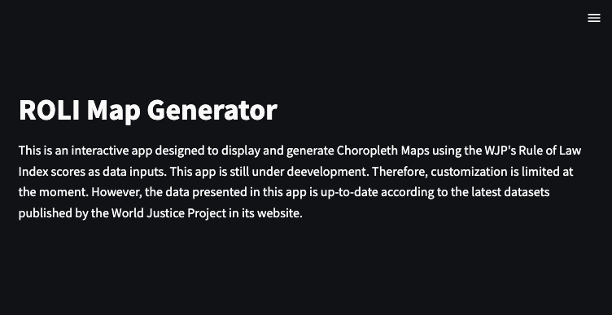
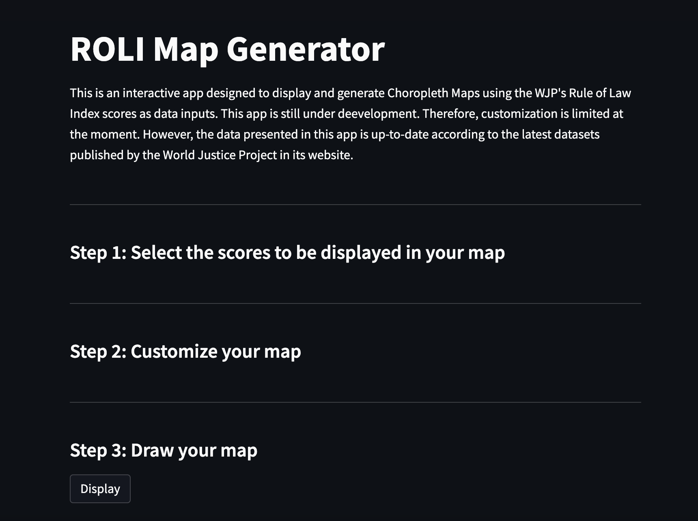
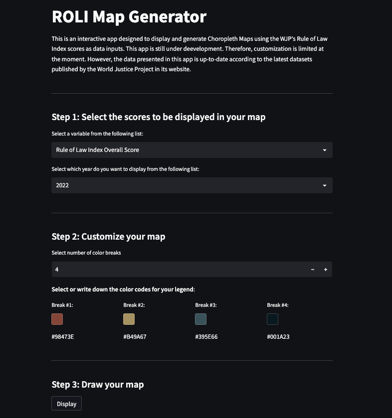
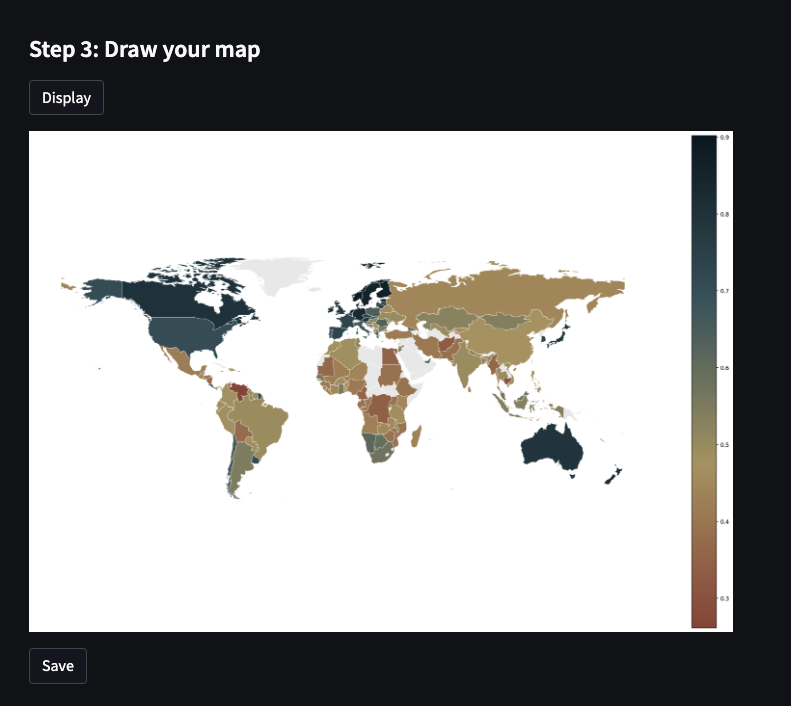

Streamlit is an open-source web framework for python. In recent years, it has experienced an increase in popularity due to its simplicity, very low learning-curve, and its focus on data science and machine learning. In this post, I'll be showing you a step-by-step guide of how I programmed this [_ROLI Map Generator_](https://roli-mapgen.streamlit.app/) app that takes the data published by the World Justice Project and produces customized Choropleth Maps with it.

**_Note:_** The ROLI Map Generator might look different to what you see in this post. In this tutorial, I'm portraying the alpha version of the app as of March, 2023.

<br>


## The basics

Before jumping into the coding of this app. We need to understand how does Streamlit works. 

First. Streamlits renders a HTML version of your app from a python script. Therefore, you need a basic or intermediate understanding of python. Prior experience with HTML, CSS or JavaScript is not necessary. However, knowing about these languages will help a lot in the process.

Second. You can visualize your app in your browser and all the changes you are applying as soon as you save the python script you are working on. More on this in a moment.

Third. Streamlit's architecture works in a very unique way. If something changes while the app is running, Streamlit will re-run the entire script from top to bottom. If you are familiar with the concepts of reactivity and laziness applied by other web frameworks such as R Shiny... I'm sorry to break this to you but you better unlearn those concepts while you program a Streamlit app. What does this means? Basically, if the user inputs a new word in a text box or clicks on a different button, Streamlit will re-run the entire script. This might seem a bit troublesome at first; however, you can use cache decorators to avoid re-running very expensive computational tasks again and again.

Fourth. User interactions with the app are massively simplified through widgets. Because of this, you really don't need to worry about the front-end of the app as long as the logical sequence of your python script is correct.

Fifth. Other web frameworks require you to split your code between server and User Interface (UI). Streamlit, does not require you to do this. Nevertheless, I still try/prefer to organize my code this way. You will notice it in a moment.

During the remaining part of this post, I will be explaining the different aspects of the programming on the go. If you want to review some of these aspects or go slowly with the basics of Streamlit, I would strongly suggest you to check the [Streamlit Documentation](https://docs.streamlit.io/) online. I personally find it very helpful and easy to go through.

## Installing Streamlit

In order to work with Streamlit you will need to install the library in your local machine. For this, install Streamlit using the PIP package manager by opening your terminal and writing the following line of code:

```
pip install streamlit
```

**IMPORTANT NOTE:** _As flagged in the [documentation](https://docs.streamlit.io/library/get-started/installation#set-up-your-virtual-environment), it is recommended to install and run streamlit from its own virtual environment. In my case, I use Anaconda to manage my virtual environments. If you are not familiar with virtual environments, I would strongly suggest you to watch this video:_

<iframe width="100%" height="315" src="https://www.youtube.com/embed/KxvKCSwlUv8" title="YouTube video player" frameborder="0" allow="accelerometer; autoplay; clipboard-write; encrypted-media; gyroscope; picture-in-picture; web-share" allowfullscreen></iframe>

Once that you have Streamlit in its own virtual environment and you have already installed the library inside this environment, you can start creating your app.

**IMPORTANT NOTE:** _I will be displaying ONLY small chunks of code in order to facilitate the explanation of the overall programming. If you feel the need to see the big picture and where these small chunks are located in the final script, I suggest you to open the final version of the python script in a separate tab of your browser and review it while you go through this post. The script can be found in [this GitHub repository](https://github.com/ctoruno/ROLI-Map-App/blob/main/app.py)_

## Writing a proper introduction

As I mentioned before, the first thing you need to do in order to start building your app, is to create a python script. We are gonna call this file `app.py`. The first thing we are going to do is to import the Streamlit library and write a title and a proper introduction. We do this as follows:

```{python}
# Importing the libraries
import streamlit as st

# Writing a title for the app
st.title("ROLI Map Generator")

# Writing an introductory paragraph
st.write(
    """
    This is an interactive app designed to display and generate 
    Choropleth Maps using the WJP's Rule of Law Index scores 
    as data inputs. This app is still under deevelopment. 
    Therefore, customization is limited at the moment. However, 
    the data presented in this app is up-to-date according to 
    the latest datasets published by the World Justice Project 
    in its website.
    """
)
```

We can make use of the `st.title()` and `st.write()` API references in order to write the text that we want to display as title and in the introductory paragraph, respectively. By now, you must be asking yourself, _but how does this look?_

## Running your Streamlit app locally

In order to preview your app in your browser, you need to run the app from your terminal. For this, open your terminal and run the following lines of code:

```{bash}
# Activating my streamlit virtual environment (I use Anaconda)
conda activate streamlit

# Changing the working directory to where your app is located
cd PATH_TO_APP

# Running the app
streamlit run app.py
```

Once that you hit ENTER after running the streamlit, a new tab will open in your default browser showing you what you have worked so far. The very simple app we have until now should look a lot like this:



## Loading the data

The first thing that we need in order for our app to work properly, is to load the data that we will be using. However, as it was mentioned before, Streamlit runs the entire script from top to bottom every time that the user interacts with the app. If the data is heavy and takes some time to load, it would be troublesome to have it loaded every time that the user interacts with the app. Therefore, it is strongly suggested to load the data into the app by using cache decorators. 

Cache decorators allow you to use the memory cache to store information separately so that future calls or requests to that specific information are served faster. Streamlit provides a cache decorator designed specifically for loading data called: `st.cache_data`. We make use of this decorator by placing it before a callable function that loads the data:

```{python}
import streamlit as st
import pandas as pd
import geopandas as gpd

# Cache of data
@st.cache_data
def load_data():
    # Loading data
    boundaries        = gpd.read_file("Data/data4app.geojson")
    roli_data         = pd.read_excel("Data/ROLI_data.xlsx")
    roli_data["year"] = roli_data["year"].apply(str)
    data              = {"boundaries" : boundaries,
                         "roli"       : roli_data}
    return data 
    
master_data = load_data()
```

As you can observe, we first place a decorator before defining a function that loads two different data sets and returns a dictionary containing both tables. In this way, every time the app calls the `load_data()` function, it will return the object stored in the cache instead of reading and loading the data using the pandas/geopandas libraries. This process saves a huge amount of time and allows the app to run smoothly.

Going back to the data tables that we have loaded, the first data frame in the list is a geojson file that contains data related to country boundaries and its geospacial geometries. I will be using the [World Bank Official Boundaries](https://datacatalog.worldbank.org/search/dataset/0038272/World-Bank-Official-Boundaries). This data set, without the geometries, looks as follows:

```{python}
master_data["boundaries"].head(10)
```

<table width="100%">
    <style scoped>
        .dataframe tbody tr th:only-of-type {
            vertical-align: middle;
        }

        .dataframe tbody tr th {
            vertical-align: top;
        }

        .dataframe thead th {
            text-align: right;
        }

        table {
        display: block;
        overflow-x: auto;
        white-space: nowrap;
        }
    </style>
  <thead>
    <tr>
      <th title="Field #1">FIELD1</th>
      <th title="Field #2">TYPE</th>
      <th title="Field #3">WB_A3</th>
      <th title="Field #4">REGION_UN</th>
      <th title="Field #5">SUBREGION</th>
      <th title="Field #6">REGION_WB</th>
      <th title="Field #7">WB_NAME</th>
      </tr>
  </thead>
  <tbody>
    <tr>
    <td align="right">0</td>
    <td>Country</td>
    <td>ADO</td>
    <td>Europe</td>
    <td>Southern Europe</td>
    <td>Europe &amp; Central Asia</td>
    <td>Andorra</td>
    </tr>
    <tr>
    <td align="right">1</td>
    <td>Country</td>
    <td>AFG</td>
    <td>Asia</td>
    <td>Southern Asia</td>
    <td>South Asia</td>
    <td>Afghanistan</td>
    </tr>
    <tr>
    <td align="right">2</td>
    <td>Country</td>
    <td>AGO</td>
    <td>Africa</td>
    <td>Middle Africa</td>
    <td>Sub-Saharan Africa</td>
    <td>Angola</td>
    </tr>
    <tr>
    <td align="right">3</td>
    <td>Country</td>
    <td>ALB</td>
    <td>Europe</td>
    <td>Southern Europe</td>
    <td>Europe &amp; Central Asia</td>
    <td>Albania</td>
    </tr>
    <tr>
    <td align="right">4</td>
    <td>Country</td>
    <td>ARE</td>
    <td>Asia</td>
    <td>Western Asia</td>
    <td>Middle East &amp; North Africa</td>
    <td>United Arab Emirates</td>
    </tr>
    <tr>
    <td align="right">5</td>
    <td>Country</td>
    <td>ARG</td>
    <td>Americas</td>
    <td>South America</td>
    <td>Latin America &amp; Caribbean</td>
    <td>Argentina</td>
    </tr>
    <tr>
    <td align="right">6</td>
    <td>Country</td>
    <td>ARM</td>
    <td>Asia</td>
    <td>Western Asia</td>
    <td>Europe &amp; Central Asia</td>
    <td>Armenia</td>
    </tr>
    <tr>
    <td align="right">7</td>
    <td>Country</td>
    <td>ATG</td>
    <td>Americas</td>
    <td>Caribbean</td>
    <td>Latin America &amp; Caribbean</td>
    <td>Antigua and Barbuda</td>
    </tr>
    <tr>
    <td align="right">8</td>
    <td>Country</td>
    <td>AUS</td>
    <td>Oceania</td>
    <td>Australia and New Zealand</td>
    <td>East Asia &amp; Pacific</td>
    <td>Australia</td>
    </tr>
    <tr>
    <td align="right">9</td>
    <td>Country</td>
    <td>AUT</td>
    <td>Europe</td>
    <td>Western Europe</td>
    <td>Europe &amp; Central Asia</td>
    <td>Austria</td>
    </tr>
    <tr>
    <td align="right">10</td>
    <td>Country</td>
    <td>AZE</td>
    <td>Asia</td>
    <td>Western Asia</td>
    <td>Europe &amp; Central Asia</td>
    <td>Azerbaijan</td>
    </tr>
  </tbody>
</table>

On the other hand, our second table contains information about countries and their achieved scores in the Rule of Law Index (ROLI). This data can be downloaded from the official website of the [World Justice Project](https://worldjusticeproject.org/rule-of-law-index/), and after a few twitches, it would look like this:

```{python}
master_data["roli"].head(10)
```

<table width="100%">
    <tr>
        <td>country</td>
        <td>year</td>
        <td>code</td>
        <td>region</td>
        <td>roli</td>
    </tr>
    <tr>
        <td>Afghanistan</td>
        <td>2014</td>
        <td>AFG</td>
        <td>South Asia</td>
        <td>0.34</td>
    </tr>
    <tr>
        <td>Afghanistan</td>
        <td>2015</td>
        <td>AFG</td>
        <td>South Asia</td>
        <td>0.35</td>
    </tr>
    <tr>
        <td>Afghanistan</td>
        <td>2016</td>
        <td>AFG</td>
        <td>South Asia</td>
        <td>0.35</td>
    </tr>
    <tr>
        <td>Afghanistan</td>
        <td>2017-2018</td>
        <td>AFG</td>
        <td>South Asia</td>
        <td>0.34</td>
    </tr>
    <tr>
        <td>Afghanistan</td>
        <td>2019</td>
        <td>AFG</td>
        <td>South Asia</td>
        <td>0.35</td>
    </tr>
    <tr>
        <td>Afghanistan</td>
        <td>2020</td>
        <td>AFG</td>
        <td>South Asia</td>
        <td>0.36</td>
    </tr>
    <tr>
        <td>Afghanistan</td>
        <td>2021</td>
        <td>AFG</td>
        <td>South Asia</td>
        <td>0.35</td>
    </tr>
    <tr>
        <td>Afghanistan</td>
        <td>2022</td>
        <td>AFG</td>
        <td>South Asia</td>
        <td>0.33</td>
    </tr>
    <tr>
        <td>Albania</td>
        <td>2012-2013</td>
        <td>ALB</td>
        <td>Eastern Europe &amp; Central Asia</td>
        <td>0.49</td>
    </tr>
    <tr>
        <td>Albania</td>
        <td>2014</td>
        <td>ALB</td>
        <td>Eastern Europe &amp; Central Asia</td>
        <td>0.49</td>
    </tr>
    <tr>
        <td>Albania</td>
        <td>2015</td>
        <td>ALB</td>
        <td>Eastern Europe &amp; Central Asia</td>
        <td>0.52</td>
    </tr>
</table>

## Creating containers

Let's assume, for now, that we just want to generate world maps. However, we will allow the user to decide on a few other aspects. More specifically, the user will decide on which score and from which yearly wave display, but also on the color palette to use. Having defined this, we will build our app into a three-steps interaction:

  * **Step 1: Select the scores to be displayed in your map**
  * **Step 2: Customize the color palette**
  * **Step 3: Draw your map**
  
We will visually represent this using [Streamlit containers](https://docs.streamlit.io/library/api-reference/layout/st.container). A container allows you to place elements inside it in order to keep the resulting HTML (and your app) tidy and organized. We create these containers as follows:

```{python}
# Creating a container for Step 1
data_container = st.container()

# Creating a container for Step 2
customization = st.container()

# Creating a container for Step 3
saving = st.container()
```

Once that we have created the containers, we can proceed to fill them using the `with` statement from python: 

```{python}
# Creating a container for Step 1
data_container = st.container()
with data_container:

    # Data Container Title
    st.markdown("<h4>Step 1: Select the scores to be displayed in your map</h4>",
                unsafe_allow_html = True)
    
st.markdown("""---""")

# Creating a container for Step 2
customization = st.container()
with customization:

    # Data Cistomization Container Title
    st.markdown("<h4>Step 2: Customize your map</h4>",
                unsafe_allow_html = True)

st.markdown("""---""")

# Creating a container for Step 3
saving = st.container()
with saving:

    #Saving Options Title
    st.markdown("<h4>Step 3: Draw your map</h4>",
                unsafe_allow_html = True)

    # Execution button
    submit_button = st.button(label = "Display")
```

As you can observe I use the `st.markdown()` method from Streamlit to write some headers and also horizontal lines that will separate the containers. The `unsafe_allow_html == True` argument allows you to leave HTML tags to be read by Streamlit when rendering the text. Also, I created an execution button at the end of the last container using the `st.button()` method which will allows the user to run the generator once that all the previous steps have been filled. At this stage, the execution button doesn't do anything when clicked but we will program the actions soon. After these additions, your app should look like this:



Now that we have the containers, we can proceed to add some input widgets. These widgets are pre-programmed elements that Streamlit puts at your disposition in order to facilitate the interaction of the user with the app so you don't have to program everything from scratch. 

To start, I will be adding two dropdown lists within the **Step 1** container. Then, I will add a numeric input and a color picker within **Step 2**. However, you should know that there are other widgets created by Streamlit and multiple others created by the community. You can check some of them in the [widgets documentation](https://docs.streamlit.io/library/api-reference/widgets) and on the [Streamlit Extras website](https://extras.streamlit.app/).

## Setting up the input widgets

Lets start with the dropdown lists we are going to place in the **Step 1** container. The first widget will allow the user to select which variable does he wants to use and display in the map. The second widget will allow the user to select from which yearly wave get the scores of the previously selected variable. For this, I will be using `st.selectbox`. 

First, wee need to create a dictionary or a list of the available options that will be displayed to the user. I will get this options directly from the data. However, given that the variable names are not self-explained, I have created a list call `variable_labels` which provide more informative labels for the user to read and select a variable (column) from the data frame. Because the available years are self-explained and there is no need to add labels to them, I define their available options through a list, instead of a dictionary.

```{python}
available_variables = dict(zip(master_data["roli"].iloc[:, 4:].columns.tolist(),
                               variable_labels))
                               
available_years = sorted(master_data["roli"]["year"].unique().tolist(),
                         reverse = True)
```

Once that we have defined the available options, we proceed to set up the two dropdown lists as follows:

```{python}
target_variable = st.selectbox("Select a variable from the following list:",
                               list(available_variables.keys()),
                               format_func=lambda x: available_variables[x])
                               
target_year     = st.selectbox("Select which year do you want to display from the following list:",
                               available_years)
```

The variable and year selected by the user will be stored in two different objects called `target_variable` and `target_year`, respectively. Once that we program our back-end actions, we can call these objects making use of these names.

Now, lets define the input widgets that we are going to place in the **Step 2** container. We first need a numeric input that will allow the user to select how many color breaks should the color palette have. For this specific example, I will allow the user to have the freedom to choose between 2 and 5 color breaks for the continuous color palette. From a practical perspective, we do this by making use of `st.number_input`. Then, we will need to dynamically set a number of color pickers equal to the number of color breaks selected by the user. A color picker can be defined using `st.color_picker`.

```{python}
# Defining default colors
default_colors = [["#B49A67"],
                  ["#B49A67", "#001A23"],
                  ["#98473E", "#B49A67", "#001A23"],
                  ["#98473E", "#B49A67", "#395E66", "#001A23"],
                  ["#98473E", "#B49A67", "#7A9E7E", "#395E66", "#001A23"]]
                  
# We first define an empty list were we will store the colors
color_breaks = []

# Dropdown menu for number of color breaks
ncolors = st.number_input("Select number of color breaks", 2, 5, 4)

# Dynamic Color Pickers
st.markdown("<b>Select or write down the color codes for your legend</b>:",
            unsafe_allow_html = True)
            
cols    = st.columns(ncolors)
for i, x in enumerate(cols):
    input_value = x.color_picker(f"Break #{i+1}:", 
                                 default_colors[ncolors-1][i],
                                 key = f"break{i}")
    x.write(str(input_value))
    color_breaks.append(input_value)
```

As you can observe the number of color pickers are dynamically generated by setting them up inside a undefined number of columns that is, at the same time, dynamically generated by the number of color breaks selected.

**IMPORTANT NOTE:** _Don't forget to place all these widgets inside each container by making use of the `with` statement. Just as we did with the panel headers above._

At the end, we should end up with a nice and tidy list containing the color codes selected by the user. We have named this list `color_breaks` and we will be calling it in the back-end actions. If you re-run your app using the terminal, your app should look a lot like this:



## Programming the execution

Now that we have a nice looking version of the app, we need to program the execution button and what does the generator do behind curtains. We outline this process by following these steps:

1. We filter the ROLI data using the targeted year selected by the user.

2. We merge the filtered ROLI data with the geographical information of the country boundaries. At this step, it is fundamental that the country codes of both data frames are identical.

3. We define the color palette using the color breaks and color codes defined by the user. We need to make use of the `LinearSegmentedColormap` method from matplotlib.

4. We draw the map using matplotlib

5. We define an button which will allow the user to save the generated map as a SVG file in their local machine.

```{python}
import io
import matplotlib.pyplot as plt
import matplotlib.colors as colors

# Server
if submit_button:

    # Filtering ROLI Data
    filtered_roli = master_data["roli"][master_data["roli"]['year'] == target_year]

    # Merge the two DataFrames on a common column
    data4map = master_data["boundaries"].merge(filtered_roli,
                                               left_on  = "WB_A3", 
                                               right_on = "code",
                                               how      = "left")
    
    # Parameters for missing values
    missing_kwds = {
        "color"    : "#EBEBEB",
        "edgecolor": "white",
        "label"    : "Missing values"
    }

    # Create a custom colormap
    colors_list = color_breaks
    cmap_name   = "default_cmap"
    cmap        = (colors
                   .LinearSegmentedColormap
                   .from_list(cmap_name, colors_list))
    
    # Drawing map with matplotlib
    fig, ax = plt.subplots(1, 
                           figsize = (25, 16),
                           dpi     = 100)
    data4map.plot(
        column       = target_variable, 
        cmap         = cmap,
        linewidth    = 0.5,
        ax           = ax,
        edgecolor    = "white",
        legend       = True,
        missing_kwds = missing_kwds
    )
    ax.axis("off")
    st.pyplot(fig)

    # Export image as SVG file
    svg_file = io.StringIO()
    plt.savefig(svg_file, 
                format = "svg")
        
    st.download_button(label     = "Save", 
                        data      = svg_file.getvalue(), 
                        file_name = "choropleth_map.svg")
```

Having programmed these steps, everytime the user hits the **Display**  button, a nice looking world map will be generated by the app:



## Customizing the app using style sheets

You can further customize the looks of your app by creating a [CCS file](https://developer.mozilla.org/en-US/docs/Web/CSS). This **Cascading Style Sheet** will allow you to define the visual aesthetics of the HTML elements of your app. I will do it by creating a file named `styles.css` in the app root directory and I will define some styles:

```{css}
.jtext {
    text-align: justify;
    text-justify: auto;
    color: #393B3B;
}

.vdesc {
    text-align: justify;
    text-justify: auto;
    color: #393B3B;
    font-size: 14px;
}

#MainMenu {
    visibility: hidden;
}

#roli-map-generator{
    text-align: center;
}

footer{
    visibility: hidden;
}

div .streamlit-expanderHeader p{
    text-size-adjust: 100%;
    font-size: calc(0.875rem + .3vw);
    font-family: "Source Sans Pro", sans-serif;
    font-weight: 600;
    color: rgb(76, 76, 82);
    line-height: 1.1;
    box-sizing: border-box;
    position: relative;
    flex: 1 1 0%;
}
```

In order for these styles to be applied to your final rendered app, you will have to call them at the very beginning of your python script by writting the following lines of code:

```{python}
with open("styles.css") as stl:
    st.markdown(f"<style>{stl.read()}</style>", 
                unsafe_allow_html=True)
```

And now, you will have a fully functional app that generates Choropleth Maps for you. You can see the current version of the app in [this link](https://roli-mapgen.streamlit.app/).
