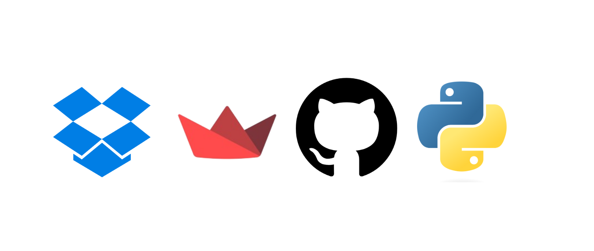
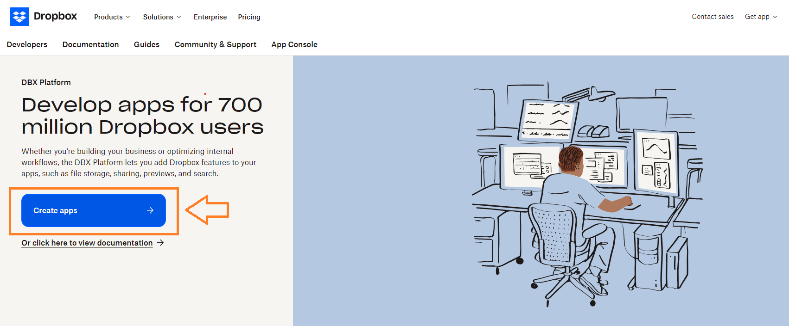
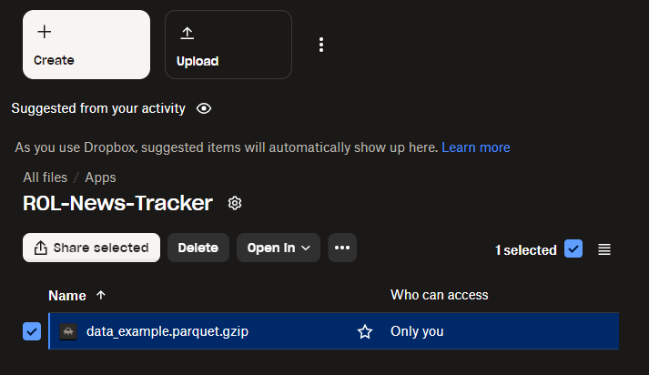
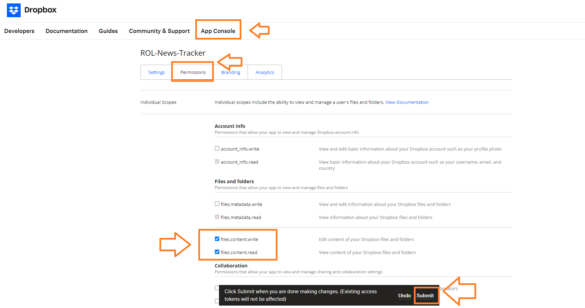
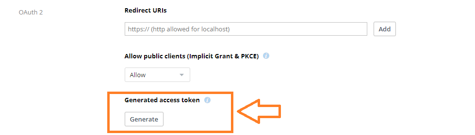
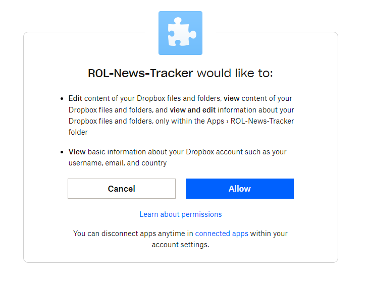
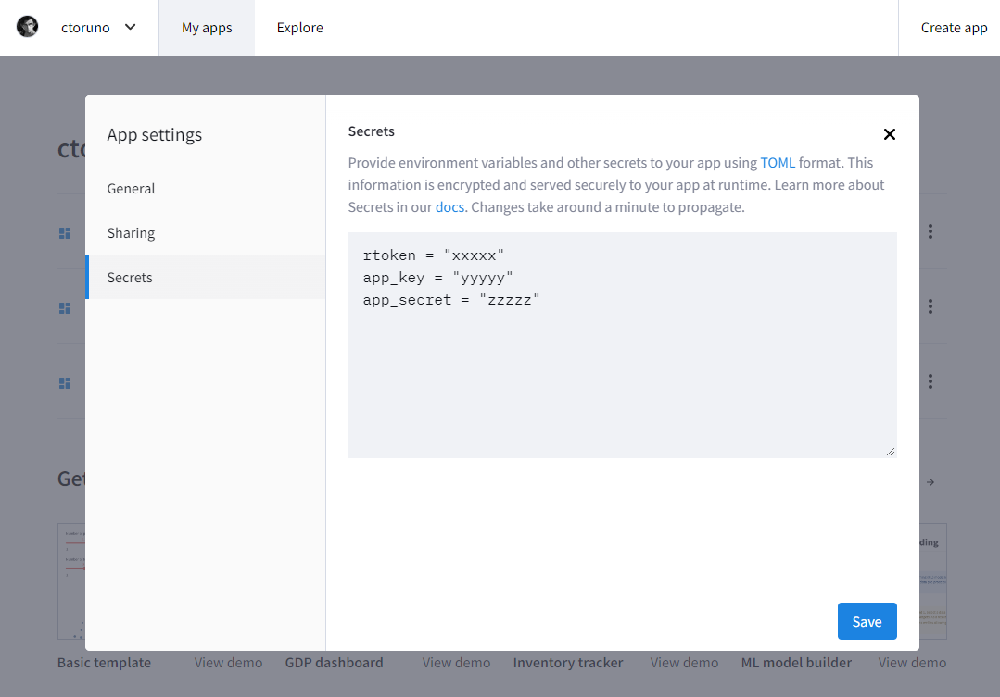

At this point of my professional carreer as a Data Scientist, I just love [Streamlit](https://streamlit.io/). Exactly one eyar ago, I wrote a [blog post about how to build data web apps using Streamlit](https://www.carlos-toruno.com/blog/streamlit/01-intro/). The post was very introductory given that I was just starting to play with the framework. Previously, I have been using Shiny in R and Dash in Python to build my web apps, which you can clearly see on the Dta Projects tab of my website. Nowadays, I have been using Streamlit as a first choice. Why? It's "low-coding" approach makes this framework very easy to learn and use, and because of that, development stage can be really fast. Obviously, if you are looking for frameworks that offer a more mature and flexible development, Django and Flask might be way better options for you. However, sometimes, you just need something very easy to develop a dashboard for your colleagues and not a fully scalable data portal. In these cases, Streamlit has become my to-go option.



In this post, I will be going through how to link your Dropbox account with Streamlit. Why would you like to do this? Several reasons, but I can think on two right now:
- **Web Apps require space on the web**: As storage needs increase, you might need more storage capacity, and depending on the application's complexity and traffic, potentially more powerful server resources as well. Separating the storage from the computing resources is a modern solution to achieve scalability.
- **Sensitive information**: If you are using [Streamlit Cloud](https://streamlit.io/cloud) to deploy your apps online, you need to link your app to a public GitHub repository. This can be a little bit troublesome because you may need to ensure that some data is still only accessible to certain users.

Ok, but why Dropbox? That's a good question. You can definetely use other cloud storage services such as [AWS S3](https://aws.amazon.com/pm/serv-s3/?nc1=h_ls) and [OneDrive] (https://www.microsoft.com/en-us/microsoft-365/onedrive/online-cloud-storage). I'm just using Dropbox as a reference for this post because I found it very easy to implement if you are searching for storage solutions for the first time.

Without further ado, let's start with this endeavor.

## Setting up your Dropbox App

First of all, you will need a Dropbox account. But more importantly, you need to register your account as a developer account. If you already have a Dropbox account, you can just go to [dropbox.com/developers](https://www.dropbox.com/developers) and register your account as a developer, ths will take a few clicks on your side. Once you are registered, you can click on the **CREATE APPS** button. This will allow you to register a specific app to have access to your Dropbox files.



To create an app, you need to define three things:
1. **The type of API**: Dropbox only have a scoped access API, which is all we need.
2. **The type of access**: I don't want the app to have access to ALL my files but rather to a specific folder that will have all the files that the app needs.
3. **The name for your app**: I will name this app as ROL-News-Tracker.

Once you have defined these settings, you can proceed and click in the **CREATE APP** button. If you go to your files manager screen, you will notice that a new directory called `Apps` was created, and inside that directory, a folder with the name of your app is already available. After a few more twiches, our registered app will have access to the content of that folder. You can upload files to this folder as you would normally do when working with Dropbox. For the purposes of this post, I will be working with a data file called `data_example.parquet.gzip`. So I have uploaded the file to my newly created app folder:



As you can see, the file is _ONLY_ accessible by me. I could load the data into my streamlit app through the share link, but that would also allow ANY person with the link to access my data file. And we don't want that, right? The issue at hand right now is, how does Dropbox know that the streamlit app has _MY_ permission to access the files? Great question reader number 3!!! For this, you need to define two additional things.

First, you need to define the specific permissions that your app will have when interacting with your Dropbox. This is called "_Permissions_*. You can set up these permissions from the **APP Console**. In the **Permissions tab**, there is a set of specific permissions for your app. Given that I want my app to be able to access (read) and save (write) files, I will check the following two permissions:
- `files.content.write`
- `files.content.read`

Once you have finished defining your apps, don't forget to click on **SUBMIT** so your changes are saved:



Second, you need to define the method to be used to authenticate your Streamlit app. In oter words, how will Dropbox know that the Streamlit app that is trying to access your files, actually ahve your permission to do so. There are several ways to deal with this. We will start with the easiest one which is through **ACCESS TOKENS**. An access token is a type of credential used to access potected resources. You can see them as keys to open locked vaults. To create a new token, you go to the **Settings tab** in the App Console, you will have to scroll down until you rach the **OAuth 2 section**. There, you will see a **Generate Access Token** button. Once you click it, a new token will be generated for you. Be sure to copy and save it because it will only be shown once.



Be extra careful on how you manage this token. In my case, I will store this token using environmental variables. I have already talked about env variables in my previous blogs. If you are not familiar with this, you can always watch this amazing vide explaining how to use the `python-dotenv` library to handle your API keys:

<iframe width="100%" height="350" src="https://www.youtube.com/embed/CJjSOzb0IYs?si=7kwfjipaNQ5BmArq" title="YouTube video player" frameborder="0" allow="accelerometer; autoplay; clipboard-write; encrypted-media; gyroscope; picture-in-picture; web-share" referrerpolicy="strict-origin-when-cross-origin" allowfullscreen></iframe>

## Using the Dropbox SDK

[Dropbox has an API](https://www.dropbox.com/developers/documentation/http/documentation) that allows you to interact with their platform in a programatic way. The API makes use of endpoints and HTTP calls to facilitate the communciation between your app and their servers. Lucky for us, they also provide multiple Software Development Kits (SDK) for a series of popular programming languages, Python included. If you are wondering what's a Python SDK, they are a series of modules and tools written in the python programming language to simplify the way you interact with a specific API. You can see them as wrappers that simplify the process for you, taking into account the traits and characteristics of the programming language of your choice. We will be using the [offical Dropbox SDK for Python](https://github.com/dropbox/dropbox-sdk-python) to interact with their API.

To install the SDK, you can run the following code from your terminal:
```
$ pip install dropbox
```

Once you have it installed, you can access your Dropbox files by following these steps:
1. Authenticate
2. Create a Dropbox object
3. Locate and read your files

#### How do I authenticate myself?
You remember the access token that I told you to copy and save? Yup, that's how. We start by loading the token into our python environment by making use of the `python-dotenv` library. I have saved my very important and secret token into a `.env` file that is located in the same directory from where I'm running this file.


```python
import os
from dotenv import load_dotenv

# Loading the Access Token as an environmental variable
load_dotenv()
access_token  = os.getenv("atoken")
```

Once we have our access token in our environment, we can use it to load a Dropbox object. The Dropbox object will be our point of contact with the server, also known as _**client**_. With our client up and running, you can use the `files_download()` method to access any file that you want. However, there is a trick, you will need to download and read the files all together. For this, we proceed as follows:


```python
import dropbox
import pandas as pd
from io import BytesIO

# Loading a Dropbox client
dbx = dropbox.Dropbox(access_token)

# Downloading Dropbox files
_, res = dbx.files_download(f"/data_example.parquet.gzip")
data = res.content

# Reading data from files
with BytesIO(data) as file:
    df = pd.read_parquet(file)

```

With this very simple steps, we already have our example data loaded into our python environment. We can take a look a this data now:


```python
df.head(5)
```

<style scoped>
    .dataframe tbody tr th:only-of-type {
        vertical-align: middle;
    }

    .dataframe tbody tr th {
        vertical-align: top;
    }

    .dataframe thead th {
        text-align: right;
    }
</style>
<table>
  <style scoped>
    .dataframe tbody tr th:only-of-type {
        vertical-align: middle;
    }

    .dataframe tbody tr th {
        vertical-align: top;
    }

    .dataframe thead th {
        text-align: right;
    }

    table {
      display: block;
      overflow-x: auto;
      white-space: nowrap;
    }
  </style>
  <thead>
    <tr style="text-align: right;">
      <th></th>
      <th>id</th>
      <th>link</th>
      <th>domain_url</th>
      <th>published_date</th>
      <th>title_trans</th>
      <th>description_trans</th>
      <th>content_trans</th>
      <th>summary</th>
      <th>impact_score</th>
      <th>pillar_1</th>
      <th>pillar_2</th>
      <th>pillar_3</th>
      <th>pillar_4</th>
      <th>pillar_5</th>
      <th>pillar_6</th>
      <th>pillar_7</th>
      <th>pillar_8</th>
      <th>associated_pillar</th>
    </tr>
  </thead>
  <tbody>
    <tr>
      <th>1</th>
      <td>487ae8c2d3057960f9332e34d5d03349</td>
      <td>https://www.delfi.ee/artikkel/120260736/polits...</td>
      <td>delfi.ee</td>
      <td>2024-01-08 14:15:35</td>
      <td>The police arrested a man suspected of a drug ...</td>
      <td>Last week, the police arrested a 51-year-old m...</td>
      <td>Information about possible drug handling in Ko...</td>
      <td>In Kohtla-Järve, a 51-year-old man was arreste...</td>
      <td>5</td>
      <td>1</td>
      <td>1</td>
      <td>0</td>
      <td>0</td>
      <td>1</td>
      <td>0</td>
      <td>0</td>
      <td>1</td>
      <td>Pillar 1</td>
    </tr>
    <tr>
      <th>19</th>
      <td>d32366030eb3fc9e94320d6a697194bb</td>
      <td>https://ekspress.delfi.ee/artikkel/120260132/t...</td>
      <td>delfi.ee</td>
      <td>2024-01-05 13:19:45</td>
      <td>A prison cell greets the former top policeman ...</td>
      <td>The court of first instance decided that the f...</td>
      <td>"Approximately 70 percent of the accusation wa...</td>
      <td>In Estonia, the court sentenced former top pol...</td>
      <td>5</td>
      <td>1</td>
      <td>1</td>
      <td>0</td>
      <td>1</td>
      <td>0</td>
      <td>0</td>
      <td>1</td>
      <td>1</td>
      <td>Pillar 1</td>
    </tr>
    <tr>
      <th>35</th>
      <td>e7196bb7d0856c169c341e08b805c266</td>
      <td>https://maaleht.delfi.ee/artikkel/120257980/da...</td>
      <td>delfi.ee</td>
      <td>2024-01-04 10:06:11</td>
      <td>Dario Andrea Cavegn: Estonian people have the ...</td>
      <td>Companies do not contribute enough in Estonia,...</td>
      <td>The Riigikogu is currently oscillating back an...</td>
      <td>In Estonia, the Riigikogu, the country's parli...</td>
      <td>2</td>
      <td>1</td>
      <td>0</td>
      <td>0</td>
      <td>0</td>
      <td>0</td>
      <td>1</td>
      <td>0</td>
      <td>0</td>
      <td>Pillar 1</td>
    </tr>
    <tr>
      <th>44</th>
      <td>4109a1fddd10197b6ea3620e0f02ed0a</td>
      <td>https://www.delfi.ee/artikkel/120259665/presid...</td>
      <td>delfi.ee</td>
      <td>2024-01-03 16:04:08</td>
      <td>President Karis sent the law related to the vo...</td>
      <td>President Alar Karis sent the law amending the...</td>
      <td>The head of state used the veto on the grounds...</td>
      <td>President Alar Karis of Estonia has sent a law...</td>
      <td>5</td>
      <td>1</td>
      <td>0</td>
      <td>0</td>
      <td>0</td>
      <td>0</td>
      <td>0</td>
      <td>0</td>
      <td>0</td>
      <td>Pillar 1</td>
    </tr>
    <tr>
      <th>62</th>
      <td>881fc1ccf241dd62ffa291138fa03373</td>
      <td>https://www.delfi.ee/artikkel/120259347/eestis...</td>
      <td>delfi.ee</td>
      <td>2024-01-02 14:05:19</td>
      <td>Marriage equality came into force in Estonia. ...</td>
      <td>From January 1 this year, marriage equality ca...</td>
      <td>Veiko Pesur, communications advisor of the Min...</td>
      <td>Estonia has legalized same-sex marriage, becom...</td>
      <td>5</td>
      <td>1</td>
      <td>0</td>
      <td>0</td>
      <td>1</td>
      <td>0</td>
      <td>0</td>
      <td>0</td>
      <td>0</td>
      <td>Pillar 1</td>
    </tr>
  </tbody>
</table>


Subarashii!

That's it? Well, yes, this way you can have access to your files in Dropbox... as long as your access token is valid. And for how long is my token valid? Well, here is the issue, Dropbox' access tokens are only valid for a few hours. That means that if you want to have your streamlit app to have permanent access to your files you will have to do some twitches to this routine. More specifically, you will need to set up a ** Refresh Token**. Refresh tokens allow you to get a new access token every time that you ask for one.

In order to set up a refresh token, you will need to follow a different approach. That only needs to be done once. Therefore, I suggest doing it in a separate python script and not in your Streamlit app script.

- First, you will need to save and store your **APP KEY** and your **APP SECRET**. You can find both of these in the **Settings Tab** in the App Console. You have to be extra careful on how you deal with these values. I will be loading them using a `dotenv` file as well.
- Then, you can use what is known as an OAuth2 Flow process to authenticate yourself. A flow process delegates most of the burden to the service that host the user account, Dropbox in this case. The process will generate an URL where you will have to login into your account and provide access to the app.


```python
from dotenv import load_dotenv
from dropbox import DropboxOAuth2FlowNoRedirect, Dropbox

# Loading the App key/secret as environmental variables
load_dotenv()
app_key    = os.getenv("app_key")
app_secret = os.getenv("app_secret")

# Setting up a OAuth 2 Flow Process
auth_flow = DropboxOAuth2FlowNoRedirect(app_key, app_secret, token_access_type="offline")
authorize_url = auth_flow.start()
print("1. Go to: " + authorize_url)
print("2. Click \"Allow\" (you might have to log in first).")
print("3. Copy the authorization code.")
```

    1. Go to: https://www.dropbox.com/oauth2/authorize?response_type=code&client_id=kelmemq5fhwlx1b&token_access_type=offline
    2. Click "Allow" (you might have to log in first).
    3. Copy the authorization code.
    

- Once that you click on the provided URL, you will first see a **WARNING** message. Do not panic, this is just standard procedure. You can proceed to the next screen where you will have to allow the app to have certain scopes and permissions:



- Once that you have granted your permission, the next screen will show you an **access code**. Copy and save that access code in your python environment so you can finish the authentication process.
- The oauth_result object will have an attribute called `refresh_token`, this is the token that we need for "offline" access to our files. Try to copy and save it in the .env file along side with your App key and secret for your streamlit app.


```python
auth_code = "ACCESS_CODE_HERE"
try:
    oauth_result = auth_flow.finish(auth_code)
except Exception as e:
    print('Error: %s' % (e,))
    exit(1)
oauth_result.refresh_token
```

Once that you have saved your refresh token, we can modify the current routine to access your Dropbox files without having to worry about the duration of our access. The script remains the same. However, you will now have to add an additional step in which you will have to retrieve a freshly generated Access Token _everytime that you start a new session with your streamlit app_:


```python
import os
import json
import requests
import dropbox
import pandas as pd
from io import BytesIO
from dotenv import load_dotenv

# Loading the Access Token as an environmental variable
load_dotenv()
app_key        = os.getenv("app_key")
app_secret     = os.getenv("app_secret")
refresh_token  = os.getenv("rtoken")

# Retrieving an access token for the current session
def retrieve_DBtoken(key, secret, refresh_token):
    """
    This function uses the Dropbox App key/secret and a refresh token to authenticate the app through
    the Dropbox API v2. It returns a freshly generated access token that can be used for the duration
    of the user session.
    """
    
    data = {
        'refresh_token': refresh_token,
        'grant_type': 'refresh_token',
        'client_id': key,
        'client_secret': secret,
    }
    response = requests.post('https://api.dropbox.com/oauth2/token', data = data)
    response_data = json.loads(response.text)
    access_token  = response_data["access_token"]
    return access_token

atoken = retrieve_DBtoken(app_key, app_secret, refresh_token)

# Loading a Dropbox client
dbx = dropbox.Dropbox(access_token)

# Downloading Dropbox files
_, res = dbx.files_download(f"/data_example.parquet.gzip")
data = res.content

# Reading data from files
with BytesIO(data) as file:
    df = pd.read_parquet(file)

# Let's take a look at our data
df.head(5)
```


<style scoped>
    .dataframe tbody tr th:only-of-type {
        vertical-align: middle;
    }

    .dataframe tbody tr th {
        vertical-align: top;
    }

    .dataframe thead th {
        text-align: right;
    }
</style>
<table>
  <style scoped>
    .dataframe tbody tr th:only-of-type {
        vertical-align: middle;
    }

    .dataframe tbody tr th {
        vertical-align: top;
    }

    .dataframe thead th {
        text-align: right;
    }

    table {
      display: block;
      overflow-x: auto;
      white-space: nowrap;
    }
  </style>
  <thead>
    <tr style="text-align: right;">
      <th></th>
      <th>id</th>
      <th>link</th>
      <th>domain_url</th>
      <th>published_date</th>
      <th>title_trans</th>
      <th>description_trans</th>
      <th>content_trans</th>
      <th>summary</th>
      <th>impact_score</th>
      <th>pillar_1</th>
      <th>pillar_2</th>
      <th>pillar_3</th>
      <th>pillar_4</th>
      <th>pillar_5</th>
      <th>pillar_6</th>
      <th>pillar_7</th>
      <th>pillar_8</th>
      <th>associated_pillar</th>
    </tr>
  </thead>
  <tbody>
    <tr>
      <th>1</th>
      <td>487ae8c2d3057960f9332e34d5d03349</td>
      <td>https://www.delfi.ee/artikkel/120260736/polits...</td>
      <td>delfi.ee</td>
      <td>2024-01-08 14:15:35</td>
      <td>The police arrested a man suspected of a drug ...</td>
      <td>Last week, the police arrested a 51-year-old m...</td>
      <td>Information about possible drug handling in Ko...</td>
      <td>In Kohtla-Järve, a 51-year-old man was arreste...</td>
      <td>5</td>
      <td>1</td>
      <td>1</td>
      <td>0</td>
      <td>0</td>
      <td>1</td>
      <td>0</td>
      <td>0</td>
      <td>1</td>
      <td>Pillar 1</td>
    </tr>
    <tr>
      <th>19</th>
      <td>d32366030eb3fc9e94320d6a697194bb</td>
      <td>https://ekspress.delfi.ee/artikkel/120260132/t...</td>
      <td>delfi.ee</td>
      <td>2024-01-05 13:19:45</td>
      <td>A prison cell greets the former top policeman ...</td>
      <td>The court of first instance decided that the f...</td>
      <td>"Approximately 70 percent of the accusation wa...</td>
      <td>In Estonia, the court sentenced former top pol...</td>
      <td>5</td>
      <td>1</td>
      <td>1</td>
      <td>0</td>
      <td>1</td>
      <td>0</td>
      <td>0</td>
      <td>1</td>
      <td>1</td>
      <td>Pillar 1</td>
    </tr>
    <tr>
      <th>35</th>
      <td>e7196bb7d0856c169c341e08b805c266</td>
      <td>https://maaleht.delfi.ee/artikkel/120257980/da...</td>
      <td>delfi.ee</td>
      <td>2024-01-04 10:06:11</td>
      <td>Dario Andrea Cavegn: Estonian people have the ...</td>
      <td>Companies do not contribute enough in Estonia,...</td>
      <td>The Riigikogu is currently oscillating back an...</td>
      <td>In Estonia, the Riigikogu, the country's parli...</td>
      <td>2</td>
      <td>1</td>
      <td>0</td>
      <td>0</td>
      <td>0</td>
      <td>0</td>
      <td>1</td>
      <td>0</td>
      <td>0</td>
      <td>Pillar 1</td>
    </tr>
    <tr>
      <th>44</th>
      <td>4109a1fddd10197b6ea3620e0f02ed0a</td>
      <td>https://www.delfi.ee/artikkel/120259665/presid...</td>
      <td>delfi.ee</td>
      <td>2024-01-03 16:04:08</td>
      <td>President Karis sent the law related to the vo...</td>
      <td>President Alar Karis sent the law amending the...</td>
      <td>The head of state used the veto on the grounds...</td>
      <td>President Alar Karis of Estonia has sent a law...</td>
      <td>5</td>
      <td>1</td>
      <td>0</td>
      <td>0</td>
      <td>0</td>
      <td>0</td>
      <td>0</td>
      <td>0</td>
      <td>0</td>
      <td>Pillar 1</td>
    </tr>
    <tr>
      <th>62</th>
      <td>881fc1ccf241dd62ffa291138fa03373</td>
      <td>https://www.delfi.ee/artikkel/120259347/eestis...</td>
      <td>delfi.ee</td>
      <td>2024-01-02 14:05:19</td>
      <td>Marriage equality came into force in Estonia. ...</td>
      <td>From January 1 this year, marriage equality ca...</td>
      <td>Veiko Pesur, communications advisor of the Min...</td>
      <td>Estonia has legalized same-sex marriage, becom...</td>
      <td>5</td>
      <td>1</td>
      <td>0</td>
      <td>0</td>
      <td>1</td>
      <td>0</td>
      <td>0</td>
      <td>0</td>
      <td>0</td>
      <td>Pillar 1</td>
    </tr>
  </tbody>
</table>


You can incorporate the previous routine to your usual streamlit app. However, loading your secrets through a `.env` file will only work when you run your app locally. Once that you have deployed your app online, you will have to adopt a different approach. If you are using the Streamlit Cloud service, you can define your secrets from the [App Console on Streamlit](https://share.streamlit.io/). You just have to locate the three-dots menu for your app in your console, and click on **Settings**. This will pop-up a window. In the **Secrets** tab, you can input the secrets directly as shown below:



However, this means that you will have to change the way you load your keys in your python script in order to access the information. For this, you can make use of the `streamlit.secrets()` attribute.


```python
import streamlit as st

# Loading the Access Token as an environmental variable
dbtoken  = st.secrets["dbtoken"]
dbkey    = st.secrets["app_key"]
dbsecret = st.secrets["app_secret"]
```

And now, you are ready roll! I'm looking at you Dalia.