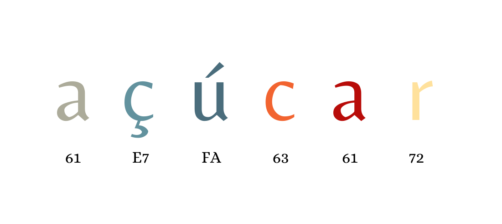
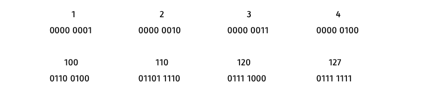
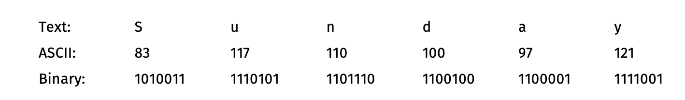
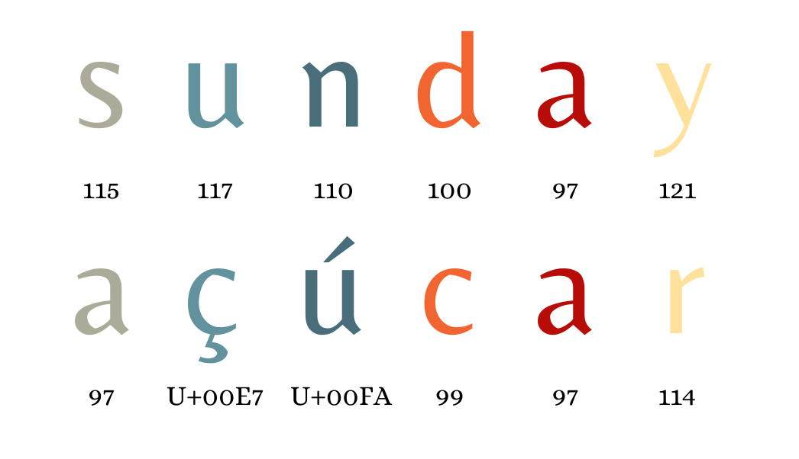
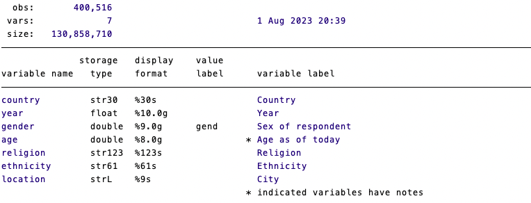
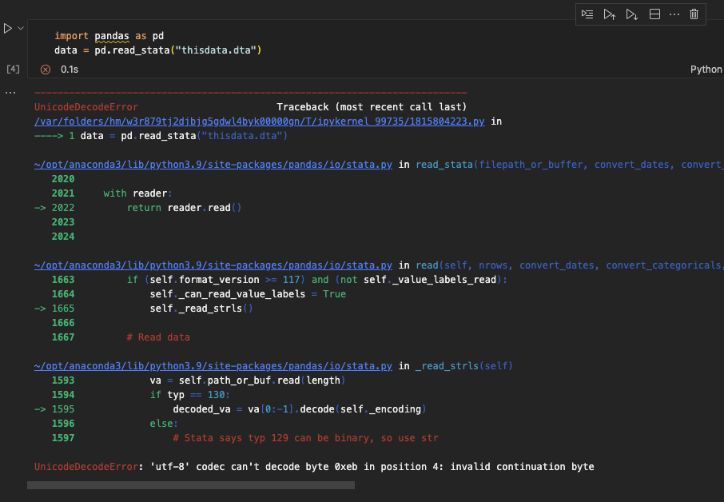
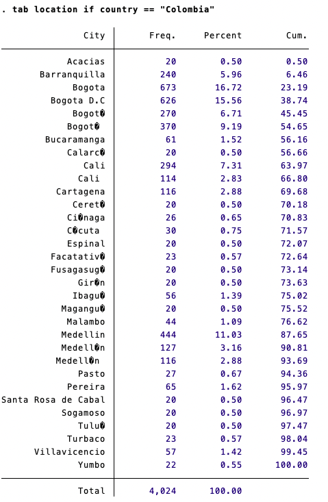

When people hears about data, the first thing that comes to mind are numbers. And most of the time, they are right. However, if you are a Data Scientist like the one I aspire to be, you would know by now that data comes in many shapes and colors. Data can come in the form of an image (think on rasters in Geographic Systems), or a collection of audio files (acoustic records) or, to spice things up, data can also come in the form of a collection of texts (like tweets). However, working with text can be a little bit tricky if you are not careful. 

Working with numeric data is quite straigthforward. I'm 99 percent sure you are not counting profits with roman numbers, plotting charts with [mayan numerals](https://en.wikipedia.org/wiki/Maya_numerals) or writing formulas in excel using the [sinhala numeric system](https://en.wikipedia.org/wiki/Sinhala_numerals). I mean, you could, but we have reached a global consensus on using our beloved hindu-arabic decimal system for numeric data (most of time). However, working with textual data is a bit more complex because we are very much attached to communicate and name things in our mother tongue and, due to the beautiful diversity of human languages and alphabet systems, this can actually be a mess. I mean, just look at my last name: "Toruño". You have no idea of how many times I have seen my name printed as "Carlos Toruño". At some point, during my high school years (I was a nerd), I started wondering why was always printed with the same exact mistake. Why always "ñ" instead of "ñ"? And this, my dear three readers, was the first time I heard about **Character Encoding**. And the truth is, if you are working with textual data, you should know about them as well. There are two articles that I would always suggest people to read and their titles are quite suggesstive about this being a compulsory rather than an optional reading:

1. [What Every Programmer Absolutely, Positively Needs To Know About Encodings And Character Sets To Work With Text](https://kunststube.net/encoding/)
2. [The Absolute Minimum Every Software Developer Absolutely, Positively Must Know About Unicode and Character Sets (No Excuses!)](https://www.joelonsoftware.com/2003/10/08/the-absolute-minimum-every-software-developer-absolutely-positively-must-know-about-unicode-and-character-sets-no-excuses/)

Once, I read that "_When you’ve written the same code 3 times, write a function. When you’ve given the same in-person advice 3 times, write a blog post_". Well, given that this blog is my personal after-office diary, in this post I will be explaining a bit about character encodings and the impact that this can have on data wrangling, analysis and visualization of text data if not handled properly.

<blockquote class="twitter-tweet">
When you’ve written the same code 3 times, write a function  When you’ve given the same in-person advice 3 times, write a blog post
&mdash; David Robinson (@drob) <a href="https://twitter.com/drob/status/928447584712253440?ref_src=twsrc%5Etfw">November 9, 2017</a></blockquote> 

## A little bit of background

The two articles that I cited before can give you a way better overview of the problem and its historical roots. But in case you want the TL;DR version, here I can give you a summary. 

Let's start with the basics. Computers have their own language to read (and even understand) human characters. You might be thinking on how Neo saw the world in The Matrix, which is not too far from the truth actually. Text characters are read by computers in bits (zeros and ones)... so yes, all data types are just numbers in the very raw state of things but that's not the purpose of this blog post. Now, back to the point. If you only have 1s and 0s to identify characters, you need a kind of system to translate a sequence of binary numbers into text. This is the role of **character encoding sets**. As their name suggest, these encoding sets are just a collection of rules on how to encode graphical characters into a binary sequence. In other words, a dictionary between the human and the computer way of seeing the characters. 

Back in the good old days, the American Standard Code for Information Interchange system, or most commonly known as **ASCII**, was the golden rule for encoding text characters. ASCII uses binary sequences (bytes) to build a unique code (or code point) for each character. When the ASCII system was being developed, most computers were running on a 8-bits architecture. What does this mean? Well, imagine that your mother tongue is binary and you only have zeros and ones to form your words. Where does one word ends and another one begins? You need to set a rule where everybody understands that, after every fixed number of digits (in this case 8), you have another "_word_". So, in a 8-bits architecture, how many "_words_" (code points) can you have? A very limited number. More specifically, you could only form 127 code points with 8-bits sequences (_The last bit/digit was reserved for computational processes, it's a long story, read the articles_).

Due to the limited number of codes you could have within a 8-bits architecture, the ASCII system only encoded characters from the English alphabet. You can check the full encoding table of all the 127 ASCII graphemes in [this website](https://www.asciitable.com/).

As an example, the word Sunday has six text characters (or graphemes): S-u-n-d-a-y. According to the table, the upper case letter-S is coded as 83 (decimal notation). And how do you express 83 in binary? Exactly, as 1010011. This was the dictionary that allowed humans and computers to communicate. See the image below to see the equivalences.

As soon as the computational capacity started to increase, people around the world started to add more and more code points on top of the ASCII system. In theory, this was cool, but the problem was that everyone started doing it at the same time all around the world. As a result, we ended up with a whole bunch of systems in which the first 127 characters were always the same and equivalent to the original ASCII, but from code point 128th onwards, that was carnival of all sorts.

All these systems became to be known as Extended ASCII. As an example, code point 215 in the CP00860 Portuguese system was equivalent to character "τ", but that same code point was equivalent to character "ﻫ" in the CP00864 Arabic system. What a mess, right? Nonetheless, it used to work quite well because most computers within the same country were using the same encoding system. So everything was fine... until the internet came. 

Nowadays you can receive a document from Sweeden in a matter of seconds, regardless of where you are. So just try to imagine the confussion that people had whenever they shared word documents with different encoding systems across the globe. This is when Unicode was born.

## Unicode: one ring to rule them all

At some point, a group of people got tired of the mess of having all these different encoding systems and they decided to create a new system that would standardize all the available text characters introduced by previous systems. As they would highligh in [their website](https://unicode.org/standard/WhatIsUnicode.html):

> _Unicode provides a unique number for every character, 
> no matter what the platform, 
> no matter what the program, 
> no matter what the language._

Despite of its benefits, Unicode didn't have a warm welcoming to the digital world. You see, when UNICODE started to standardize all these characters across human languages and systems, the world (and specifically the USA) got used to their default extended ASCII systems. Programs were not able to recognize these new code points defined by the UNICODE Standard. So they were facing the typical QWERTY problem. QWERTY problem you say?

Most of the keyboards on this part of the globe use the QWERTY keyboard. However, this is not the most efficient keyboard layout. The layout was first introduced in the Sholes & Glidden Type-Writer back in 1874. According to [Yasuoka & Yasuoka](https://repository.kulib.kyoto-u.ac.jp/dspace/bitstream/2433/139379/1/42_161.pdf), the layout was designed to facilitate the transcription of messages in Morse code by telegraph operators by leaving  letters that are often confused for one another close to each other. This is a quite interesting piece of history but, why havent we changed it? We don't use type-writers or morse code, at lest not as commonly as it was 100 years ago. The answer, __inertia__. The cost of leaving a well stablished tradition such as the QWERTY keyboard is so high, that changing it is almost impossible. Something like that could have happen to our dear UNICODE Standard.

The brilliant idea was to leave the core 127 ASCII characters with their original encoding, so programs reading UNICODE could read them without any issue even if their source encoding was not unicode. But everything above the 127th code point had a standardized code, expressed in hex notation with "U+" as a prefix. This way, people using the English alphabet (which was and still is the dominant alphabet in the tech world) didn't noticed the change. You can check the individual character encodings in the [official website](https://home.unicode.org/).

In the previous example, the word _s-u-n-d-a-y_ will still be encoded the same way as it was in the ASCII system. But if we take a different word such as the portuguese "açúcar" (sugar) then you will start noticing the differences (see the image below). Programs running on Unicode are able to read the first core ASCII characters in either decimal or U+hex notation. But any special character not included in the core ASCII will need to be encoded using the U+hex notation.

This was my best attempt to introduce you to character encoding systems. If you would like to review everything, you can finally read the articles I suggested you or you can also watch this short video explaining everything in a very cool way:

<iframe width="100%" height="315" src="https://www.youtube.com/embed/ut74oHojxqo?si=KfDd63QWg_YxR8X-" title="YouTube video player" frameborder="0" allow="accelerometer; autoplay; clipboard-write; encrypted-media; gyroscope; picture-in-picture; web-share" allowfullscreen></iframe>

## Why are we talking about this again?

Good question. Despite the great efforts that the Unicode Consortium has made in convincing the world that standards such as UTF-8 are indeed better for the whole word, the reality is that not everyone is using it and, what is even worse, many people is not even aware of it.

Try to imagine the following scenario. You have managed to collect data all around the world, from more than a hundred countries spreading over a decade. Every country-yea is a separate dataset. Now, given that the data is "_comparable_", you merge all these files together into a master dataset [angels singing inthe background]. After the great deal of work, you save this data as a STATA file and you name it "thisData.dta" and you are confident that your naming skills are improving. The final data looks like this:

 

Everything is fine. But then, your boss asks you to do a very simple task. We now need to geocode every single observation. If you are wondering what geocoding is, you can check this [post](https://www.carlos-toruno.com/blog/geocoding/). You are aware that Stata is not your best friend for dealing with GIS and APIs, so you decide to switch to Python and open the data using [Pandas](https://pandas.pydata.org/). Surprise!! you got your first **RED FLAG!!**. As you can read from the Python console, there is a decoding error that is not allowing you to even read the data. **UNICODE DECODE ERROR**.

 

You decide to go back to STATA and take a look at the data and you realize that there is a bunch of weird characters when you take a look at the cities:

 

Not bueno. This is actually known as "[_Mojibake_](https://en.wikipedia.org/wiki/Mojibake)" and it is the result of forcing a character to be read in the wrong encoding system. I have bad news for you, the geocoding task, is not gonna be as easy as you thought because the most common APIs for georeferencing data such as Google Maps and Open Street Maps won't be able to accurately target the location if the inputed strings have Mojibake. Actually, any kind of text processing technique that you would like to apply, such stemming and tokenization, will fail.

 There are three possible ways of dealing with this issue:

1. If you have access to he original datasets and their encodings, I would suggest you to construct your merged file again but first translate every single dataset into unicode before merging everything together. You **will have to declare** the source encoding system and the target system UTF-8.

    * In R, the [iconv](https://www.rdocumentation.org/packages/base/versions/3.6.2/topics/iconv) function allows you to transform every vector.
    * In Python, you can use the [codecs module](https://docs.python.org/3/library/codecs.html) to encode and decode between systems.
    * Since Stata 14, you can use the [unicode translate](https://www.stata.com/manuals/dunicodetranslate.pdf) command to transform the whole file from one encoding to another.

2. If you don't have access to the original encoding of the data, you can use some algorythms to try to guess the source encoding.

    * In R, you can use the [guess_encoding() function](https://readr.tidyverse.org/reference/encoding.html) from the [reader package](https://readr.tidyverse.org/index.html).
    * In Python, I would suggest you to try the [chardet library](https://chardet.readthedocs.io/en/latest/index.html).
    * Stata also provides a unicode analyze function that will analyze if the file is encoded using the unicode standard but it is not an auto-detection tool per se.

3. In the worst case scenario, you can just start replacing Mojibakes in a manual way if you know for sure their correct values. Depending on the complexity of your data, this can be straightforward (unlikely) or the new Mission Impossible film.

Tschüss!!