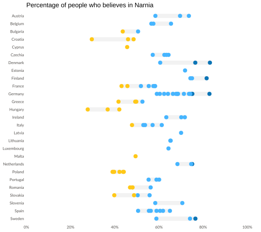
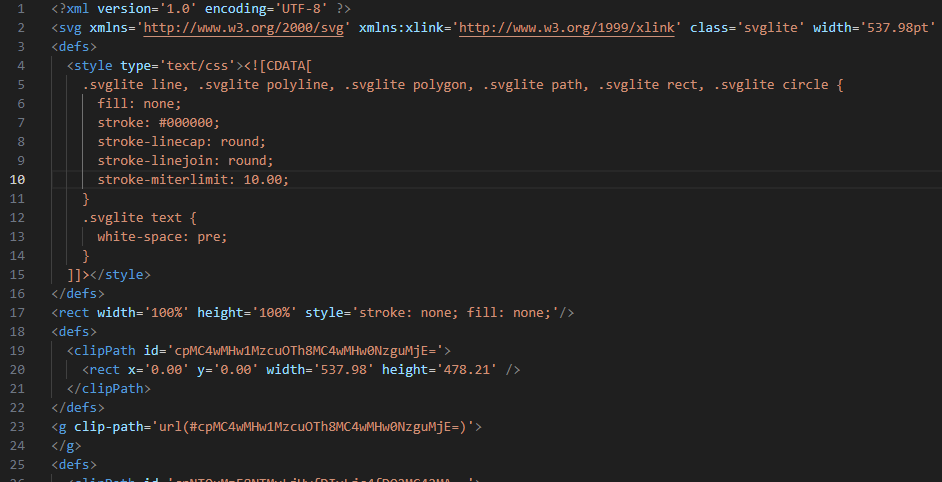
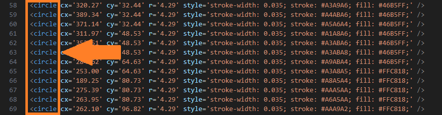

Creating data visualizations can be quite the challenge. You need to understand your data, get creative with the design (and maybe even some story-telling), have the technical skills to bring it all together, and adapt it to your audience. In [one of my first blog posts](https://www.carlos-toruno.com/blog/data-viz-process/), I shared my process for making data visualizations, including some thoughts on the use of static vs interactive charts. The thing is, creating data visualizations is more than just displaying numbers or text, you need to think on ways to allow your audience to engage with your data. Today, I want to share a little hack I came up with in order to blend static and interactive charts into a single outcome. Why would I ever want todo this? Well, interactive dashboards require of a server back-end that will do some computation after receiving inputs from the user. Sometimes, you do not need such capacity, instead, very simple and basic animations would be more than enough to facilitate a better understanding of the data. I’m calling this "Project Tooltips." Stick around, and I’ll show you what it's all about! I promise no popcorn, but at least (!!! spoiler alert!!!) you will learn how to add interactive tooltips to static charts without needing that C++, Java, or Python server behind the courtains.


## The problem at hand
So, back in my office, we have been producing these graphic reports that consist on very simple documents that heavily rely on the use of data visualizations to deliver messages from the data that we collect in our public opinion polls. Take this report on the [Rule of Law in Peru 2022](https://worldjusticeproject.org/our-work/research-and-data/rule-of-law/peru-2022) as an example. After a brief section on the Executive Findings, we go heavy metal mode shooting chart after chart to the reader. One of the bright innovations that we have been applying to the latest reports is on switching the primary outcome from printed PDFs to _scroll-down-until-you-get-bored_ web versions. Personally, I love the idea. Nowadays, we produce a web and printed version of the report using HyperText Markup Language (HTML) and Cascading Style Sheets (CSS).

So far, in order to have harmony between the printed and web version of the report, we have opted for producing purely static visualizations. At the end of the day, when you are looking at a single country over time or comparing the latest data between a limited set of countries, the need for interactivity is a _nice-to-have_ more than a need. Since the beginning, we have been producing our data visualizations as **Scalable Vector Graphics (SVG)** rather than using raster-based formats such as the popular PNGs or JPGs. Why? Vector-based formats are more suitable for editing and they are also more suitable for the web. I won't go into detail about the difference between vector and raster formats (my GIS professor from grad school would be disappointed), but I would suggest you to watch the video bellow if you are insterested. Trust me, the use of SVGs is key for what we are trying to achieve.

<iframe width="100%" height="345" src="https://www.youtube.com/embed/VEi_BU2FqQw?si=_3OVCVTaLCSijmap" title="YouTube video player" frameborder="0" allow="accelerometer; autoplay; clipboard-write; encrypted-media; gyroscope; picture-in-picture; web-share" referrerpolicy="strict-origin-when-cross-origin" allowfullscreen></iframe>

Now, if you have been following my blog for the past months, you will know that we are working with data for the European Union. That's 27 countries, first strike. To add a little bit more of spice, we have some subnational data that spawns over 100 regions. At this point, interactivity becomes a _must_ rather than a _nice-to-have_. Take the following (fictional data) on the percentage of people in the EU that believes in Narnia:



In the chart above, each circle represents a region from each country. The chart looks great, simple, and aesthetic. What's the problem? There was no way for you to know what each circle meant without me explaining it. More importantly, even if I placed a text explaining that in the chart, you have no idea to know what is the exact percentage for what specific region. We could come up with some static solution as adding some text boxes. However, adding over 100 text boxes might be challenging and it will extremely reduce the aesthetic of the chart. I consider myself a minimalist after all. But just for the sake of chaos, here you have a visual of how 100 text boxes would look like:


Beautiful chaos. 

Now, we could insert an interactive chart from Tableu, some R Shiny, or a Python Plotly as HTML widgets into our report. But these solutions require a lot of work. Obviously, once that they are implemented, they bring even more features to the table. However, if you think about it, we just need the text boxes to show up only when their respective data point is hoovered by the reader. That very basic feature would solved the whole puzzle. Now, Carlos, how can we do this?

## The true potential of vector images
If you watched the video that I shared above, you might have heard that one advantage of using SVGs is that you can add interactivity features to it through CSS or JavaScript. How is this possible? Well, SVG are written using Extensible Markup Language (XML). If you think that XML sounds very much like HTML is because both are Markup Languages, though they have slightly different features and purposes. In fact, if you open an SVG and an HTML file side by side in a text editor, you'll see they look quite similar due to their tree-based, parent-child, tagging structure.



When a website has a SVG image, the browser processes the SVG file by parsing its XML tree structure and renders the image in real time. Because of this, we should be able to insert some JavaScript into the XML tree of the SVG to add some interactivity. Why does it has to be JavaScript? Because JavaScript is the language of the web. It is the only programming language that is natively supported by all web browsers for client-side scripting. This means that JavaScript can run directly within any browser without the need for any additional plugins or interpreters. And that is exactly what we are going to do.

## A two-steps solution
I made a great effort to expose the problem and the logic behind the solution. Now, I will be explaining a step-by-step on how to achieve a more elegant and stand-alone solution for the example above. In a nutshell, we will be working on two fronts. First, we are going to produce our chart again. But this time, we will add some "_special_" aesthetics to help us identify the elements (circles and text boxes) in the XML tree. Once we have our caffeinated over-labeled chart, we will use the `lxml` python library to navigate through the XML tree. We will be adding/moving elements around the tree while also modifying their attributes. Therefore, it is highly important that you know the basics of XML and how it works. If you are familiar with HTML or you have been following my webscraping posts, you will have no issues at getting the grasp of how a XML tree works. If not, I would suggest you to watch the following video:

<iframe width="100%" height="345" src="https://www.youtube.com/embed/KeLiQXqVgMI?si=syGhpZG-RiF3IX_F" title="YouTube video player" frameborder="0" allow="accelerometer; autoplay; clipboard-write; encrypted-media; gyroscope; picture-in-picture; web-share" referrerpolicy="strict-origin-when-cross-origin" allowfullscreen></iframe>

### Re-drawing the chart
The chart that I shared above is a type of categorical scatterplot, it was drawn using the `ggplot` library in R, but you can use any other tool at hand to produce the base SVG (matplotlib, seaborn, plots.jl). If we inspect the SVG file using a text editor such as VSCode, we will see that the XML tree contains elements such as lines, circles, and paths:



The XML tree has exactly **27 line elements**, one for each country denoting the bars that connect the circles, and around **110 circle elements**, one for each subnational region. All of these elements are sorted in the same way that they were passed to the ggplot function when the chart was drawn. Because the data frame was alphabetically sorted first by country and then by region ID, the first line element belongs to Austria, the second one to Belgium, and so on until reaching Sweden. Under the same logic, the first circle belongs to the Austria's AT1 region, the second one to Austria's AT2 region, and so on until reaching Sweden's SE3 region. Until here, everything seems quite straightforward and we only need to be careful on how the data is sorted when passing it to the plotting function.

The problem resides when we try to locate the tooltips (text boxes). There is one per region, so, you might think that we will have the same amount of circle elements. Sadly, we don't. The tooltips are plotted using polygons and path elements. We do have around 110 polygon elements corresponding to each one of the boxes. However, we have around **3,600 path elements**. Crazy, right? Well, as it happens, each path element corresponds to a single letter inside the tooltips. Given that the tooltips contain information such as the region names, the amount of path elements for each tooltip will differ from each other.

We could rely on the order in which everything is plotted to identify elements and to which region or country every line, circle, and path belongs to. But if you ask me, I would prefer to have some sort of ID on these elements so we can reduce the margin for error in our charts. Sadly, this is not as straightforward as I would like it to be. Most plotting libraries do not care about identifying elements once that the chart is saved as a SVG. Therefore, I had to rely on a handy trick for this. Let's go back and explore the content of one of our circle elements:

```{xml}
<circle cx='284.62' cy='64.63' r='4.29' style='stroke-width: 0.035; stroke: #A6A6A6; fill: #46B5FF;' />
```

Every circle element has four attributes: cx and cy are the circle coordinates, r refers to the radius of the circle, and the we have the style attributes that contain information on the aesthetics. Inside the style attributes, we have a color code for filling the circle "#46B5FF" and another for the thin border around the circle "#A6A6A6". The fill color will depend on the value that we are plotting, for our case example this is the percentage of respondents that believe that Narnia is real. However, the border is arbitrary and fixed for all the circles. The key is to use this style attribute to identify to which specific region each circle and path element belongs to without having to rely on how the data was sorted.

To achieve this, I generated a set of 110 unique colors for each region. This set consists of 110 slight variations of the “#A6A6A6” color. While each variation has a unique color code, the differences are so subtle that they are almost imperceptible to the human eye. Additionally, I created a second set of unique colors for the tooltips, with slight variations of the dark grey “#1E212B” color. Here is the code I used to produce these color sets:


```python
import random

# Base color
base_color = (166, 166, 166)  # RGB equivalent of #A6A6A6

# Function to create slight variations of the base color
def generate_similar_colors(base_color, n, variation=5):
    colors = set()
    while len(colors) < n:
        new_color = (
            min(max(base_color[0] + random.randint(-variation, variation), 0), 255),
            min(max(base_color[1] + random.randint(-variation, variation), 0), 255),
            min(max(base_color[2] + random.randint(-variation, variation), 0), 255),
        )
        hex_color = "#{:02X}{:02X}{:02X}".format(*new_color)
        colors.add(hex_color) 
    return list(colors)

# Generate 120 unique colors
unique_colors = generate_similar_colors(base_color, 120)
```

Once that we have our two sets of unique colors for the circle borders and the tooltips, we can incorporate them into our ggplot routine. For the purposes of this post, I won't go over how I generated the ggplot. However, you can find the code for the resulting plot in [this GitHub repo](https://github.com/WJP-DAU/eu-thematic-reports/blob/main/data-viz/code/EUDumbell.R).

If we inspect the circle elements, they would look like this:
```{xml}
<circle cx='352.51' cy='48.53' r='4.29' style='stroke-width: 0.035; stroke: #A3ABA6; fill: #46B5FF;' />
``` 

This circle element has the stroke color "#A3ABA6" which we have assigned to BE2 Flemish Region in Belgium following the table bellow:


```python
import pandas as pd

region_colors = pd.read_excel("region_labels.xlsx")
region_colors
```


<div>
<style scoped>
    .dataframe tbody tr th:only-of-type {
        vertical-align: middle;
    }

    .dataframe tbody tr th {
        vertical-align: top;
    }

    .dataframe thead th {
        text-align: right;
    }
</style>
<table border="1" class="dataframe">
  <thead>
    <tr style="text-align: right;">
      <th></th>
      <th>country</th>
      <th>region_id</th>
      <th>region_name</th>
      <th>border_color</th>
      <th>label_color</th>
    </tr>
  </thead>
  <tbody>
    <tr>
      <th>0</th>
      <td>Austria</td>
      <td>AT1</td>
      <td>East Austria</td>
      <td>#A3A9A6</td>
      <td>#21222E</td>
    </tr>
    <tr>
      <th>1</th>
      <td>Austria</td>
      <td>AT2</td>
      <td>South Austria</td>
      <td>#A4ABA6</td>
      <td>#221E30</td>
    </tr>
    <tr>
      <th>2</th>
      <td>Austria</td>
      <td>AT3</td>
      <td>West Austria</td>
      <td>#A5A6A4</td>
      <td>#1A1C2F</td>
    </tr>
    <tr>
      <th>3</th>
      <td>Belgium</td>
      <td>BE1</td>
      <td>Brussels Region</td>
      <td>#A1A8A6</td>
      <td>#1A212B</td>
    </tr>
    <tr>
      <th>4</th>
      <td>Belgium</td>
      <td>BE2</td>
      <td>Flemish Region</td>
      <td>#A3ABA6</td>
      <td>#23222C</td>
    </tr>
    <tr>
      <th>...</th>
      <td>...</td>
      <td>...</td>
      <td>...</td>
      <td>...</td>
      <td>...</td>
    </tr>
    <tr>
      <th>105</th>
      <td>Spain</td>
      <td>ES3</td>
      <td>Madrid</td>
      <td>#A6ABA2</td>
      <td>#1C2328</td>
    </tr>
    <tr>
      <th>106</th>
      <td>Spain</td>
      <td>ES7</td>
      <td>Canary Islands</td>
      <td>#A1A1A5</td>
      <td>#1E1C2F</td>
    </tr>
    <tr>
      <th>107</th>
      <td>Sweden</td>
      <td>SE1</td>
      <td>Eastern Sweden</td>
      <td>#A9A2A7</td>
      <td>#1B1D26</td>
    </tr>
    <tr>
      <th>108</th>
      <td>Sweden</td>
      <td>SE2</td>
      <td>Southern Sweden</td>
      <td>#AAA4A1</td>
      <td>#1E202D</td>
    </tr>
    <tr>
      <th>109</th>
      <td>Sweden</td>
      <td>SE3</td>
      <td>Northern Sweden</td>
      <td>#A8A9A9</td>
      <td>#1C2529</td>
    </tr>
  </tbody>
</table>
<p>110 rows × 5 columns</p>
</div>


### Modifying the XML tree
Once that we have a SVG in which we can use the stroke/fill color to identify to which region each circle, path, and polygon element belongs to, we can proceed to read the image in Python. We can do this by using the [lxml library](https://lxml.de/). I prefer the `lxml` library above the native `xml` because it has more flexible functions when it comes to identify parent tags, which makes things easier for us.


```python
from lxml import etree as ET

# Reading the SVG file
tree = ET.parse("example_2.svg")
root = tree.getroot()
root.set("onload", "init(event)")

# Register namespaces to handle the SVG namespace properly (lxml)
namespaces = {
    'svg'  : 'http://www.w3.org/2000/svg', 
    'xlink': 'http://www.w3.org/1999/xlink'
}

for prefix, uri in namespaces.items():
    ET.register_namespace(prefix, uri)

# We create dictionaries for the unique colors
region_borders = dict(zip(region_colors["region_id"], region_colors["border_color"]))
region_labels  = dict(zip(region_colors["region_id"], region_colors["label_color"]))
```

The first modification will be to create a new ID attribute for the circle elements using the `region_id` as a unique identifier. For this, we will have to loop over regions and then over all the elements that have a style attribute, trying to find the circle element that matches each subnational region. Once we find a match, we can assign a new ID attribute through the `set()` method.


```python
for nuts, color_code in region_borders.items():
    for element in root.xpath(".//*[@style]", namespaces = namespaces):
        if color_code in element.attrib["style"]:
            element.set("id", f"{nuts}_circle")
```

We proceed with a similar approach with the tooltips. However, given that the tooltips have multiple elements associated, it is easier if we first create a **regional** (g) element that will have all the associated polygons and paths within. In other words, we will create "_bags_" to group all the associated elements together. We do this "_bagging_" because it is easier to target a single bag than targeting multiple elements when asking the tooltips to appear and disappear.


```python
for nuts, color_code in region_labels.items():

    # The tooltips have multiple elements associated. Therefore, it is easier if we first create a <g> element that will
    # have all the associated polygons within:
    nuts_group = ET.Element("g", id = f"{nuts}_tooltip")

    first_found = False  
    for element in root.xpath(".//*[@style]", namespaces = namespaces):

        if color_code in element.attrib["style"]:
            
            # We find the parent and remove the matched element from it
            original_parent = element.getparent()
            original_parent.remove(element)

            # To proceed, we need the NUTS GROUP element to be already present in the XML tree to add all the associated polygons there.
            # We just need to do this once:
            if not first_found:
                original_parent.append(nuts_group)
                first_found = True

            # We find the NUTS GROUP element and add the matched element to it
            nuts_group_element = original_parent.find(f".//g[@id='{nuts}_tooltip']")
            nuts_group_element.append(element)
```

Once that we have all the path elements packed together in regional bags, we proceed to hide them by default. Take into account that some elements might not be present in the data due to imputations:


```python
# Hide tooltips by default
for nuts in region_colors["region_id"].to_list():
    tooltip = root.find(f".//g[@id='{nuts}_tooltip']")
    if tooltip:
        tooltip.set("visibility", "hidden")
    else:
        print(f"{nuts}_tooltip not found!!!")
```
    

Now, we add some trigger events as `onmouseover` and `onmouseout` attributes. The idea is that every time that the user hoovers over a circle, the visibility attribute of its respective tooltip will be modified to "visible" and then set back to "hidden" when the mouse leaves the circle area. Please note that the events will be defined as JavaScript functions within a **script** tag at the end of the XML tree.


```python
# Assign onmouseover and onmouseout callbacks to patches.
for nuts in region_colors["region_id"].to_list():
    circle = root.xpath(f"//svg:circle[@id='{nuts}_circle']", namespaces=namespaces)
    if circle:
        circle[0].set("onmouseover", "ShowTooltip(this)")
        circle[0].set("onmouseout", "HideTooltip(this)")
    else:
        print(f"{nuts}_circle not found!!!")

# We need a JS that can modify the visibility attributes of the tooltips
script = """
    <script type="text/ecmascript">
    <![CDATA[

    function init(event) {
        if ( window.svgDocument == null ) {
            svgDocument = event.target.ownerDocument;
            }
        }

    function ShowTooltip(obj) {
        var cur = obj.id.split("_")[0];
        var tip = svgDocument.getElementById(cur + '_tooltip');
        tip.setAttribute('visibility', "visible")
        }

    function HideTooltip(obj) {
        var cur = obj.id.split("_")[0];
        var tip = svgDocument.getElementById(cur + '_tooltip');
        tip.setAttribute('visibility', "hidden")
        }

    ]]>
    </script>
    """

# Insert the script at the bottom of the file and save it.
script_element = ET.fromstring(script)
root.append(script_element)
```

Finally, we proceed to save the SVG as a new file:


```python
# Write the modified tree to a new file
tree.write('example_with_tooltips.svg', xml_declaration=True, encoding='utf-8')
```

At the end, we should end up with a chart with interactive tooltips as follows:
<object type="image/svg+xml" data="example_with_tooltips.svg" width="100%"></object>