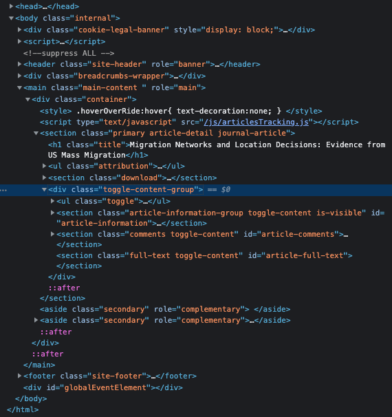

# A very brief introduction to Web Scrapping

As a data analyst and an economist, there are times in which you would
have to go out of your comfort zone and search for the data needed for
your research or analysis. Nowadays, there is no better data pool than
the internet. You have an inmensive ocean of information at your
disposal and the digital world in which we live makes it possible to
access certain data in a single click. However, the amount of
information that is compiled and organize in a way for you to use is
just a small fraction of all the information available out there.
Therefore, for some research questions, it is necessary to use
alternative tools to gather and compile this information. One of such
tools (or group opf tools) are the ones we usually label as **Web
Scraping**. In this series of articles, I will cover the basics of
webscraping and how to apply it using some of the Python libraries
available.

## What is Web Scraping?

In a nutshell, Web Scraping is the process in which we collect
information from the web with the objective to export it as an organized
data structure that would fit our needs. Under this definition, manual
processes of coping and pasting the information from the web would be
considered as web scraping. However, given the complexity and, most
importantly, the huge volumes of the information that we would usually
like to extract, web scraping is most likely to be done in an automatic
fashion. For this, it is common to program an automatic web scrapper
using any of the programming languages available like Python, R or
JavaScript.

There are some cases in which the websites allow to access their data
throught an Application Programming Interface or, most commmonly refer
to, as API. An API is a set of definitions and protocols that allow the
communication between two software applications through a set of
previously defined rules. In our specific case, a formal communication
channel between our "*scrapper*" and the website's server to
automatically download their data. This process is the fastest way to
access the data on the internet. Nevertheless, this is not always the
case and sometimes we will have to program our own "*bot*" to scrap the
information we want. Consider the crawler and scraper bots as the last
resource to achieve your goals.

## Is Web Scraping legal?

Due to the increasing popularity and use of webscraping, along with some
legal cases, many people asks: *Is web scraping legal?* In reality, this
question might be difficult to access and it would depend on the
geographical/institutional/legal grounds where it is asked and, most
importantly, I'm no lawyer at all. However, there is a few point that we
should always take into account.

For example, what kind of data are we extracting from the web? It is
important that we make sure that we are extracting **Publicly Available
Data**. Information is considered publicly available when...

-   The user has made the data public
-   No account or login information is required to access the data
-   The robots.txt file does not prohibit the extraction of the
    information we are targeting.

PromptCloud.com has a straighforward article on [how to read and respect
robots.txt
files](https://www.promptcloud.com/blog/how-to-read-and-respect-robots-file/).
For more information about the legality of web scraping, you can check
[this video](https://www.youtube.com/watch?v=tcMdWM8wmqs&t=65s) from
ParseHub.

## How does Web Scraping works?

As we mentioned before, Web Scrappoing is the process of extracting
information from the web. However, in order to extract it, you would
first have to search for this data even within a single website.
Therefore, we usually talk about making use of a web crawler and a web
scraper.

As explained in [this
article](https://www.zyte.com/learn/what-is-web-scraping/) by Zyte.com,

> A web crawler, which we generally call a "spider," is an artificial
> intelligence that browses the internet to index and search for content
> by following links and exploring websites.

On the other hand,

> A web scraper is a specialized tool designed to accurately and quickly
> extract data from a web page.

In other words, while the crawler targets URLs to pass to the scraper,
the scraper makes use of tools such as XPaths, CSS selectors and/or
regular expressions to target chunks of code within the HTML code of a
website and create an organized data set for your desired use. However,
sometimes, a crawler might behave just like a scraper given that it
might have to make use of the same tools to extract the desire URLs.

Once that know the URLs of the pages that you want to scrap, you request
(and download) the HTML code of those pages, and then you locate the
information that you would like extract. For example, let's say that we
would like to extract the public information (authors, title,
publication date, etc) of the [following
article](https://www.aeaweb.org/articles?id=10.1257/app.20180294) from
the American Economic Association. If you were to right-click anywhere
on the website and chose to inspect the HTML elements, you will see that
the HTML code of this specific page looks something like this:



As you can see, the HTML code of the website looks something like a tree
with all those nested lines of code. And somewhere within those
branches, we will find the information that we want. For example, if we
go deep enough in those branches, we can locate the title and the names
of the authors like this:


Having located the elements that we want, we can make use of the tree
structure of the HTML to reach this element. As you can see in the image
above, the title of the article is represented in the following way:

``` {html}
<h1 class = "title"> Migration Networks and Location Decisions: Evidence from US Mass Migration </h1>
```

In other words, the title is wrapped within a tag element `<h1>` with
`class = "title"`. Additionally, if we inspect the whole HTML tree, we
can see that this element is located in the following location:

``` {html}
html > body > main > div > section > h1
```

The above is sort of a *route* or *path* that we can follow through the
branches (or children) of the HTML code in order to reach the element
that we need. According to this route, we first need to locate the
`<body>` tag, then go deeper in the tree and through the `<main>` tag
and follow the path all the way until we reach the `<h1>` tag that we
are looking for. At this point, you might think that this is a very
exhausting way to locate and extract a single piece of text.

Fortunately, as in real life, there are many ways to refer to *where* an
element is located within the HTML code. And, depending on the structure
of the code, there are methods that allow you to take ***shortcuts*** to
your desired element. There are many methods available, however, the
most popular ones are the so call XPaths and CSS Selectors.

## CSS Selectors vs XPath

Sadly, I won't go in depth with these type of locators in this article.
Nonetheless, I will borrow some definitions from [this excellent
article](https://oxylabs.io/blog/xpath-vs-css) from Oxylabs and then I
will explain the very basics of these locators.

> CSS, or Cascading Style Sheet, is a set of components and rules that
> inform the browser which HTML elements have to be located and applied
> with CSS properties.

As we know, HTML is the standard language in which documents are
designed for their diffusion in the web. As a markup language, its
beauty comes mainly from its simplicity. HTML relies on the use of style
sheets that will apply formatting and all the stunning visuals that we
expect from the web to the elements present in the HTML code. Today, the
standard relies on the use of Cascading Style Sheet or CSS.

> HTML is rarely served without CSS. If there is a need to change the
> appearance of any HTML element, the most common way to do that is by
> applying a style to it -- it can be as simple as changing text color,
> or it can be more complex if you are using animation.

Continuing with our example, the title, as we can appreciate, has some
unique formatting that no other element in the page has. It has a
certain font size, it uses a certain font family, a certain font color,
etc. These characteristics are not explicitly expressed in the `<h1>`
element. But rather, the developers decided to assign these
characteristics to ALL elements that have a `class = "title"`. Given
that no other element has the class "title" in the entire code, you can
call and refer to the `<h1>` element that we are interested in, by
referencing its class using the folloing CSS Selector: `.title`. As you
will see, you can also assign style and formatting not only through
classes, but also identifiers, attributes, positioning, among others. In
the same manner, you can also select this same element by calling its
XML Path, or XPath.

> XPath is a language that takes advantage of the hierarchical structure
> of a XML document in order to build up expressions that can go through
> the document and select pre-defined parts of it.

The idea behind XPath is to give a sort of navigational system that can
go through the document and find an element by either their hierarchical
position or through a matching mechanism. For example, if we wanted to
select `<h1>` by taking advantage that no other element has the title
class, we would use the following XPath:
`\\*[contains(@class, 'title')]`. As you can see, we are not locating
the element by their hierarchical position but making of a matching
pattern that works similarly to regular expressions.

The previous calls work because the element that we are searching for is
the only element in the entire HTML code that uses the
`class = "title"`. However, if there were more elements that used this
same class, things would be a bit more complicated. At the end, you will
have to rely on different traits to refer to a certain element in a
website, such as their style class, their identifiers, their
positioning, their ancestors, their visible text, among others.

Most of the programming of a web scrapper involves the correct
identification and selection of the elements in the HTML code. The
tricky part is that every website is different in a unique manner, and
what works for one website, might not work for another.
