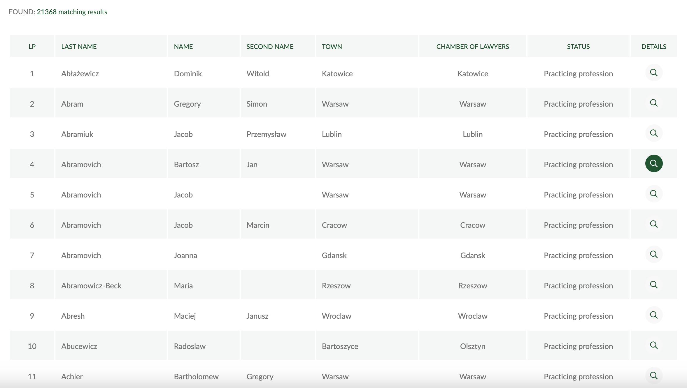

In the [previous post](https://www.carlos-toruno.com/blog/webscrapping/01-intro/), I explained the very basics of Web Scraping, how does it work and I also introduced the use of CSS Selectors and XPath to locate elements in the HTML code. In this article, I will explain how can we extract information from online websites when using the [requests](https://requests.readthedocs.io/en/latest/) library in Python.

In this example, we will be extracting information from the [Polish National Registry of Lawyers](https://rejestradwokatow.pl/adwokat). More specifically, we would like to know the geographical distribution of lawyers, their law specializations, their experience, among other available data.


## Be polite

As mentioned in the previous post of this series, before scrapping any type of information, we need to comply with the standard _Étiquette_. Therefore, lets go through a checklist of things to take into account before procceding.

#### Is the data publicly available?

As we can observe, all the information that we are targeting is available to anyone who enters this website. We don't know how was this data was disclosure to people, so we are assuming that individuals know that their personal information is made public in this website and that they agreed on it. Given that we are talking about a national organization, this assumption is very plausible. In the same manner, no login or special access is required to view this information.

Addittionally, the [robots.txt](https://rejestradwokatow.pl/robots.txt) file does not disallow any type of content. However, it asks to set a crawl-delay of 10 seconds, a request that we will respect.

#### Can we access the data through other means?

As explained before, we should always check if we can access and download the data through an API or by locating the AJAX calls if the website is dynamic. This last part means that we should check if the data is embedded within the source code or if it is called from other URL.

I have already checked the possibilities (at least the ones I know) and I concluded that we need to program a bot to extract the information. Also, if you prefer to use R to extract information from the internet, you can check the [Polite package](https://dmi3kno.github.io/polite/), which provides a very clear protocol to follow when scraping the web.

## Requests and Beautiful Soup

[Requests](https://requests.readthedocs.io/en/latest/) is a Python library that allows you to send HTTP requests to a specific website to access its source code. If you are wondering what is HTTP and why do we need to do this, I would highly suggest you to watch this short video explaining it:

<iframe width="100%" height="415" src="https://www.youtube.com/embed/tkfVQK6UxDI" title="YouTube video player" frameborder="0" allow="accelerometer; autoplay; clipboard-write; encrypted-media; gyroscope; picture-in-picture" allowfullscreen></iframe>

In summary, we will use this library to send a HTTP requests using either the GET or POST methods, in order to fetch the source code of the website and load it into our Python session. The requests library is one of the most used Python libraries nowadays. In order to install it, you can run the following from your terminal:

```
pip install requests
```

... or install it from your anaconda distribution by running the following line:

```
conda install -c anaconda requests
```

The request library will helps us get the code. However, once that we have the HTML code, we will need extra help to read this and to quickly locate elements within the source code. Depending on the length and complexity of the website, the HTML code can extend from a few hundred to even thousands of lines. Here is where the [Beautiful Soup library](https://www.crummy.com/software/BeautifulSoup/) enters the stage.

Beautiful Soup is a Python library that provides methods to quickly navigate, search and identify elements in HTML or XML documents. In other words, Beautiful Soup functions as a parser. To install it, you can run the following from your terminal:

```
pip install beautifulsoup4
```

... or install it from your anaconda distribution by running the following line:

```
conda install -c anaconda beautifulsoup4
```

## Extracting the information

The website we are going to scrap, contains data of more than 21,000 lawyers. For this article, we will just extract the information for the first set of lawyers. 


We begin by importing the libraries we will use.


```python
import pandas as pd
import requests
import time
import re
from bs4 import BeautifulSoup
```

As mentioned before, we have to be polite when scraping the web. Therefore, we need to present ourselves by adding a customize header to our HTTP request. The header is used to provide information about the request context, so the server can tailor the reponse according to the request made. To set up a header, we define the information in a dictionary as follows:


```python
# Defining headers
headers = {
    "User-Agent": "My App 1.0.0 (contact: user@mail.com)"
}
```

Back to the website we are extracting the information from, we can see that if we click on **SEARCH** without giving any filtering criteria, we get a table listing all available individuals with some information such as the name, the location and the proffesional status of the individual.




The information presented in this table is good, but not enough. However, if you click on **Details** (magnifying glass icon) at the end of each row, the site takes you to the individual's personal page where you can obtain all the available information about the lawyer. 


It is this information the one that we want to scrap. So, our first task is to obtain a list with all the URLs that take us to these pages. These URLs are contained inside each of the magnifying glass icons in the table that we got before. If you inspect tthe HTML code for these icons, you will see the following:


As we can observe, the URL for this specific lawyer is specified as a **href** attribute within the **a tag** that contains the details (magnifying glass) icon. To extract this information, we proceed as follows:


```python
# Creating an empty list to store results
lawyer_links = []

# Looping across pages to get all lamaster_datainks
for page in range(1, 4):
    
    # Define the root URL to scrap:
    root_url = f"https://rejestradwokatow.pl/adwokat/list/strona/{page}/sta/2"

    # Fetching and parsening the information
    page_response = requests.get(root_url, 
                                 headers = headers)
    page_soup     = BeautifulSoup(page_response.text, "lxml")
    time.sleep(5)
    
    # Extracting the URL from the href attributes
    for row in page_soup.findAll("tr")[1:]:
        link = row.select_one("tr > td:nth-child(8) > a").get("href")
        lawyer_links.append(link)
```

There are two things I would like to clarify from the code presented above. First, the **root URL** that I used is different that the one that you are seeing in your browser. However, if you click on the **NEXT PAGE** icon at the end of the table, you will see that the URL in your browser is similar to the one I'm using as **root URL**. This happens because, in websites that have a pagination layout, the first page does not always reflect the "_true_" URL. Therefore, it is a good advise to use the URL from the following pages as the pivoting link to perform the scraping.

Second, to locate all the URLs from the table, I decided to first select ALL the table rows (designated with the **tr tag**), and from each one of these rows, I locate the **a tag** which is always in the 8th column for each row (designated with the **td tag**). Once I'm able to locate and select the HTML tag that contains the URL, I extract the href attribute from it.

How does the information that we just extracted look like?

```python
# How does it look? Preview of the first 5 URL that we just extracted
lawyer_links[0:5]
```

    ['https://rejestradwokatow.pl/adwokat/abaewicz-dominik-49965',
     'https://rejestradwokatow.pl/adwokat/abram-grzegorz-43883',
     'https://rejestradwokatow.pl/adwokat/abramiuk-jakub-55005',
     'https://rejestradwokatow.pl/adwokat/abramowicz-bartosz-35809',
     'https://rejestradwokatow.pl/adwokat/abramowicz-jakub-35810']

Now that we can access the individual pages for each lawyer, we need to extract the information we want from each of these pages. Each one of these URLs looks as follows:


If we inspect the HTML code of the elements we want to extract, we will notice that most of them are contained in **div tags** that have no attributes that would help us to quickly identify them in the HTML tree. For example, the address information looks like this in the source code:


However, we can notice something from how the HTML is structured. In the case of the address information, there is a _parenting_ **div tag** that contains the whole row. Under this tag, we can find two sibling tags. The first one is a **span tag** that contains the words "_Correspondence address:_" (in polish), and the second one is a **div tag** that contains the specific address for each lawyer. The later will change from person to person, but the first one will always be the same. What we can do, is use this visible text to identify the **span tag** and then select its sibling to extract the information we want. For this, we can use regular expressions methods from the [re library](https://docs.python.org/3/library/re.html) to match the visible key words from the string attribute as follows:

```
BeautifulSoup.find("span", string = re.compile("KEY_WORD")).find_next_sibling("div")
```

To identify the other HTML elements, we follow a similar method to the exposed above and we save the results into a dictionary. Then, we append each record to a list that contains the results for all individuals. In the following code, we scrap the information for the first 25 individuals (please take your time to see how we extracted the address information before analyzing how we extracted the other elements):


```python
# Creating an empty list to store results
lawyers_list = []

# Defining a decoding function to read emails (don't worry about this part, I'll make another blogpost about this):
def cfDecodeEmail(encodedString):
    r = int(encodedString[:2],16)
    email = ''.join([chr(int(encodedString[i:i+2], 16) ^ r) for i in range(2, len(encodedString), 2)])
    return email

# Looping across retrieved links
for link in lawyer_links[0:25]:

    # Fetching/parsening
    record_response = requests.get(link, headers = headers)
    record_soup     = BeautifulSoup(record_response.text, "lxml")
    time.sleep(5)

    # Retrieving information
    personal_info   = record_soup.find("div", class_ = "line_list_K")

    name            = record_soup.find("section").find("h2").text.strip()
    status          = personal_info.find("span", string = re.compile("Status:")).find_next_sibling("div").text.strip()
    registered_on   = personal_info.find("span", string = re.compile("Data wpisu w aktualnej")).find_next_sibling("div").text.strip()

    try:
        address   = personal_info.find("span", string = re.compile("Adres do korespondencji")).find_next_sibling("div").text.strip()
        address   = re.sub("\t|\n", ",", address)
        address   = re.sub("\s\s", "", address)
    except AttributeError:
        address   = "NA"
        
    try: 
        phone       = personal_info.find("span", string = re.compile("Komórkowy")).find_next_sibling("div").text.strip()
    except AttributeError:
        phone       = "NA"

    try: 
        email       = personal_info.find("span", string = re.compile("Email")).find_next_sibling("div")
        email       = email.get("data-ea") + "@" + email.get("data-eb")
    except AttributeError:
        email       = "NA"

    subpanel     = record_soup.find("div", class_ = "mb_tab_content special_one")

    try:
        office_info  = subpanel.find("div", class_ = "line_list_K").text
        office_info  = re.sub("\t|\n", ",", office_info)
        office_info  = re.sub("\s\s", "", office_info)
    except AttributeError:
        office_info  = "NA"

    try:
        proffesional_phone = re.search("(?<=Komórkowy:).+?(?=,)", office_info).group().strip()
    except AttributeError:
        proffesional_phone = "NA"

    try:
        proffesional_email = subpanel.find("div", class_ = "line_list_K").find("a", class_ = "__cf_email__").get("data-cfemail")
        proffesional_email = cfDecodeEmail(proffesional_email)
    except AttributeError:
        proffesional_email = "NA"

    try:
        specs  = subpanel.select_one("div > div.line_list_A > div").text.strip()
    except AttributeError:
        specs  = "NA"

    # Defining dictionary entry
    lawyer = {
        "name"               : name,
        "status"             : status,
        "reg_date"           : registered_on,
        "address"            : address,
        "phone"              : phone,
        "email"              : email,
        "office_info"        : office_info,
        "proffesional_phone" : proffesional_phone,
        "proffesional_email" : proffesional_email,
        "specializations"    : specs,
        "URL"                : link
        } 
    
    # Appending to main list
    lawyers_list.append(lawyer)
    
```

Once that we have collected all the information that we want, we can save the list with all the results as a pandas data frame and save it as a CSV file using the following:


```python
# Saving data into a data frame    
master_data = pd.DataFrame(lawyers_list)

# Saving data frame as a CSV file
master_data.to_csv("Poland_lawyers.csv", index = False, encoding = "utf-8") 

# How does it look? Showwing the first 10 rows of the data frame
master_data[0:11]
```


<div>
<style scoped>
    .dataframe tbody tr th:only-of-type {
        vertical-align: middle;
    }

    .dataframe tbody tr th {
        vertical-align: top;
    }

    .dataframe thead th {
        text-align: right;
    }

    table {
      display: block;
      overflow-x: auto;
      white-space: nowrap;
    }
</style>
<table border="1" class="dataframe">
  <thead>
    <tr style="text-align: right;">
      <th></th>
      <th>name</th>
      <th>status</th>
      <th>reg_date</th>
      <th>address</th>
      <th>phone</th>
      <th>email</th>
      <th>office_info</th>
      <th>proffesional_phone</th>
      <th>proffesional_email</th>
      <th>specializations</th>
      <th>URL</th>
    </tr>
  </thead>
  <tbody>
    <tr>
      <th>0</th>
      <td>Abłażewicz Dominik Witold</td>
      <td>Wykonujący zawód</td>
      <td>2010-11-06</td>
      <td>Kancelaria Adwokacka , Wojewódzka 15/3,40-026 ...</td>
      <td>NA</td>
      <td>kancelaria@ablazewicz.pl</td>
      <td>,,Kancelaria ,Kancelaria Adwokacka,Wojewódzka ...</td>
      <td>508432180</td>
      <td>NA</td>
      <td>Praktyka ogólna</td>
      <td>https://rejestradwokatow.pl/adwokat/abaewicz-d...</td>
    </tr>
    <tr>
      <th>1</th>
      <td>Abram Grzegorz Szymon</td>
      <td>Wykonujący zawód</td>
      <td>2011-08-03</td>
      <td>White &amp; Case M.Studniarek i wspólnicy sp.k. , ...</td>
      <td>NA</td>
      <td>grzegorz.abram@whitecase.com</td>
      <td>,,Kancelaria ,Kancelaria Adwokacka,Lwowska 19,...</td>
      <td>NA</td>
      <td>NA</td>
      <td>Praktyka ogólna</td>
      <td>https://rejestradwokatow.pl/adwokat/abram-grze...</td>
    </tr>
    <tr>
      <th>2</th>
      <td>Abramiuk Jakub Przemysław</td>
      <td>Wykonujący zawód</td>
      <td>2015-05-07</td>
      <td>Kancelaria Adwokacka ,ul. Jezuicka 4 ,20-113 L...</td>
      <td>600 812 202</td>
      <td>adwokat@abramiuk.pl</td>
      <td>,,Kancelaria ,Kancelaria Adwokacka,Jezuicka 4,...</td>
      <td>NA</td>
      <td>NA</td>
      <td>Praktyka ogólna</td>
      <td>https://rejestradwokatow.pl/adwokat/abramiuk-j...</td>
    </tr>
    <tr>
      <th>3</th>
      <td>Abramowicz Bartosz Jan</td>
      <td>Wykonujący zawód</td>
      <td>2022-07-07</td>
      <td>Kancelaria Adwokacka ,ul. Marynin 25A/35,01-46...</td>
      <td>NA</td>
      <td>NA</td>
      <td>,,Kancelaria ,Kancelaria Adwokacka,ul.Marynin ...</td>
      <td>515456741</td>
      <td>bartoszjanabramowicz@gmail.com</td>
      <td>NA</td>
      <td>https://rejestradwokatow.pl/adwokat/abramowicz...</td>
    </tr>
    <tr>
      <th>4</th>
      <td>Abramowicz Jakub</td>
      <td>Wykonujący zawód</td>
      <td>2022-07-07</td>
      <td>Kancelaria Adwokacka , Żupnicza 25/43,03-821 W...</td>
      <td>NA</td>
      <td>NA</td>
      <td>,,Kancelaria ,Kancelaria Adwokacka,Żupnicza 25...</td>
      <td>792560294</td>
      <td>jakub.abramowicz2@gmail.com</td>
      <td>NA</td>
      <td>https://rejestradwokatow.pl/adwokat/abramowicz...</td>
    </tr>
    <tr>
      <th>5</th>
      <td>Abramowicz Jakub Marcin</td>
      <td>Wykonujący zawód</td>
      <td>2005-07-11</td>
      <td>Kancelaria adwokacka , Paulińska 2/12,31-065 K...</td>
      <td>NA</td>
      <td>j_abramowicz@o2.pl</td>
      <td>,,Kancelaria ,Kancelaria Adwokacka,Paulińska 2...</td>
      <td>503 090 269</td>
      <td>NA</td>
      <td>Praktyka ogólna</td>
      <td>https://rejestradwokatow.pl/adwokat/abramowicz...</td>
    </tr>
    <tr>
      <th>6</th>
      <td>Abramowicz Joanna</td>
      <td>Wykonujący zawód</td>
      <td>1977-03-29</td>
      <td>Kancelaria Adwokacka ,ul. Chlebnicka 48/51 ,80...</td>
      <td>NA</td>
      <td>abramowicz@pro.onet.pl</td>
      <td>,,Kancelaria ,Kancelaria Adwokacka,Chlebnicka ...</td>
      <td>605 622 929</td>
      <td>abramowicz@pro.onet.pl</td>
      <td>Praktyka ogólna</td>
      <td>https://rejestradwokatow.pl/adwokat/abramowicz...</td>
    </tr>
    <tr>
      <th>7</th>
      <td>Abramowicz-Beck Maria</td>
      <td>Wykonujący zawód</td>
      <td>2016-05-11</td>
      <td>Kancelaria Adwokacka ,ul. A. Asnyka 4/2,35-001...</td>
      <td>606 748 459</td>
      <td>abramowicz.ma@gmail.com</td>
      <td>,,Kancelaria ,Kancelaria Adwokacka,A. Asnyka 4...</td>
      <td>606 748 459</td>
      <td>abramowicz.ma@gmail.com</td>
      <td>NA</td>
      <td>https://rejestradwokatow.pl/adwokat/abramowicz...</td>
    </tr>
    <tr>
      <th>8</th>
      <td>Abresz Maciej Janusz</td>
      <td>Wykonujący zawód</td>
      <td>2002-06-27</td>
      <td>ul. Łąkowa 4/1,50-36 Wrocław</td>
      <td>NA</td>
      <td>NA</td>
      <td>,,Kancelaria ,Kancelaria Adwokacka,Łąkowa 4/1,...</td>
      <td>NA</td>
      <td>NA</td>
      <td>Praktyka ogólna</td>
      <td>https://rejestradwokatow.pl/adwokat/abresz-mac...</td>
    </tr>
    <tr>
      <th>9</th>
      <td>Abucewicz Radosław</td>
      <td>Wykonujący zawód</td>
      <td>2020-01-16</td>
      <td>Kancelaria Adwokacka Adwokat Radosław Abucewic...</td>
      <td>509286278</td>
      <td>radoslaw-abucewicz@wp.pl</td>
      <td>,,Kancelaria ,Kancelaria Adwokacka Adwokat Rad...</td>
      <td>509286278</td>
      <td>radoslaw-abucewicz@wp.pl</td>
      <td>NA</td>
      <td>https://rejestradwokatow.pl/adwokat/abucewicz-...</td>
    </tr>
    <tr>
      <th>10</th>
      <td>Achler Bartłomiej Grzegorz</td>
      <td>Wykonujący zawód</td>
      <td>2008-02-27</td>
      <td>Kancelaria Adwokacka , Chłodna 22a/9,00-891 Wa...</td>
      <td>NA</td>
      <td>bartlomiej.achler@achler.pl</td>
      <td>,,Kancelaria ,Kancelaria Adwokacka,Chłodna 22a...</td>
      <td>NA</td>
      <td>NA</td>
      <td>Prawo i postępowanie cywilne</td>
      <td>https://rejestradwokatow.pl/adwokat/achler-bar...</td>
    </tr>
  </tbody>
</table>
</div>


Results look great!!

As you can see requests and BeautifulSoup provide an easy framework to gather information from the web. Sadly, I can't go explaining detail by detail every line of my codings but I hope that the explanation of the general setting will alow you to understand the entirety of the code.
