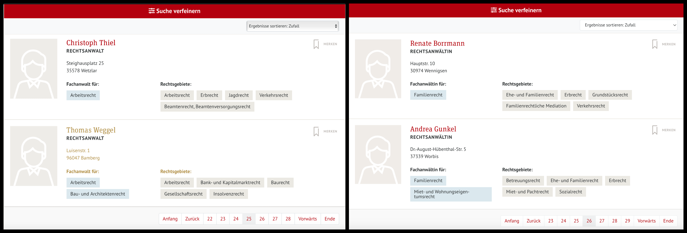
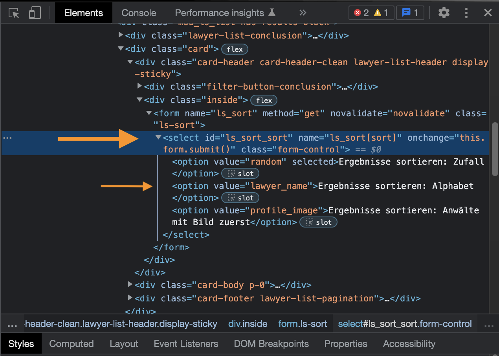
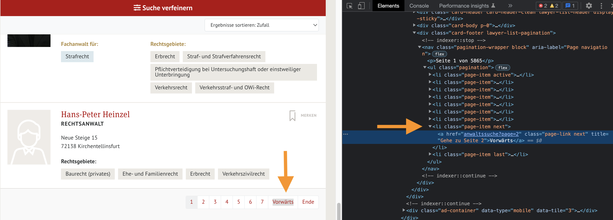

In my [previous post](https://www.carlos-toruno.com/blog/webscrapping/02-requests/) about webscrapping with Python, I talked a bit about how to use the [Requests](https://requests.readthedocs.io/en/latest/) and [Beautiful Soup library](https://www.crummy.com/software/BeautifulSoup/) libraries in order to extract the information from the web and we applied these tools to gather information from the [Polish National Registry of Lawyers](https://rejestradwokatow.pl/adwokat). However, requests might fall short when we have to extract information from dynamically generated content that use internal APIs or JavaScript to display the information. Under this scenario, we need to expand our set of tools in order to overcome these obstacles. One of such alternatives is to use a web driver. Therefore, in this post, I will be explainign how to use a web driver to locate HTML elements in a website and I will use it to extract lawyers information from [The German Lawyers' Association](https://anwaltauskunft.de/magazin).


## What's a web driver?
According to the [W3C Advisory Committee](https://www.w3.org/TR/webdriver/):

> A WebDriver is a remote control interface that enables introspection and control of user agents. It provides a platform- and language-neutral wire protocol as a way for out-of-process programs to remotely instruct the behavior of web browsers.

In other words, a web driver allows you to remotely control a web browser. Because of this, these tools are mainly use to run local tests when you are developing a website. However, due to its characteristics, it can also be used to perform webscraping because it allows you to control or program the behavior of a web browser through coding. Nowadays, the most popular WebDriver out there is undoubtly the [Selenium Project](https://www.selenium.dev/documentation/webdriver/). For this post, we will be using the [Selenium Python Library](https://selenium-python.readthedocs.io/index.html) to extract the information we want. If you want to learn more about WebDrivers and Selenium, I would suggest you to watch the following video:

<iframe width="100%" height="315" src="https://www.youtube.com/embed/unu7R9DU-eU" title="YouTube video player" frameborder="0" allow="accelerometer; autoplay; clipboard-write; encrypted-media; gyroscope; picture-in-picture" allowfullscreen></iframe>

## The problem at hand
As mentioned before, the request library might fall short when dealing with dynamic websites. As we did in the [previous exercise](https://www.carlos-toruno.com/blog/webscrapping/02-requests/) with Poland, this time I would like to gather information related to the geographical distribution, the different law specializations and contact information of german lawyers. For this, I will be scraping information from [The German Lawyers' Association website](https://anwaltauskunft.de/anwaltssuche).

As we can observe, right from the beginning we get a list of 58,648 lawyers that are listed in 5,865 pages of results that display a summary of 10 lawyers each. Nevertheless, this summary is not enough and we would have to go to the individual pages that contain the full information for each lawyer. To achieve this, we could easily extract the information using the **request** and **BeautifulSoup** libraries to loop across all the pages of result and fetch the URLs of the individual pages. Then, once that we have a list with all 58 thousand links, we could loop across each of these URLs and retrieve all the information we are interested in.

However, if we take a look at how results are sorted, we can observe that, by default, the lawyers are listed **randomly**. This means that, the order in which lawyers are displayed migh change every time that we request the source code. That being the case, even if we loop through all 5,865 pages of results, we might end up skipping some lawyers because of the randomness in which results are showed and even webscraping the same lawyer several times. Take a look at the following two images for example, both of them show the lawyers that are at the end of page number 25. 



As we can observe, lawyers are completely different people. In order to get all the information we want, we would need to click on the dropdown list that we have above the list of results and select **Sort Results: Alphabetically** (_Ergebnisse sortieren: Zufall_). This way, we would ensure that we don't get duplicates nor that we skip lawyers while looping across the pages of results.


Once that we select the alphabetical sorting in the dropdown list, we can observe that the URL is still `https://anwaltauskunft.de/anwaltssuche?page=1`, but now, the results are sorted in alphabetical order. This is because the search results are generated dynamically through JavaScript functions. Given that the URL is not altered, the **request** library is of no help in this scenario. We need a tool that allow us to emulate the behavior of a web browser. For this same reason, I will be using **Selenium** for the crawling and, once I have fetched all individual URLs, we can perform the webscraping using the tools we know until now.


## Installing Selenium
The first thing that we need to do is to install Selenium for Python. For this, we can install it in our local machone by running the following in our terminal:

```
pip install selenium
```

... or install it from your anaconda distribution by running the following:

```
conda install -c conda-forge selenium
```

Once that we have installed Selenium, we need to download the web driver that we will be controlling remotely. In this exercise, I will be using Chromium from Google. We can download the executable from the [Chromium website](https://chromedriver.chromium.org/downloads) and, we need to make sure that we download the driver version that matches our web driver. Given that I am using Google Chrome version 108.0.5, I will download the version 108.0.5 of the driver.

## Using Selenium for crawling
First, we will import Selenium and all the related modules:


```python
from selenium import webdriver
from selenium.webdriver.support.select import Select
from selenium.webdriver.support import expected_conditions as EC
from selenium.webdriver.support.ui import WebDriverWait
from selenium.webdriver.common.by import By
```

Once that we have imported Selenium, we need to set up and load the driver remotely:


```python
# Setting up a Selenium webdriver
options = webdriver.ChromeOptions()
options.headless = False
driver = webdriver.Chrome(executable_path = "/Users/carlostorunopaniagua/Documents/GitHub/chromedriver_mac64",
                          options         = options)

# Defining a waiting period
wait = WebDriverWait(driver, 10)

```

Three things are worth noticing from the code above:

1. First, we define a set of options. In this set of options we can define if the driver will run headless or not. A headless browser will run in the background and you would not be able to see the automatization behind. For now, we will set this option as `False` so we can see what's going on behind the curtains. As a consequence, once we run the driver, we should see a new window poping-up in our screen.

2. Second, in order to load the driver, we need to define tha path where we saved the executable that we just downloaded.

3. We also define an explicit waiting time. This waiting time will be the maximum amount of seconds that the driver will wait for a web element to load

Once that we have loaded the driver, we can open the website as follows:


```python
# Defining and opening the root website from where we will be extracting the individual links
root_url = "https://anwaltauskunft.de/anwaltssuche"
driver.get(root_url)

```

Once that we have opnened the root website, we need to sort our results alphabetically. To do this we need to locate the dropdown list in the HTML code. If we inspect this element, we would see the following HTML code:



As we can observe, the dropdown list is wrapped around a **select tag** and, more importantly, it has an **id** attribute assigned to it, which is `ls_sort_sort`. We can use this **id** to locate the element in the HTML code and change its selected values. Additionally, if we keep analyzing the HTML code, we can observe that the **select tag** has three children tag which represent the three different options that we can select from the dropdown list: _random sorting_, _alphabetical sorting_ and _lawyers with picture first_.   

Keep in mind that what we want to do is to sort the results alphabetically, so, we need to change the selected option from the dropdown list from _random_ to _alphabetical_. To achieve this, we will be using the **value attribute** of these options, in other words, _random_, _lawyer_name_ and _profile_image_ in the following fashion:


```python
# Locating dropdown list and saaving the element
dropdown  = Select(driver.find_element_by_id("ls_sort_sort"))

# Changing the selected option for this element
dropdown.select_by_value("lawyer_name")
```

After running the above code, we should see our results sorted alphabetically in our web driver, meaning that lawyer Sabine Aalbars should be on top of our results.

Now that we have our results sorted as we want, we need to retrieve the links to the individual pages of each lawyer. To do this, we can retrieve the source code of the current web page. However, keep in mind that we we will need the help of a parsening tool to easily read this source code and, more immportantly, to navigate through it. For this, we can use the BeautifulSoup library as we have done before:


```python
from bs4 import BeautifulSoup

# Fetching source code
content = driver.page_source

# Parcening the retrieved code
soup    = BeautifulSoup(content, "lxml")
```

Now that we have the code tidy and organized into our soup, we can now turn into locating the links. If we keep going deeper into the code, we can observe that the links are stored as **href attributes** within some **a tags**:


In order to reach these **a tags**, we can first locate the body where all the lawyers cards are contained. This is the **div tag** that has the class attribute of _card-body p-0_. And once that we have located this upper level tag, we can loop across all of its children tag, which are ten, the exact number of lawyers in each page. To do this, we proceed as follows:


```python
# Extracting links
card_body = soup.find("div", class_ = "card-body p-0")
results   = [card.find("a").get("href") for card 
                in card_body.findAll("div", class_ = "lawyer lawyer-list")]

# Lets take a look at the results:
results
    
```


    ['anwaltssuche/sabine-aalbers-ojk6m',
     'anwaltssuche/frans-aarts-9op8k',
     'anwaltssuche/alexander-e-abadschieff-4qj9l',
     'anwaltssuche/marco-abate-klgym',
     'anwaltssuche/marion-abbassi-abrell-zogqq',
     'anwaltssuche/ralf-abbing-lg1al',
     'anwaltssuche/eduard-abbrent-jwx77',
     'anwaltssuche/yasmin-abd-el-aal-beanw',
     'anwaltssuche/abdou-abdel-gabbar-dqnja',
     'anwaltssuche/mona-abdel-hamid-rgmx8']


Wonderful!! We have succesfully extracted the links (or at least a part of it). However, we need to do this for every page of results that we have. So we need to write down a loop to repeat this same routine in all the pages that we need. If we manually go to the next page, we will see that the URL changes from `anwaltssuche?page=1` to `anwaltssuche?page=2`. So this means that we can take advantage of the pagination and just ask the driver to open the new page. Nevertheless, fort he sake of showing the capacities of Selenium, I will adopt another course of action.

If we go to the bottom of the list of results. We will observe a pagination bar. What we need to do is to click on the Next Page button (_Vorwärts_) and we will have the next ten lawyers sorted alphabetically. To do this we need to locate the HTML element associated to this button in the code. If we right-click on the element and inspect it, we can observe that the pagination bar is associated to a **ul tag** and that each of the buttons of this pagination bar is associated to a **li tag** within it.



We can right click the respective **li tag** in order to copy its **XPATH**, which is a really long path and then we can click on this element by running the following:


```python
# Defining XPATH for the NEXT PAGE button:
xpath_nextPage = '//*[@id="article-12"]/div[1]/div[2]/div[3]/nav/ul/li[8]/a'

# Clicking on defined element
wait.until(EC.element_to_be_clickable((By.XPATH, xpath_nextPage))).click()
```

After we run the above lines, we should see that the Chromium driver is now on page 2 of the results. Meaning that we can just retrieve the source code and use BeautifulSoup to fetch the URLs that we want. Which is a good thing now. The above startegy relies on the fact that the Next Page button is always the 8th **li tag** in the pagination bar. However, if we now go to the bottom of the second page of results, we can see that this is no longer the case. Given that now, we can also go back to the first page, the pagination bar include a new button and now the Next Page button is now the 9th element. 

Therefore, if we want to crawl across pages retrieving all the URLs, we need to adjust this in our loop until the Next Page button has a stable position in the pagination bar.

Taking all of the above issues into account, our loop code to retrive the individual links for the first 15 pages of results can be written as follows:


```python
# Creating an empty list to store results
lawyers_links = []

# Loopinga across pages
for page in range(1, 16):

    # Fetching/Parsening
    print("Currently extracting links from page " + str(page))
    content = driver.page_source
    soup    = BeautifulSoup(content, "lxml")

    # Extracting links
    card_body = soup.find("div", class_ = "card-body p-0")
    results   = [card.find("a").get("href") for card 
                    in card_body.findAll("div", class_ = "lawyer lawyer-list")]
    
    # Storing links
    lawyers_links.extend(results)

    # Defining NEXT PAGE xpath
    if page == 1:
        nextpath = '//*[@id="article-12"]/div[1]/div[2]/div[3]/nav/ul/li[8]/a'
    if page == 2:
        nextpath = '//*[@id="article-12"]/div[1]/div[2]/div[3]/nav/ul/li[9]/a'
    if page > 2:
        nextpath = '//*[@id="article-12"]/div[1]/div[2]/div[3]/nav/ul/li[10]/a'
    
    # Clicking on the next page
    if page < 5865:
        wait.until(EC.element_to_be_clickable((By.XPATH, nextpath))).click()
```

    Currently extracting links from page 1
    Currently extracting links from page 2
    Currently extracting links from page 3
    Currently extracting links from page 4
    Currently extracting links from page 5
    Currently extracting links from page 6
    Currently extracting links from page 7
    Currently extracting links from page 8
    Currently extracting links from page 9
    Currently extracting links from page 10
    Currently extracting links from page 11
    Currently extracting links from page 12
    Currently extracting links from page 13
    Currently extracting links from page 14
    Currently extracting links from page 15


Now that we have successfully retrieve the links, we can proceed to scrape the information from the individual pages using the tools that we learned in the previous post.

> **Advice**: Don't forget to close the driver by running: driver.close()


```python
import requests
import time
import re
import pandas as pd

# Defining headers
agent = ["Mozilla/5.0 (Macintosh; Intel Mac OS X 10_15_7) ",
         "AppleWebKit/537.36 (KHTML, like Gecko) Chrome/",
         "96.0.4664.110 Safari/537.36"]
headers = {
    "User-Agent": "".join(agent)
}

# Defining a function to extract the information from a website
def html_extraction(lawyer_extension):
    
    # Define the root URL to scrap:
    base_url = f"https://anwaltauskunft.de/{lawyer_extension}"

    # Fetching/parsening
    base_response = requests.get(base_url, 
                                 headers = headers)
    base_soup     = BeautifulSoup(base_response.text, "lxml")
    time.sleep(2)

    # Extracting info from the website
    name    = base_soup.find("div", class_ = "h1 name").text.strip()
    
    try :
        address = base_soup.find("address").text.strip()
        address = re.sub("\n", ", ", address)
    except AttributeError:
        address = "NA"

    try:
        specs   = base_soup.find("div", class_ = "lawyer-sections").find("h6")
        specs   = specs.find_next_sibling("div").text.strip()
        specs   = re.sub("\n|\n\n", ", ", specs)
    except AttributeError:
        specs   = "NA"
    
    try:
        languages = base_soup.find("div", class_ = "lawyer-languages").find("h6")
        languages = languages.find_next_sibling("ul").text.strip()
    except AttributeError:
        languages = "NA"

    # Getting PDF URL
    header  = base_soup.find("div", class_ = "lawyer-detail-head m-0").select_one("div > div:nth-child(1)")
    pdf_btn = header.find("ul").select_one("ul > li:nth-child(2)")
    pdf_ext = pdf_btn.find("a").get("href")

    # Defining dictionary entry
    dct = {
        "name"               : name,
        "address"            : address,
        "specializations"    : specs,
        "languages"          : languages,
        "PDF"                : pdf_ext,
        "URL"                : base_url
        }

    return dct

# Creating an empty list to store results
lawyers_list = []

# Setting up a counter
N = 1

# Looping across the first 10 links to retrieve information:
for link in lawyers_links[1:10]:
    
    # Applying functions to retrieve information
    html_info = html_extraction(link)

    # Appending to main list
    lawyers_list.append(html_info)

# Saving data into a dataframe    
master_data = pd.DataFrame(lawyers_list).drop_duplicates()    

# Let's take a look at our results
master_data
```


<div>
<style scoped>
    .dataframe tbody tr th:only-of-type {
        vertical-align: middle;
    }

    .dataframe tbody tr th {
        vertical-align: top;
    }

    .dataframe thead th {
        text-align: right;
    }

    table {
      display: block;
      overflow-x: auto;
      white-space: nowrap;
    }
</style>
<table border="1" class="dataframe" width="100%">
  <thead>
    <tr style="text-align: right;">
      <th></th>
      <th>name</th>
      <th>address</th>
      <th>specializations</th>
      <th>languages</th>
      <th>PDF</th>
      <th>URL</th>
    </tr>
  </thead>
  <tbody>
    <tr>
      <th>0</th>
      <td>Christoph Podszun</td>
      <td>Rosental 1, 44135 Dortmund</td>
      <td>Jugendstrafrecht, Straf- und Strafverfahrensre...</td>
      <td>Französisch\n                                 ...</td>
      <td>anwaltssuche/christoph-podszun-21lxy?pdf=18</td>
      <td>https://anwaltauskunft.de/anwaltssuche/christo...</td>
    </tr>
    <tr>
      <th>1</th>
      <td>Daniel Feigl</td>
      <td>Hopfenstr. 8, 80335 München</td>
      <td>Steuerrecht, Gesellschaftsrecht, Erbrecht</td>
      <td>Englisch</td>
      <td>anwaltssuche/daniel-feigl-bmod8?pdf=18</td>
      <td>https://anwaltauskunft.de/anwaltssuche/daniel-...</td>
    </tr>
    <tr>
      <th>2</th>
      <td>Gesa Mielcke</td>
      <td>Horster Str. 23, 46236 Bottrop</td>
      <td>Testamentsvollstreckung, Insolvenzrecht, Verbr...</td>
      <td>Englisch\n                                    ...</td>
      <td>anwaltssuche/gesa-mielcke-90exn?pdf=18</td>
      <td>https://anwaltauskunft.de/anwaltssuche/gesa-mi...</td>
    </tr>
    <tr>
      <th>3</th>
      <td>Benjamin Peschel</td>
      <td>Speditionstr. 1, 40221 Düsseldorf</td>
      <td>NA</td>
      <td>NA</td>
      <td>anwaltssuche/benjamin-peschel-nlwno?pdf=18</td>
      <td>https://anwaltauskunft.de/anwaltssuche/benjami...</td>
    </tr>
    <tr>
      <th>4</th>
      <td>Simone Schmidgen</td>
      <td>Harkortstr. 15, 40210 Düsseldorf</td>
      <td>Verkehrszivilrecht, Ehe- und Familienrecht, Er...</td>
      <td>Englisch</td>
      <td>anwaltssuche/simone-schmidgen-wgv7q?pdf=18</td>
      <td>https://anwaltauskunft.de/anwaltssuche/simone-...</td>
    </tr>
    <tr>
      <th>5</th>
      <td>Andrea Grimmer-Vohrer</td>
      <td>Bahnhofstr. 47/1, 73430 Aalen</td>
      <td>Wohnungseigentumsrecht, Miet- und Pachtrecht, ...</td>
      <td>Englisch\n                                    ...</td>
      <td>anwaltssuche/andrea-grimmer-vohrer-eldpw?pdf=18</td>
      <td>https://anwaltauskunft.de/anwaltssuche/andrea-...</td>
    </tr>
    <tr>
      <th>6</th>
      <td>Jan Schoonbrood</td>
      <td>Kloosterweg 1, 6412 CN HEERLEN, Niederlande</td>
      <td>Niederlande</td>
      <td>Englisch\n                                    ...</td>
      <td>anwaltssuche/jan-schoonbrood-xzmaz?pdf=18</td>
      <td>https://anwaltauskunft.de/anwaltssuche/jan-sch...</td>
    </tr>
    <tr>
      <th>7</th>
      <td>Birgid Riedelbauch-Hastreiter</td>
      <td>Ludwigstr. 25, 95632 Wunsiedel</td>
      <td>NA</td>
      <td>NA</td>
      <td>anwaltssuche/birgid-riedelbauch-hastreiter-kmy...</td>
      <td>https://anwaltauskunft.de/anwaltssuche/birgid-...</td>
    </tr>
    <tr>
      <th>8</th>
      <td>Ass. jur. Nicklas M. Zielen</td>
      <td>Marburger Str. 25, 35088 Battenberg</td>
      <td>Zivilrecht, Verkehrsrecht, Telekommunikationsr...</td>
      <td>Englisch\n                                    ...</td>
      <td>anwaltssuche/ass-jur-nicklas-m-zielen-bewlw?pd...</td>
      <td>https://anwaltauskunft.de/anwaltssuche/ass-jur...</td>
    </tr>
  </tbody>
</table>
</div>


Results look wonderful!!!

As you could have noticed, we did not retrieve the contact information because this data is encripted within the source code. In an upcoming post, I will be explaining on how can we extract this type of information by just taking an alternative course of action.
