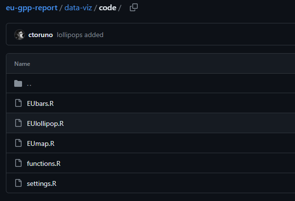

I use the word **workflow** a lot when talking to people from other teams. I use it so often, that they seem to be used to it by now. However, from time to time, one person will approach me and ask: "_ok, but what do you mean by workflow?_". You wont believe it, but everytime that I talked about this concept, I knew what I was referring to, but I never had it so clear to be able to explain it. As my dear friend Santiago once told me...

> "_The workflow is an intangible and transversal concept to everything that we do. Which is a fancy way of saying that we have no idea wtf it is_." (Pardo, 2024)

Well, I have written in this post all of our ideas about our dear workflow. So, from now on, we are able to explain it. Right?

With no further add-ons, let's start the Ted talk. Apologies for the long post ahead. There is no TL;DR version, but I promise to be fun at least.

## More than work is a flow, it is a Philosophy

Well, if we want to be technicals, a workflow is a sequence of tasks or activities that are part of a larger process. This is a really good definition. However, in every project, the specific tasks or steps will depend on the objectives and outcomes at hand. For example, the individual steps for creating the charts for a country report will differ significantly from the steps needed to create a Media Report.

This bring us to the conclusion that the specific workflow will always be different depending on the project at hand. Honestly, I could stop explaining here, but you will end up with the same questions as when you started reading this post. And that would be a lame post. So, don't worry, I promise to explain further.

Let's acknowledge the fact that any project is going to be full of specific details that make the project unique. But those particularities can be easily address if you have a general idea to work around. And that general idea, is what Santiago and I have crafted in the past two years.

You see, we both started working as data analysts at the same time. Because of this, we had to study the stablished data processes and routines together. Additionally, we were overwhelmed by the amount of things to do and we had to jump in and continue where the other left. At some point, we started to realize a few things that were slowing us down:

- The processes were difficult to learn. The routines were written by a person and only that person could easily understand what was going on.

- Changes were easy to implement but they required a lot of time due to the repetitive nature of the code.

- Changes were difficult to track because routines were long and there were no version control systems to track changes.

- Filing systems were not built for data processes.

- Lack of transparency and replication.

Having identified these and other issues, we started defining some basic principles that would be in place regardless of the nature of the project.

## The six basic principles

We have come around with 6 basic principles that have come to be the basic pillars under which every data workflow should be build upon:

1. An intuitive filing and naming system
2. Git first, SharePoint next
3. Break down your code
4. What is repetitive, can be refactored
4. One-click to rule to them all
5. Document everything, publish everything

#### An intuitive filing and naming system
An intuitive filling system is a basic organizational matter. When files are well organized, information is easy to access and find. Moreover, when files are named in an intuitive and consistent way, it is easier to retake and continue the work that you paused a few weeks ago or to support a colleague in a project that is already well advanced.

If you check any of the projects that we have worked on in the past 18 months, you will find that we always have four different folders: `data`, `code`, `inputs`, and `ouputs`. And the way that files are organized within each folder allow us to locate things faster. This is not an issue when you have been working on a project for the past 3 months, but it becomes one when you come back to that [LAC Reports project](https://github.com/ctoruno/LAC-Reports) where everything started.

In the same fashion, the way we name files and even variables is a small investment that brings great time savings in the long run. For example, there is one name that is always present in our code, the famous `data2plot`. When we see that name in any coding script, we know that data is already processed and ready to be plotted.

Also, isn't it easier to automatize processes when things are named similarly and consistently in the same way? In case you are wondering, it is easier.

#### Git first, SharePoint next
Sharepoint and OneDrive are great cloud platforms that allow us to share and edit files in a team. In OneDrive, I can see who made what change in my Word document. These type of systems are known as version control systems. However, OneDrive will not be able to help me if I want to see which specific lines of code where changed by my team mate yesterday. This is where [Git](https://git-scm.com/) and [Github](https://github.com/) enter into the scene. [Git](https://git-scm.com/) is a free and open source version control system that allows you to track, modify, branch, and merge your code in collaboration with other people. On the other hand, [Github](https://github.com/) is a web service that provides cloud hosting for your Git repositories, along with some other features.

Git tools have become a must when working with any project that requires coding, from academic research, to web development. Some of the popular names in the research world such as [The Economist](https://github.com/TheEconomist), [V-Dem](https://github.com/vdeminstitute), [The World Bank](https://github.com/worldbank) have their own institutional Github pages. Since last year, the DAU counts with its [own GitHub page](https://github.com/WJP-DAU).

However, this requires some coordination. As a rule, our Git repositories have a "_code administrator_" who is in charge of setting up the Git repo and having its own local copy in the SharePoint. Everyone else, has their own local copy outside the SharePoint. This way, we are able to work with two version control systems without interfering with each other.

If you wanna know how Git works, I would suggest you to check the following video:

<iframe width="100%" height="315" src="https://www.youtube.com/embed/hwP7WQkmECE?si=nEt0ZWflIrYeGd73" title="YouTube video player" frameborder="0" allow="accelerometer; autoplay; clipboard-write; encrypted-media; gyroscope; picture-in-picture; web-share" referrerpolicy="strict-origin-when-cross-origin" allowfullscreen></iframe>

#### Break down your code
Nobody likes very long scripts with thousands of lines of code. Nobody!!! They are very tiresome to read and follow. Therefore, one of the best things that you can do for your colleagues is to break down your super long script and save it in multiple files that follow some logic. This is known as "**Modular Programming**".

The idea behind modular programming is to break down your code into smaller pieces. Why? Sometimes, you do not need to understand the whole system, you just need to understand how a specific feature works. For example, let's think on the production of media reports. We could have a very long Python script in which we have the extraction, translation, classification, and summarization of news articles all together. The truth is, we do not need to have such a long script!!! Please, pay attention.

We can split the system into smaller pieces. We do not need to understand how the classification works if we are only working in fixing some issues in the extraction, we only need to understand how the pieces are connected, which can be in the shape of a master file that we sometimes call the `RunMe` file.

If you take a look at the [master routine](https://github.com/WJP-DAU/eu-gpp-report/blob/main/data-viz/RunMe.R) that creates the 150 charts for the EU Subnational GPP Report, you would be surprised to know that it is less than 75 lines long. Why? because most of the code is broken down in modules according to its role:

This way, the project is easier to read, follow, and mantain. However, spliting you code into smaller pieces is not the only approach into making it shorter, you can also introduce a functional approach to your code.

#### What is repetitive, can be functional

I once read that, if you repeat the same piece of code three or more times, you should convert that repetitive chunk into a function. A function is a self-contained block of code that performs a task. This way, if you need to perform the task again, you do not need to write the whole code again, you just call the function and it will do it for you. This is known as a functional approach in programming.

I remember once that I had to change the labels in the axis of every bar chart in a report. It was a very silly change. However, because the original author of the code did not write a function to create the charts, I had to apply the change in every bar plot manually. With a function, I would have done the task in less than 10 seconds, because I would only have had to do it once.

In order to apply this functional approach, you have to start "_thinking ahead_" in your project. No doubt it is easier to just copy and paste the block of code and modify minor values. However, in the long run, it can save you and your colleagues a lot of time. However, I'm also aware that dirty and inefficient code is also the result of pressing deadlines. This is why, refactoring should be a constant way of life.

Refactoring refers to the process of restructuring existing code without changing its external behavior. This is done in order to improve the efficiency (and aesthetics) of your code in order to make it easier to read, understand, and mantain.

#### One-click to rule to them all

This one is easy... your code should be, at best, a one-click routine... for **ANYONE**, not just you. In other words, the user should be able to run it with very very very few changes. Hopefully, none. And that's it. No further explanations needed. If you need to modify more than three parameters for your code to run, you need to go back to the previous two points.

#### Document everything, publish everything
Ok, this one is my favorite. You have to document everything that you do and that might not be clear for other people... including yourself 6 months ahead!!! This way, you democratize your code by making it accesible to everyone. This would reduce the dependency on the original author, it would make it easier to read and follow, and you would not have to expent 50 hours explaining it to someone else.

You created a Git repo? Write that [README file](https://github.com/ctoruno/WJP-news-tracker/blob/main/README.md)!!!

You created a function in Python? Write that [docstring](https://peps.python.org/pep-0257/)!!!

You added a twitch that seems shady in your code? Write the reason why as a comment in your script!!!

You had an issue and you think that someone might have it in the future? Write it down in the [issues logbook](https://github.com/ctoruno/WJP-Resources/blob/main/issues-logbook/Merge/merged_encoding_issue.md)!!!!

Are you worried that the other members of your team might alter the peace and balance that you have brought along with Santiago? Well, write a [Coding Handbook](https://wjp-r-handbook.netlify.app/) and make it a compulsory reading for everyone.

Have I mentioned the README file? WRITE THAT README FILE!!!

The more democratic you make your code, the easier will be life for everyone else in the team. Trust me in this one.

Finally, and this is not an essential part of the workflow, but it is an essential part of our philosophy... we publish everything. You can find, clone, and play with the code of EVERYTHING that we do from our [Github pages](https://github.com/ctoruno). From country reports to our crazy web apps. This is not just because we firmly believe in transparency but also because it is a heavy incentive for us to improve and have a beautiful code public. At the end of the day, you wouldn't post an ugly picture in your instagram, right?

