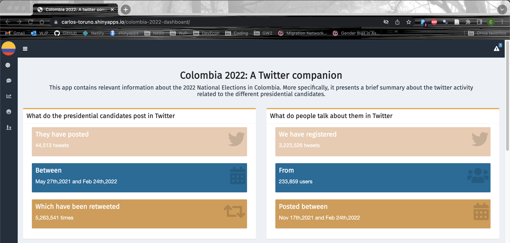

## [Colombia 2022: A twitter companion](https://carlos-toruno.shinyapps.io/colombia-2022-dashboard/) is the result of collecting over 3 million tweets related to all the presidential pre-candidates for the 2022 Colombian General Elections.

---

### Description
This project is divided in two different stages. First, we have the collection stage, where I extracted over 3 million tweets related to all the presidential candidates for the 2022 Colombian General Elections using the R based twitter client ([twitteR](https://github.com/geoffjentry/twitteR)) developed by Jeff Gentry. Additionally, I downloaded over 44,000 tweets posted by the candidates official accounts. The code for the extraction is publicly available in the following [GitHub Repository](https://github.com/ctoruno/Colombia-2022-twitter-data).

The second stage, consisted in building and deploying a Shiny Dashboard displaying the results of applying a basic analysis of the tweets extracted. The dashboard has two main panels: Speech Analysis and Social Monitoring. In the Speech Analysis tab, the user can see the results of performing a basic frequency analysis and topic modelling to the tweets published by the candidates' official accounts. In the Social Monitoring tab, the user can see the see the results of applying the same analysis methods but, to the tweets posted by the community. These tabs can be accessed through the left sidebar of the dashboard.

The first version of the dashboard had a third panel displaying the results of applying a Sentiment Analysis to the tweets podted by the community. However, this section is no longer available and the analysis is being updated from a lexicon structure to a machine learning perspective.

