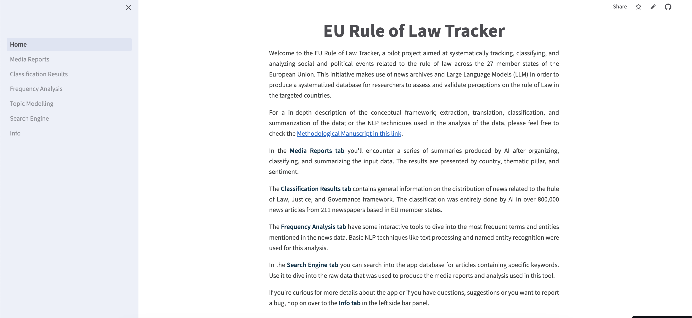

## The [EU Rule of Law Tracker](https://eu-rol-tracker.streamlit.app/) aims at systematically tracking, classifying, and analyzing social and political events related to the Rule of Law across the 27 member states of the European Union.

---

### Description
This initiative makes use of news archives and Large Language Models (LLM) in order to produce a systematized database for researchers to assess and validate perceptions on the rule of Law in the targeted countries.

For a in-depth description of the conceptual framework; extraction, translation, classification, and summarization of the data; or the NLP techniques used in the analysis of the data, please feel free to check the [Methodological Manuscript in this link](https://ctoruno.github.io/eu-rol-tracker/).

