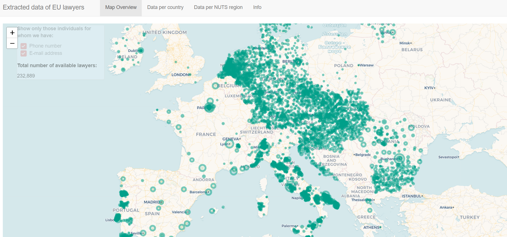

## The [EU Lawyer Dataset](https://carlos-toruno.shinyapps.io/EU-Lawyer-Data/) is the result of collecting information on almost 350,000 lawyers in the EU area.

---

### Description
This dataset is mainly built from webscrapping the publicly available information published by national and regional Bar Associations in the 27 countries members of the European Union. The dataset reflects a huge team effort on webscrapping several different websites, translating information to english, geocoding addresses and unifying the individual data into a single dataset.

The dashboard has three main panels: Overview, Country Data and NUTS Data. In the overview tab, the user can see the geographical spreed of data across the continent. In the country data tab, we summarize the main information at the country level. Finally, in the NUTS Data tab, the user can find some summary statistics at the NUTS region level.

Kudos to [Santiago Pardo](https://github.com/aspardog), [Jaehee Lee](https://github.com/jaehee99) and Pablo González for their collaboration in the collection and cleaning of this data. And to Ana María Montoya for her guidance and giving the very first idea to start this massive task.

