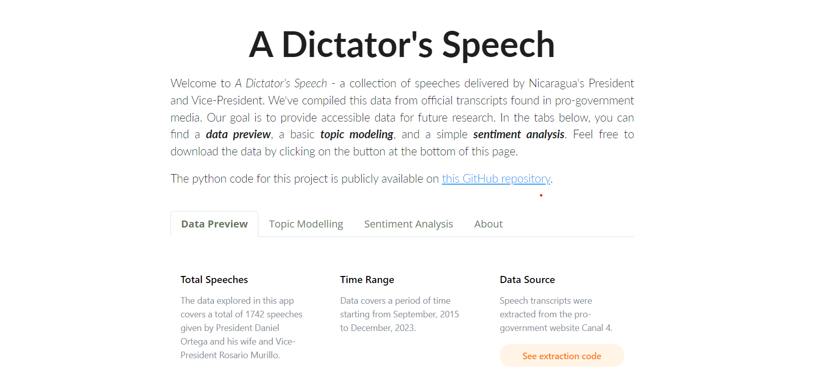

## [Nicaragua: A Dictator's Speech](https://nds-dash.onrender.com) is a data base of speeches delivered by Nicaragua's President and Vice-President. +1,700 speeches have been compiled from official transcripts found in pro-government media. The data comprises speeches given by the Presidential couple between September, 2015 and December, 2023.

---

### Description
The main goal of the project is to  project is to provide accessible data for future research. The data project has a [website](https://nds-dash.onrender.com) that is regularly updated. There, you can find a _data preview_, a basic _topic modeling_, and a simple _sentiment analysis_. Feel free to download the data from the [GitHub repository](https://github.com/ctoruno/Nicaragua-dictators-speech) or from the website.

